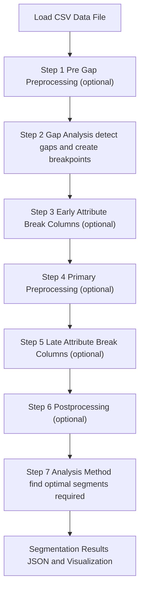

# Highway Segmentation Analysis - User Guide

## Table of Contents

1. [Overview](#overview)
2. [Pavement Analysis Context](#pavement-analysis-context)
3. [Getting Started](#getting-started)
4. [User Interface Guide](#user-interface-guide)
5. [Common Tasks](#common-tasks)
6. [Analysis Methods](#analysis-methods)
7. [Common Pavement Analysis Scenarios](#common-pavement-analysis-scenarios)
8. [Basic Workflow](#basic-workflow)
9. [Understanding Results](#understanding-results)
10. [Pavement-Specific Parameter Guidance](#pavement-specific-parameter-guidance)
11. [Data Import & Export](#data-import--export) — [Connecting to a Database](#connecting-to-a-database)
12. [Advanced Configuration](#advanced-configuration)
13. [Troubleshooting](#troubleshooting)
14. [Technical Reference](#technical-reference)

---

## Overview

The Highway Segmentation Analysis application provides advanced statistical and optimization-based methods for dividing highway data into optimal segments for pavement analysis. The system offers six analysis methods, spanning traditional genetic algorithms, constrained optimization variants, and deterministic change point detection.

### Key Features

- **🧬 Multiple Analysis Methods**: Single-objective GA, NSGA-II, constrained GA variants, AASHTO CDA, and PELT segmentation
- **🧹 Preprocessing Framework**: Optional data cleaning and outlier detection before analysis
- **📊 Smart Data Handling**: Automatic gap detection with mandatory breakpoint insertion
- **🎯 Flexible Attribute Breaks**: Early breaks for preprocessing segments, late breaks for analysis segments
- **📈 Interactive Visualization**: Click-to-explore results with detailed segment information
- **💾 Comprehensive Export**: JSON, Excel, and CSV outputs with complete analysis metadata
- **⚙️ Persistent Settings**: Your preferences are automatically saved between sessions
- **🔧 Extensible Architecture**: Easy addition of new analysis methods, preprocessing methods, and parameters

### Currently Supported Analysis Approaches

1. **Single-Objective Genetic Algorithm**: Traditional optimization minimizing segment variation
2. **Multi-Objective NSGA-II**: Pareto front exploration of quality vs. segment length tradeoffs
3. **Constrained Single-Objective**: Target-length segmentation with penalty enforcement
4. **Constrained GA (Deb Feasibility)**: Constraint-domination approach using Deb feasibility rules instead of penalty weights
5. **AASHTO Enhanced CDA**: Statistical change point detection (citation: [CITATIONS.md](CITATIONS.md))
6. **PELT Segmentation**: Deterministic change point detection using the PELT algorithm

---

## Pavement Analysis Context

### Why Segmentation Matters for Pavement Management

Pavement networks are inherently variable due to:

- **Construction History**: Different construction dates, materials, and techniques
- **Traffic Loading**: Varying traffic volumes, vehicle types, and axle loads across sections
- **Environmental Conditions**: Climate variations, drainage differences, subgrade changes
- **Maintenance History**: Different rehabilitation timing, methods, and treatment effectiveness
- **Functional Classification**: Interstate vs. arterial vs. collector roads requiring different design standards
- **Structural Composition**: Varying layer thicknesses, base types, and pavement structures

**Segmentation Goal**: Divide the network into homogeneous sections where:

- Pavement condition is relatively uniform within segments
- Similar treatment strategies and priorities apply
- Deterioration patterns and rates are consistent
- Resource allocation and project limits are optimized
- Performance predictions are more accurate

### Common Pavement Indices for Segmentation

This tool works with any numeric pavement condition index:

- **IRI (International Roughness Index)**: Ride quality measurement, typical range 40-250 inches/mile
- **PCI (Pavement Condition Index)**: Overall condition rating, 0-100 scale (100 = excellent)
- **Rutting Depth**: Structural distress indicator, typically 0-25mm
- **Cracking Indices**: Alligator cracking, longitudinal cracking, etc. (% area or length)
- **Structural Numbers**: Composite measure of pavement layer strength
- **Deflection Data**: FWD (Falling Weight Deflectometer) measurements indicating structural capacity
- **Friction Numbers**: Surface safety measurements (skid resistance)
- **Texture Depth**: Surface drainage and noise characteristics

### Typical Pavement Segmentation Applications

1. **Network-Level Planning**: Divide network into treatment sections for budget allocation and multi-year programming
2. **Project-Level Design**: Identify homogeneous sections within projects to optimize treatment limits and reduce costs
3. **Performance Modeling**: Create consistent sections for deterioration curve development and life-cycle analysis
4. **Data Quality Control**: Identify anomalous data, equipment calibration issues, or transition zones
5. **Historical Analysis**: Track condition changes over time in statistically consistent sections
6. **Treatment Effectiveness**: Evaluate rehabilitation performance in homogeneous test sections
7. **Pavement Management Systems**: Define analysis sections for optimal resource allocation

---

## Getting Started

### Installation

1. **Extract Application**: Unzip all files to your desired installation directory
2. **Install Dependencies**: Run `pip install -r requirements.txt` from the project directory
3. **Optional (Recommended for CLI)**: Run `pip install -e .` to enable the `highway-seg` command
4. **Launch Application**: Execute `python src/run.py`
5. **Verify Installation**: The GUI should open and show the main window with the **Optimization Log** tab

### Quick Start

**For a basic analysis without preprocessing:**

1. In **📁 Data Source**, choose **CSV File** or **Database (SQL)** and click **Connect / Open** to load your data (see [Connecting to a Database](#connecting-to-a-database) for the DB workflow)
2. Select **X Column (Distance)** and **Y Column (Data Values)** (these are not auto-selected)
3. Optional (multi-route data): pick **Route Column (Optional)** then click **Filter** to select which routes to process
4. In **Step 2: Gap Analysis**, set **Gap Threshold** (controls where mandatory breakpoints are inserted at data gaps)
5. Leave preprocessing steps (1, 4, 6) set to "None" (collapsed panels)
6. In **Step 7: Analysis Method**, select your method and configure parameters (expand the panel)
7. Under **Results File (Required):** either type a base name in the left field, or click **Browse...** to select the full output path and filename
8. Click **🚀 Start** and monitor progress in the **Optimization Log** tab
9. When complete, the enhanced visualization window will open automatically

**To use preprocessing or attribute breaks:**

- See the [Processing Pipeline Overview](#processing-pipeline-overview) diagram and [Preprocessing Framework](#preprocessing-framework) section
- Use **Step 3** for structural attribute breaks (pavement type, lanes) if you want preprocessing per structure type
- Use **Step 4** to enable outlier detection or data cleaning
- Use **Step 5** for administrative attribute breaks (county, district) for final segmentation

**To load existing results:** Use **📊 Load & Plot Results**

---

## User Interface Guide

The interface is split into a left configuration pane and a right execution/results pane.

### Processing Pipeline Overview

The left panel guides you through a **7-step pipeline** that prepares your data and runs analysis. Here's how data flows through the system:



**Key Concepts:**

- **Optional Steps** (`(optional)` in the diagram): Skip by selecting "None" when that processing stage is not needed
- **Required Steps** (no `(optional)` label): Must be configured; Gap Analysis and Analysis Method are always performed
- **Early vs Late Attributes**: Early breaks define preprocessing segments (structural boundaries), late breaks define analysis segments (administrative boundaries)
- **Data Flow**: Each step refines the data or adds constraints, leading to the final segmentation

### Left Panel - Configuration & Control

The left panel follows the 7-step processing pipeline shown in the diagram above. Each step is described below.

#### 📁 **File Operations** (Top Section)

- **Data File / Browse...**: Select an input CSV. The app reads headers immediately and populates the column dropdowns.
- **X Column (Distance)** and **Y Column (Data Values)**: You must select these explicitly for each new file.
- **Route Column (Optional)**:
  - Set to **None - treat as single route** to analyze the file as one route.
  - Set to a column name to enable multi-route mode, then use **Filter** to pick which route IDs to process.
  - In multi-route mode, rows with missing route IDs (blank/empty) are excluded from analysis and this is logged.
    If all rows are missing/invalid for the selected route column, the run is blocked with an error.
- **Results File (Required)**:
  - Left field sets the base results filename.
  - **Browse...** opens a save dialog to set both output folder and filename (`.json`).
  - If you only set a base name and do not browse, output may save to the current working directory.

#### **7-Step Processing Pipeline** (Below File Operations)

#### Step 1: Pre-Gap Preprocessing (optional)

- **Panel Title**: "1. Pre-Gap Preprocessing (optional)"
- **What you do**: Expand this panel only if you need preprocessing before gap detection.
- **What it affects**: Runs on raw data before Step 2.
- **Typical use**: Most users leave this at "None".
- **Current options**: Uses the same preprocessing method list as other preprocessing panels (for example, Tukey Fences Outlier Detection).

#### Step 2: Gap Analysis

- **Panel Title**: "2. Gap Analysis - Gap Threshold (in x units)"
- **What you do**: Enter the gap threshold value.
- **What it affects**: Any gap larger than this value creates a required breakpoint.
- **Why it matters**: All analysis methods use these required breakpoints.
- **Note**: If you do not want gap-detection breakpoints, set this value larger than the largest route length in your data.

#### Step 3: Early Attribute Break Columns (optional)

- **Panel Title**: "3. Early Attribute Break Columns (optional)"
- **What you do**: Click **Select...** and choose columns where value changes should force breaks.
- **What it affects**: Breaks are applied before Step 4 preprocessing.
- **When to use**: Structural boundaries where preprocessing should run separately by section.
- **Examples**: `PAVEMENT_TYPE`, `FUNCTIONAL_CLASS`, `LANES`, `BASE_TYPE`
- **Default**: None selected.

#### Step 4: Primary Preprocessing (optional)

- **Panel Title**: "4. Primary Preprocessing (optional)"
- **What you do**: Expand the panel, choose a preprocessing method, then set its parameters.
- **What it affects**: Runs after Steps 1-3 and operates within those boundaries.
- **When to use**: Outlier handling or other data cleaning before final segmentation.
- **Default**: "None" (collapsed).

#### Step 5: Late Attribute Break Columns (optional)

- **Panel Title**: "5. Late Attribute Break Columns (optional)"
- **What you do**: Click **Select...** and choose columns where value changes should force breaks.
- **What it affects**: Breaks are applied after Step 4 preprocessing.
- **When to use**: Reporting or administrative boundaries you want final segments to respect.
- **Examples**: `COUNTY`, `DISTRICT`, `MAINTENANCE_ZONE`, `JURISDICTION`
- **Default**: None selected.

#### Step 6: Postprocessing (optional)

- **Panel Title**: "6. Postprocessing (optional)"
- **What you do**: Expand this panel only if you need a final preprocessing step before analysis.
- **What it affects**: Runs after late attribute-breaks setup and before Step 7.
- **Typical use**: Most users leave this at "None".
- **Current options**: Uses the same preprocessing method list as other preprocessing panels (for example, Tukey Fences Outlier Detection).

#### Step 7: Analysis Method

- **Panel Title**: "7. Analysis Method"
- **What you do**: Select the analysis method, then set that method's parameters.
- **What it affects**: This required step controls how final segment boundaries are found.
- **Available methods**: Single-Objective GA, Multi-Objective NSGA-II, Constrained Single-Objective, Constrained GA (Deb Feasibility), AASHTO CDA, PELT Segmentation.
- **Default**: Expanded with the first method selected.
- **See**: [Analysis Methods](#analysis-methods) section for detailed descriptions

#### **Early vs. Late Attribute Breaks - Key Distinction**

The two-stage attribute break system serves different purposes:

- **Early breaks** (Step 3) → **Preprocessing segments**: Sections with the same structural characteristics where it's statistically valid to compute outlier thresholds, apply smoothing, etc. This prevents mixing incompatible data types (e.g., asphalt vs. concrete have different normal value ranges).

- **Late breaks** (Step 5) → **Analysis segments**: Administrative or reporting boundaries that define the final segments for optimization but don't affect how preprocessing statistics are computed.

**Example configuration:**

- **Early**: `PAVEMENT_TYPE`, `LANES` - structural attributes affecting data distribution
- **Late**: `COUNTY`, `DISTRICT` - administrative attributes for reporting
- **Result**: Preprocessing uses asphalt-specific statistics within asphalt sections, concrete-specific within concrete, but final segmentation also respects county boundaries

#### ⚙️ **Other Settings** (Bottom Section)

- **Reset to Defaults**: Button that resets all parameters back to their default values
- **Runtime & Caching**: Expandable section with advanced options (use defaults unless you have specific needs)

### Right Panel - Execution & Results

#### 🚀 **Action Buttons**

Buttons are arranged in two rows:

**Row 1 (primary controls):**

- **🚀 Start**: Validates inputs, loads data if needed, then runs the selected method.
- **⏹ Stop**: Requests a graceful stop (the run halts after the current step/generation).
- **📊 Load & Plot Results**: Open an existing results JSON and launch the enhanced visualization window.

**Row 2 (secondary actions):**

- **❓ Help**: Opens a Documentation dialog with buttons to open the User Guide and any available method-specific docs in your browser.
- **📋 Create Batch Command**: Saves your current run settings to a file and copies a terminal command you can use to run one or many input files in a single batch run.
- **❌ Exit**: Exits the application (saving settings).

#### 🗂️ **Results Tabs**

- **Optimization Log**: Live run log output.
- **Results Files**: A human-readable summary extracted from a schema-compliant results JSON (populated after a run and/or when you load a results file).

#### 📈 **Enhanced Visualization Window**

When you load results (or when a run completes), the enhanced visualization window can display:

- A **Route** selector for multi-route results
- A segmentation plot (right pane)
- A Pareto front plot (left pane) will be visible for multi-objective methods
- A **Break Attributes Diagram** (optional): a compact lane view that shows the values of the selected attribute break columns (early and/or late) along the x-axis at the top of the segmentation graph.
- **📊 Export to Excel** to export the loaded results to a full Excel workbook
- **📄 Export Segments CSV** to export a flat segment-level CSV (useful for GIS and PMS tools)

---

## Common Tasks

### To run a new analysis (end-to-end)

1. Select your input data: **Browse...** next to **Data File**
2. Choose **X Column (Distance)** and **Y Column (Data Values)**
3. Optional: for multi-route datasets, choose a **Route Column (Optional)** and click **Filter** to select routes
4. In **Step 2: Gap Analysis**, set **Gap Threshold** (controls where mandatory breakpoints are inserted at data gaps)
5. Optional: Configure preprocessing and attribute breaks (see tasks below)
6. Choose where results will save: enter a base name under **Results File (Required)**, or click **Browse...** to choose the full output path and filename.

7. In **Step 7: Analysis Method**, select your method and configure its parameters (expand the panel if collapsed)
8. Click **🚀 Start**. If you click **⏹ Stop** before completion, the run may stop without saving a consolidated results file. If an output file already exists, you'll be prompted to overwrite.
9. After completion, review the **Results Files** tab (summary), then review the enhanced visualization window (opens automatically). Use **📊 Load & Plot Results** to reopen results later.

### To configure preprocessing

1. In **Step 3: Early Attribute Break Columns**, click **Select...** if you want structural boundaries (e.g., `PAVEMENT_TYPE`, `LANES`). These create segments where preprocessing operates independently. Skip this if you don't need preprocessing or all data is structurally similar.
2. In **Step 4: Primary Preprocessing**, expand the panel and select a method (e.g., **Tukey Fences Outlier Detection**). Configure parameters (k_factor, action); this is where outlier detection/data cleaning happens.

3. See [Preprocessing Framework](#preprocessing-framework) for detailed guidance

### To set up attribute breaks without preprocessing

**For structural boundaries only (early attribute breaks):**

1. In **Step 3: Early Attribute Break Columns**, click **Select...**
2. Choose columns representing structural characteristics: `PAVEMENT_TYPE`, `FUNCTIONAL_CLASS`, `LANES`, etc.
3. Leave **Step 4: Primary Preprocessing** set to "None"
4. These breaks will force segmentation boundaries but won't modify data

**For administrative boundaries only (late attribute breaks):**

1. Leave **Step 3: Early Attribute Break Columns** as "None"
2. Leave **Step 4: Primary Preprocessing** set to "None"
3. In **Step 5: Late Attribute Break Columns**, click **Select...**
4. Choose columns representing administrative boundaries: `COUNTY`, `DISTRICT`, `JURISDICTION`, etc.
5. These breaks apply after any preprocessing (or immediately if no preprocessing) and define final analysis segment boundaries

**For both types:**

- Configure both Step 3 (early) and Step 5 (late) with appropriate columns
- Early breaks affect preprocessing, late breaks only affect final segmentation
- See [Early vs. Late Attribute Breaks](#early-vs-late-attribute-breaks---key-distinction) for the distinction

### To filter which routes are processed

1. Set **Route Column (Optional)** to the column that contains route IDs
2. Click **Filter**
3. In the dialog, click routes to toggle selection, or type in the search box and use **Add Route**
4. Click **OK** to apply (the UI will show "N of M selected")

- Tip: **Select All Routes** / **Clear All Routes** are convenient for large files.
- In multi-route mode you must select at least one route.
- Note: If the selected route column contains missing route IDs (blank/empty), those rows are excluded from analysis.
  If that excludes all rows, multi-route analysis cannot proceed.

### To load and visualize an existing results file

1. Click **📊 Load & Plot Results**
2. Choose a `.json` results file
3. If `jsonschema` is installed, the app validates the JSON and logs any warnings
4. Use the enhanced visualization window to explore the plots and switch routes

### To export results to Excel

1. Load results (either after a run, or via **📊 Load & Plot Results**)
2. In the enhanced visualization window, click **📊 Export to Excel**
3. Choose an output `.xlsx` file

### To export results to CSV

1. Load results (either after a run, or via **📊 Load & Plot Results**)
2. In the enhanced visualization window, click **📄 Export Segments CSV**
3. Choose an output `.csv` file

The CSV contains one row per segment (from the best/first solution for each route) with columns for route ID, segment index, start, end, length, point count, and the y-column statistics (avg, min, max, std). This format is suited for import into GIS tools and pavement management systems.

---

## Preprocessing Framework

The preprocessing framework provides optional data cleaning and outlier detection **before** analysis methods run. Preprocessing helps ensure that segmentation algorithms work with high-quality data by removing outliers, smoothing noise, or handling anomalies.

### Why Preprocessing?

**Problem**: Raw pavement condition data often contains:

- **Outliers**: Equipment errors, sensor spikes, GPS positioning errors
- **Noise**: Random measurement variation that doesn't represent true pavement condition
- **Anomalies**: Bridge approaches, construction zones, temporary conditions

**Solution**: Preprocessing methods detect and handle these issues **before** analysis, resulting in:

- More reliable segmentation (algorithms aren't distracted by bad data)
- Better segment homogeneity (outliers don't inflate variance)
- Cleaner visualizations (easier to see real trends)

**When to use preprocessing**:

- ✅ Data collected from equipment prone to sensor errors
- ✅ Known data quality issues (GPS drift, calibration problems)
- ✅ Visual inspection shows obvious outliers or spikes
- ✅ Agency requires outlier removal for analysis
- ❌ Data is already clean and validated
- ❌ You want to preserve all raw measurements (research/audit purposes)

### Three Preprocessing Phases

The framework provides three optional preprocessing phases:

1. **Pre-Gap Preprocessing** (Step 1 - rare): Applied to raw data before gap detection. Use case: initial data validation or format conversion. Method selection uses the same preprocessing method list as Steps 4 and 6.
2. **Primary Preprocessing** (Step 4 - most common): Applied after gaps and early attribute breaks. Use case: outlier detection, noise reduction, and data cleaning. It operates **within** segments defined by structural boundaries. Available method: Tukey Fences Outlier Detection. This is the main preprocessing phase most users will configure.
3. **Postprocessing** (Step 6 - rare): Applied after all attribute breaks. Use case: final transformations before analysis. Method selection uses the same preprocessing method list as Steps 1 and 4.

### Early vs. Late Attribute Breaks for Preprocessing

The two-stage attribute break system is crucial for proper preprocessing:

**Early Attribute Breaks** (Step 3) → Define **preprocessing segments**:

- Applied **before** primary preprocessing (Step 4)
- Purpose: Create segments with similar structural characteristics
- Examples: `PAVEMENT_TYPE`, `FUNCTIONAL_CLASS`, `LANES`, `BASE_TYPE`
- **Why**: Ensures preprocessing statistics are computed separately for structurally different sections

**Example**: If you have both asphalt and concrete sections:

- Without early breaks: Outlier thresholds computed mixing asphalt (IRI ~80-120) and concrete (IRI ~60-90) data
- With early breaks on `PAVEMENT_TYPE`: Separate outlier thresholds for asphalt sections and concrete sections
- **Result**: More appropriate outlier detection for each pavement type

**Late Attribute Breaks** (Step 5) → Define **analysis segments**:

- Applied **after** primary preprocessing (Step 4)
- Purpose: Administrative boundaries for final segmentation
- Examples: `COUNTY`, `DISTRICT`, `MAINTENANCE_ZONE`, `JURISDICTION`
- **Why**: These don't affect data distribution, so preprocessing doesn't need to respect them

### Available Preprocessing Methods

#### Tukey Fences Outlier Detection

**Purpose**: Identifies and handles outliers using the interquartile range (IQR) method.

**How it works**:

1. Computes Q1 (25th percentile) and Q3 (75th percentile) for each segment
2. Calculates IQR = Q3 - Q1
3. Defines outlier bounds: [Q1 - k×IQR, Q3 + k×IQR]
4. Points outside bounds are outliers

**Parameters**:

- **k (multiplier)**: Controls sensitivity
  - k=1.5 (default): Standard outlier detection, moderately aggressive
  - k=3.0: Very conservative, only extreme outliers
  - k=1.0: Aggressive, more points flagged as outliers
- **Action**: What to do with outliers
  - **Remove**: Delete outlier points entirely
  - **Cap**: Replace outlier values with the nearest fence value
  - **Interpolate**: Replace with interpolated value from neighbors

**When to use Tukey Fences**:

- ✅ IQR-based detection appropriate for your data distribution
- ✅ Want standard, well-understood statistical method
- ✅ Data has clear outliers visible in plots
- ✅ Moderate to high data density (interpolation needs neighbors)

**Typical pavement parameters**:

- **IRI data**: k=1.5, action=interpolate (preserve data points but fix values)
- **PCI data**: k=1.5, action=cap (keep values within valid 0-100 range)
- **Deflection data**: k=3.0, action=remove (be conservative with structural data)

**Example configuration**:

```text
Step 3: Early Attribute Break Columns = ["PAVEMENT_TYPE"]
Step 4: Primary Preprocessing = Tukey Fences
  - k_factor = 1.5
  - action = interpolate
```

**Result**: Outliers detected separately for asphalt vs. concrete sections, interpolated values replace outliers.

### Configuring Preprocessing in the GUI

**Basic setup (most common)**:

1. **Leave Step 1 as "None"** (pre-gap preprocessing rarely needed)

2. **Configure Step 3 - Early Attribute Breaks** (if needed for preprocessing): click **Select...**, choose structural columns such as `PAVEMENT_TYPE`, `LANES`, and `FUNCTIONAL_CLASS`, then apply them so preprocessing runs independently within those segments.

3. **Configure Step 4 - Primary Preprocessing**: expand the collapsible panel, select **Tukey Fences Outlier Detection** from the dropdown, and configure parameters (`k_factor`, `action`) in the parameter grid.

4. **Leave Step 6 as "None"** (postprocessing rarely needed)

**To skip preprocessing entirely**:

- Leave Steps 1, 4, and 6 all set to "None" (default)
- The system runs without any preprocessing

**To preview preprocessing effects**:

- Run analysis with preprocessing enabled
- Check the JSON results file for `preprocessing_summary` and `preprocessing_modification_log`
- Look for total modifications and per-point modification details
- Visualization shows which points were modified (if available)

### Preprocessing Scenarios for Pavement Data

#### Scenario 1: Interstate IRI with sensor spikes

**Problem**: Profiler data shows occasional extreme spikes (IRI > 400) due to sensor errors

**Configuration**:

- Step 3: Early breaks = ["PAVEMENT_TYPE"] (separate asphalt/concrete)
- Step 4: Tukey Fences, k=1.5, action=interpolate
- Step 5: Late breaks = ["COUNTY"] (administrative boundaries)

**Result**: Spikes interpolated using nearby valid values, segmentation not distorted by bad data

#### Scenario 2: Urban arterial PCI with mixed pavement types

**Problem**: Manual PCI surveys have outliers, mixing asphalt and concrete sections

**Configuration**:

- Step 3: Early breaks = ["PAVEMENT_TYPE", "FUNC_CLASS"]
- Step 4: Tukey Fences, k=1.5, action=cap (keep in 0-100 range)
- Step 5: Late breaks = ["DISTRICT"]

**Result**: Outliers capped appropriately for each pavement type, respecting valid PCI range

#### Scenario 3: Clean research-grade data

**Problem**: None - data already validated and clean

**Configuration**:

- Steps 1, 4, 6: All set to "None"
- Step 3: Early breaks = [] (none)
- Step 5: Late breaks = ["COUNTY"] if needed for reporting

**Result**: No preprocessing applied, analysis uses raw data

### Preprocessing Output and Verification

**Results metadata**: The JSON output includes `preprocessing_summary` and `preprocessing_modification_log` for each route showing:

- Method used (e.g., "tukey_fences")
- Parameters applied (k_factor, action)
- Number of modifications made
- Details of each modification (x location, old value, new value, reason)

**Verification checklist**:

- ✅ Check modification count - is it reasonable? (< 5% of data typical)
- ✅ Review modified locations - do they align with known data issues?
- ✅ Compare results with/without preprocessing - significant difference?
- ✅ Validate that early attribute breaks created appropriate segments

**Common issues**:

- ⚠️ Too many modifications (> 10% of data): k_factor may be too aggressive (increase k)
- ⚠️ No modifications when expected: k_factor may be too conservative (decrease k)
- ⚠️ Unexpected sections grouped: Check early attribute break configuration

### When NOT to Use Preprocessing

**Research/audit scenarios**:

- Published methodologies requiring raw data
- Forensic analysis where data provenance is critical
- Validation studies comparing with other tools
- Legal/regulatory contexts requiring unmodified data

**Alternative: Late attribute breaks only**:

- If preprocessing isn't appropriate but you need attribute boundaries
- Configure Step 5 (late breaks) but leave Step 4 as "None"
- Result: Segmentation respects attributes without modifying data

### Backward Compatibility

**Old results files**: JSON files created before the preprocessing framework was added:

- Do not contain preprocessing sections → interpreted as "no preprocessing was applied"
- Visualization and Excel export handle these gracefully
- All existing results remain valid and loadable

**New results without preprocessing**: If you run with all preprocessing steps set to "None":

- Results file documents "no preprocessing" explicitly
- Functionally identical to old pre-framework results
- Forward and backward compatible

---

## Analysis Methods

This section is a user-facing overview of each method. Method parameters are shown directly in the UI under **Analysis Method** and are saved into the results JSON as part of the run metadata.

Method documentation: each method can provide a dedicated doc at `src/analysis/methods/docs/<method_key>/README.md`. This guide links to those docs and keeps only high-level “which method should I use?” guidance.

### Single-Objective Genetic Algorithm

**Purpose**: Find the single best segmentation minimizing within-segment variation.

Method docs: [src/analysis/methods/docs/single/README.md](src/analysis/methods/docs/single/README.md)

**Best Used For**:

- Standard segmentation tasks where homogeneity is the primary goal
- When you need one clear segmentation recommendation
- Baseline comparisons with other methods
- Quick analysis of data characteristics

**Results**:

- One optimal segmentation solution
- Clear visualization with color-coded segments
- Detailed fitness and segment length information

**Pavement Applications**:

- **Network screening**: Rapidly identify sections needing immediate attention for budget prioritization
- **Maintenance planning**: Group similar condition sections for efficient treatment scheduling
- **Budget justification**: Demonstrate statistically significant condition differences to support funding requests
- **Quality assurance**: Validate consistency of data collection equipment and procedures
- **Baseline analysis**: Establish reference segmentation for comparing with other methods

**Typical Pavement Parameters**:

For **IRI segmentation** on a typical highway corridor:

- **Min Length**: 0.3-0.5 miles (minimum practical project length, crew mobilization)
- **Max Length**: 2-5 miles (typical resurfacing project limits, budget constraints)
- **Gap Threshold**: 0.05-0.1 miles (typical GPS/DMI data spacing, bridge/structure gaps)
- **Population Size**: 100-200 (sufficient exploration for pavement networks)
- **Generations**: 100-200 (usually achieves convergence for condition data)

**Example Workflow**: 50-mile Interstate corridor with IRI data

- Set Gap Threshold = 0.1 miles (accounts for measurement spacing and bridge gaps)
- Min Length = 0.5 miles (agency minimum project length)
- Max Length = 3.0 miles (typical resurfacing contract size)
- Expected outcome: 15-25 segments for typical heterogeneous corridor
- Validate breakpoints against maintenance records and known treatment boundaries

---

### Multi-Objective NSGA-II Optimization

**Purpose**: Discover the complete range of optimal tradeoffs between segment homogeneity and segment length.

Method docs: [src/analysis/methods/docs/multi/README.md](src/analysis/methods/docs/multi/README.md)

**Best Used For**:

- Exploring multiple segmentation possibilities
- Understanding quality vs. practicality tradeoffs
- When segment count preferences vary among stakeholders
- Research and comparative analysis

**Results**:

- **Pareto Front Plot**: Shows all optimal solution tradeoffs
- **Interactive Exploration**: Click any point to see detailed segmentation
- **Solution Comparison**: Easily switch between different optimal solutions
- **Export Flexibility**: Save any selected solution from the front

**Navigation**:

- **Left Plot**: Pareto front (Total Deviation vs. Average Segment Length)
- **Right Plot**: Detailed view of selected solution with segment visualization
- **Point Selection**: Click any Pareto front point to examine that solution
- **Multiple Solutions**: Each point represents a different optimal balance

**Interpretation**:

- **Lower-left points**: Better homogeneity, more segments, shorter lengths
- **Upper-right points**: Fewer segments, longer lengths, more variation
- **Front shape**: Reveals data characteristics and optimization constraints

**Pavement Applications**:

- **Project alternatives analysis**: Present multiple options to decision-makers showing cost vs. quality tradeoffs
- **Budget scenario planning**: Explore "what-if" scenarios for different funding levels
- **Stakeholder engagement**: Show range of possibilities when preferences vary among management, engineering, and operations
- **Treatment strategy evaluation**: Compare fine-grained maintenance vs. major rehabilitation approaches

**Typical Pavement Parameters**:

For **PCI segmentation** on arterial network:

- **Min Length**: 0.2-0.4 miles (smaller projects acceptable on arterials)
- **Max Length**: 2-4 miles (typical urban project limits)
- **Population Size**: 150-300 (need good Pareto front diversity)
- **Generations**: 200-400 (multi-objective requires more iterations)
- **Archive Size**: 50-100 (number of Pareto solutions to maintain)

**Interpreting Results for Pavement Management**:

On a Pareto front for PCI data:

- **Lower-left solutions**: More segments, better condition homogeneity, higher treatment costs
  - Use when: Quality is critical, detailed analysis needed, sufficient budget available
- **Upper-right solutions**: Fewer segments, longer projects, more internal variation
  - Use when: Budget constrained, simpler management preferred, accept some heterogeneity
- **Middle solutions**: Balanced approach, often most practical for agencies

---

### Constrained Single-Objective Optimization

**Purpose**: Find the best segmentation while targeting a specific average segment length.

Method docs: [src/analysis/methods/docs/constrained/README.md](src/analysis/methods/docs/constrained/README.md)

**Best Used For**:

- Meeting regulatory requirements for segment lengths
- Standardizing analysis across multiple highway sections
- Balancing analysis quality with operational constraints
- When segment length consistency is important

**Configuration**:

- **Target Avg Length**: Your desired average (e.g., 2.0 miles)
- **Length Tolerance**: Acceptable deviation (e.g., ±0.2 miles)  
- **Penalty Weight**: Enforcement strength (higher = stricter, range: 1-1000)

**Results**:

- Optimal segmentation respecting your length constraint
- **Constraint Satisfaction Report**: Clear YES/NO constraint achievement
- **Achievement Analysis**: Target vs. achieved average length comparison
- **Penalty Impact**: Shows how constraint affected the optimization

**Success Indicators**:

- "Constraint satisfied: YES" in results summary
- Achieved average within your specified tolerance
- Reasonable fitness value considering the constraint

**Pavement Applications**:

- **Regulatory compliance**: Meet DOT requirements for standard segment lengths in reporting systems
- **Standardized analysis**: Ensure consistency across multiple districts or highway sections
- **Contractor coordination**: Match typical construction project sizes for bidding efficiency
- **Pavement management systems**: Align with existing PMS section definitions

**Typical Pavement Parameters**:

For **meeting 1-mile agency standard** with IRI data:

- **Target Avg Length**: 1.0 miles (agency requirement)
- **Length Tolerance**: ±0.2 miles (acceptable range: 0.8-1.2 miles)
- **Penalty Weight**: Start at 100-200, increase if constraint not satisfied
- **Min Length**: 0.5 miles (allow shorter segments where data demands)
- **Max Length**: 1.5 miles (prevent extremely long outliers)

**Common Agency Standards**:

- **State DOTs**: Often require 0.5-mile or 1-mile standard sections for reporting
- **Local agencies**: May use shorter 0.1-mile sections for urban arterials
- **Research studies**: Sometimes need specific lengths for statistical power (e.g., 0.25-mile)

---

### Constrained GA (Deb Feasibility)

**Purpose**: Find homogeneous segments while enforcing target-length feasibility using Deb feasibility rules (constraint-domination) instead of a penalty weight.

Method docs: [src/analysis/methods/docs/constrained_deb/README.md](src/analysis/methods/docs/constrained_deb/README.md)

**Best Used For**:

- Constraint-focused studies where feasibility should dominate objective tradeoffs
- Cases where penalty tuning is difficult or unstable
- Reproducible operations where users want explicit feasible/infeasible ranking behavior

**Configuration**:

- **Target Avg Length**: Desired average segment length
- **Length Tolerance**: Feasible band around the target average
- **Population / Generations**: Exploration depth for the GA search

**Results**:

- Best feasible segmentation found under Deb rules
- Clear feasible/infeasible outcome behavior based on tolerance band
- Segment statistics comparable to other GA methods

**Pavement Applications**:

- Agency programs with strict section-length standards
- Batch studies where consistent feasibility logic is needed across many routes
- Workflows where penalty-weight calibration overhead is undesirable

---

### PELT Segmentation

**Purpose**: Fast deterministic change-point detection using PELT for users who want a non-evolutionary segmentation approach.

Method docs: [src/analysis/methods/docs/pelt_segmentation/README.md](src/analysis/methods/docs/pelt_segmentation/README.md)

**Best Used For**:

- Rapid first-pass segmentation on large datasets
- Deterministic reruns with identical inputs
- Sensitivity studies where penalty and smoothing are easier to tune than GA controls

**Configuration**:

- **Penalty**: Main control for breakpoint sensitivity
- **Cost Function**: Error model used by PELT
- **Optional Smoothing / Min Length**: Stabilization and practical segment control

**Results**:

- Deterministic breakpoint set
- Runtime typically lower than GA methods on long series
- Output structure compatible with the same reporting workflow

**Pavement Applications**:

- Corridor screening before deeper GA or CDA studies
- Operational reruns where deterministic behavior is preferred
- Large-network analysis under tighter runtime constraints

---

### AASHTO Enhanced CDA Statistical Analysis

**Purpose**: Statistically-justified, deterministic segmentation using change point detection theory.

Method docs: [src/analysis/methods/docs/aashto_cda/README.md](src/analysis/methods/docs/aashto_cda/README.md)

**Best Used For**:

- Research requiring statistical validation of breakpoints
- Regulatory compliance needing documented methodology
- Comparison with established MATLAB/SAS implementations
- When deterministic (non-random) results are required
- Validation of genetic algorithm results

**Statistical Approach**:

- **Change Point Detection**: Identifies statistically significant breakpoints
- **Segmented Processing**: Analyzes sections between mandatory breakpoints independently
- **Deterministic Results**: Same input always produces same output (no randomness)

**Reference**:

This implementation is based on the AASHTO CDA research code. If you use AASHTO CDA results from this tool, cite:

- Katicha, S., Flintsch, G. (2025). *Enhanced AASHTO Cumulative Difference Approach (CDA) for Pavement Data Segmentation*. Transportation Research Record (accepted).

**Key Parameters**:

**Alpha (α) - Statistical Significance**:

- **Purpose**: Controls false positive rate for breakpoint detection
- **Range**: Typically between 0.001 and 0.49 (the exact default is shown in the UI)
- **Lower values**: More conservative, fewer breakpoints, higher confidence
- **Higher values**: More sensitive, more breakpoints, lower confidence

**Error Estimation Method**:

This setting controls how the algorithm estimates the random measurement error standard deviation ($\sigma$). That $\sigma$ value is used in the change point significance test.

- **Method 1**: MAD with Normal Distribution
  - Uses the *difference sequence* `diff(y)` and estimates $\sigma$ via a scaled Median Absolute Deviation (MAD).
  - Most robust when your measurements include spikes/outliers.
- **Method 2**: Standard Deviation of Differences (**Recommended**)
  - Uses the *difference sequence* `diff(y)` and estimates $\sigma$ from the sample standard deviation of differences.
  - Often works well for highway data because differencing reduces the influence of slow trends/level shifts.
- **Method 3**: Standard Deviation of Measurements
  - Estimates $\sigma$ directly from the sample standard deviation of `y`.
  - Can be overly influenced by real step-changes (which are exactly what the method is trying to detect).

Note: Methods 1 and 2 both work on `diff(y)` and divide by $\sqrt{2}$ to convert difference variability into an estimate of measurement error.

**Use Segment-Specific Length**:

- **Enabled (recommended)**: The significance test scales by the length of each candidate segment.
- **Disabled**: The significance test scales by the total data length instead (less typical).

**Max Segments**:

- **None (Unlimited)**: No explicit cap is applied; the algorithm stops when it no longer finds statistically significant change points.
- **Specific Number**: Applies a hard cap on the number of segments *within each section between mandatory breakpoints* (gaps). The algorithm may still return fewer segments if additional change points are not significant.

**Diagnostic Output**:

- **Enabled**: Prints verbose step-by-step diagnostics to the console and adds extra diagnostic fields into the results JSON (under the run statistics/diagnostics section).
- **Disabled**: Runs without the extra diagnostic logging.

**Results**:

- **Deterministic Segmentation**: Statistically-justified breakpoint locations
- **Statistical Validation**: Each breakpoint supported by significance testing
- **Section-by-Section Analysis**: Detailed processing information per data section
- **Comprehensive Diagnostics**: Algorithm parameters, processing summary, section details

**Diagnostic Information (when enabled)**:

```text
=== AASHTO CDA Analysis: Route_Name ===
Total mandatory breakpoints: 8
Segmentable sections to process: 7

Section 1: [196.853 to 198.104] - length: 1.251 miles, points: 65
  -> CDA found 3 internal breakpoints
...
Final result: 49 segments from 49 breakpoints
```

**Enhanced JSON Export**:

- Algorithm metadata and parameters
- Processing summary with section-by-section details
- Statistical validation information
- Diagnostic data for method verification

**When to Use AASHTO CDA**:

- Research requiring statistical justification
- Regulatory submissions needing documented methodology
- Validation of other segmentation approaches
- Workflows where reproducibility is critical
- Comparison with published AASHTO procedures

**Pavement Applications**:

- **Research publications**: Defensible methodology for peer-reviewed journals
- **Legal/regulatory compliance**: Statistically justified breakpoints for contested decisions
- **Forensic analysis**: Investigate pavement failures with documented change point detection
- **Validation studies**: Compare with engineering judgment or existing segmentation schemes
- **Contract disputes**: Objective evidence of pavement condition transitions

**Typical Pavement Parameters**:

For **IRI analysis** requiring statistical justification:

- **Alpha (α)**: 0.05 (standard 95% confidence level for pavement engineering)
- **Error Estimation**: Method 2 (Std Dev of Differences) - recommended for pavement condition data
- **Use Segment-Specific Length**: Enabled (accounts for varying segment sizes)
- **Max Segments**: None (let statistics determine breakpoints)
- **Diagnostic Output**: Enabled for documentation and verification

**Comparing AASHTO CDA to Genetic Algorithms**:

| Characteristic | AASHTO CDA | Genetic Algorithm |
| -------------- | ---------- | ----------------- |
| Result variability | None (deterministic) | Some (random seed) |
| Statistical justification | Yes (p-values) | No (heuristic optimization) |
| Computational time | Fast | Moderate to slow |
| Number of breakpoints | Data-driven | Parameter-driven |
| Best for | Research, validation | Practical optimization |

**Validation Example**:

```text
Run both AASHTO CDA (α=0.05) and Single-Objective GA on same IRI data:
- AASHTO CDA: 23 segments, statistically justified breakpoints
- GA (min=0.5, max=3.0): 21 segments, optimized for homogeneity
- Agreement: 18 breakpoints within 0.1 miles
→ Conclusion: Both methods identify similar major transitions
→ Use: AASHTO for documentation, GA for operational optimization
```

---

## Common Pavement Analysis Scenarios

This section provides step-by-step guidance for typical pavement engineering applications.

### Scenario 1: Interstate Rehabilitation Prioritization

**Context**: 50-mile Interstate corridor, annual IRI surveys, need to identify and prioritize 10 miles for rehabilitation within budget

**Recommended Approach**:

1. **Method**: Use **Single-Objective GA** for clear, prioritized recommendations
2. **Attribute Breaks Configuration**:
   - **Step 3 - Early Attribute Break Columns**: ["PAVEMENT_TYPE", "MAJOR_STRUCTURE"]
     - Why early: These are structural boundaries where pavement characteristics differ significantly
     - Ensures each pavement type/structure is analyzed with appropriate statistical thresholds
   - **Step 5 - Late Attribute Break Columns**: None needed (or add ["COUNTY"] if required for reporting)
3. **Optional Preprocessing** (recommended if data quality is uncertain):
   - **Step 4 - Primary Preprocessing**: Tukey Fences Outlier Detection
     - k_factor: 1.5
     - action: interpolate (preserve data points but fix sensor spikes)
     - Operates within each pavement type separately (due to early breaks)
4. **Parameters**:
   - **Step 2** Gap Threshold: 0.1 miles (bridge gaps, measurement spacing)
   - **Step 7** Min Length: 0.5 miles (minimum rehabilitation project)
   - **Step 7** Max Length: 3.0 miles (typical contract size)
   - **Step 7** Population: 150, Generations: 150
5. **Analysis**:
   - Run analysis, obtain one optimal segmentation
   - Sort segments by mean IRI (descending - worst first)
   - Select top segments totaling ~10 miles
6. **Validation**:
   - Cross-check with pavement management system data
   - Verify against recent construction/maintenance records
   - Consider geographic distribution and contractor access
7. **Documentation**: Export to Excel for presentation to management

**Expected Outcome**: Clear prioritization list with statistical justification for selected segments

---

### Scenario 2: Local Agency Network Budget Optimization

**Context**: 500-mile arterial network, limited annual budget, need to show project alternatives to agency board

**Recommended Approach**:

1. **Method**: Use **Multi-Objective NSGA-II** to demonstrate quality vs. cost tradeoffs
2. **Attribute Breaks Configuration**:
   - **Step 3 - Early Attribute Break Columns**: ["FUNCTIONAL_CLASS", "PAVEMENT_TYPE"]
     - Why early: Structural characteristics affecting data distribution and analysis requirements
     - Different functional classes may have different normal condition ranges
   - **Step 5 - Late Attribute Break Columns**: ["JURISDICTION"]
     - Why late: Administrative boundary for project assignment and funding, not a statistical boundary
     - Applied after any preprocessing to define final reporting segments
3. **Optional Preprocessing** (if data quality varies):
   - **Step 4 - Primary Preprocessing**: Tukey Fences, k=1.5, action=cap
     - Operates separately within each functional class/pavement type combination
4. **Parameters**:
   - **Step 2** Gap Threshold: 0.05 miles (more sensitive for urban arterials)
   - **Step 7** Min Length: 0.2 miles (allow shorter urban projects)
   - **Step 7** Max Length: 2.0 miles (urban project constraints)
   - **Step 7** Population: 200, Generations: 300, Archive: 75
5. **Presentation Strategy**:
   - Display Pareto front to board: "More segments = higher quality but higher cost"
   - Show 3-5 representative solutions from across the front
   - Highlight tradeoffs: "Option A: 150 segments, $50M vs. Option B: 100 segments, $35M"
6. **Decision Support**:
   - Let decision-makers select preferred balance point
   - Export selected solution for project development
   - Use for multi-year capital improvement planning

**Expected Outcome**: Informed board decision with clear understanding of quality vs. cost tradeoffs

---

### Scenario 3: Research Study Validation and Publication

**Context**: Academic/agency research comparing automated segmentation to traditional engineering judgment

**Recommended Approach**:

1. **Method**: Use **AASHTO CDA** for statistical rigor and reproducibility
2. **Attribute Breaks Configuration**:
   - **Step 3 - Early Attribute Break Columns**: ["TREATMENT_BOUNDARY", "PAVEMENT_TYPE"] if available from records
     - Why early: Historical treatment boundaries represent structural changes in pavement composition
     - Pavement type affects expected condition distributions
   - **Step 5 - Late Attribute Break Columns**: None (let CDA find all statistically significant breaks)
     - For pure research, avoid administrative constraints
3. **Preprocessing**: None recommended
   - Research typically requires raw, unmodified data for reproducibility
   - Document any data cleaning separately in methodology
4. **Parameters**:
   - **Step 7** Alpha: 0.05 (95% confidence - standard for pavement engineering research)
   - **Step 7** Error Estimation: Method 2 (Standard Deviation of Differences)
   - **Step 7** Use Segment-Specific Length: Enabled
   - **Step 7** Diagnostic Output: Enabled (essential for methodology documentation)
5. **Validation Process**:
   - Document all parameters completely
   - Compare automated breakpoints to existing agency segment boundaries
   - Calculate agreement metrics (% within 0.1 miles, mean offset, etc.)
   - Run sensitivity analysis on α values (0.01, 0.05, 0.10)
6. **Publication Documentation**:
   - Export diagnostic JSON for methodology verification
   - Include statistical confidence levels for each breakpoint
   - Provide complete parameter settings in methods section
   - Reference: Katicha & Flintsch (2025) paper

**Expected Outcome**: Peer-reviewable methodology with full statistical justification

---

### Scenario 4: DOT Standard Segment Length Compliance

**Context**: State DOT requires 1.0-mile segments ±0.2 miles for pavement management system reporting

**Recommended Approach**:

1. **Method**: Use **Constrained Single-Objective** with agency length requirement
2. **Attribute Breaks Configuration**:
   - **Step 3 - Early Attribute Break Columns**: None (or minimal structural breaks if required)
     - For PMS compliance, typically avoid early breaks unless agency mandates them
   - **Step 5 - Late Attribute Break Columns**: ["DISTRICT_BOUNDARY", "ROUTE_TYPE"]
     - Why late: Administrative boundaries required by PMS structure
     - These define reporting segments but don't affect statistical analysis
3. **Preprocessing**: Optional - depends on agency policy
   - Check if PMS requires raw data or allows preprocessing
   - If allowed: **Step 4** Tukey Fences, k=1.5, action=interpolate
4. **Parameters**:
   - **Step 2** Gap Threshold: Per agency standard (typically 0.1 miles)
   - **Step 7** Target Avg Length: 1.0 miles (agency requirement)
   - **Step 7** Length Tolerance: 0.2 miles (acceptable range: 0.8-1.2 miles)
   - **Step 7** Penalty Weight: Start at 200, increase to 500 if needed
   - **Step 7** Min Length: 0.5 miles (allow exceptions where data demands)
   - **Step 7** Max Length: 1.5 miles (prevent outliers)
5. **Compliance Verification**:
   - Check "Constraint Satisfied: YES" in results
   - Verify achieved average is within 0.8-1.2 mile range
   - Review segment length distribution
6. **Integration**:
   - Export to agency PMS format (Excel or CSV)
   - Validate segment IDs match agency conventions
   - Document any exceptions requiring engineering judgment

**Expected Outcome**: Compliant segmentation ready for PMS import

---

### Scenario 5: Treatment Effectiveness Evaluation

**Context**: Need to create test sections to evaluate mill-and-overlay effectiveness over 5-year period

**Recommended Approach**:

1. **Method**: Use **Single-Objective GA** to create homogeneous pre-treatment sections
2. **Attribute Breaks Configuration**:
   - **Step 3 - Early Attribute Break Columns**: ["TRAFFIC_VOLUME_CLASS", "SUBGRADE_TYPE"]
     - Why early: These control variables must be consistent within test sections
     - Different subgrade types have different deterioration mechanisms
     - Traffic loading directly affects performance - must isolate this variable
   - **Step 5 - Late Attribute Break Columns**: None
     - Research design: avoid administrative boundaries that could confound results
3. **Preprocessing** (recommended for research quality):
   - **Step 4 - Primary Preprocessing**: Tukey Fences, k=1.5, action=interpolate
     - Critical for research: ensure outliers don't bias pre-treatment condition assessment
     - Operates separately within each traffic/subgrade combination
4. **Parameters**:
   - **Step 2** Gap Threshold: 0.05 miles (tight control for research)
   - **Step 7** Min Length: 0.3 miles (minimum statistical sample)
   - **Step 7** Max Length: 1.0 miles (control section size)
   - **Step 7** Higher generations (300+) for refined homogeneity
5. **Section Selection**:
   - Select 5-10 most homogeneous segments (lowest std deviation)
   - Ensure similar pre-treatment condition (IRI, PCI)
   - Match traffic levels across test sections
6. **Monitoring Plan**:
   - Annual condition surveys using same equipment/method
   - Track deterioration rates in consistent sections
   - Compare treated vs. control sections

**Expected Outcome**: Statistically valid test sections for performance comparison

## Basic Workflow

### Step 1: Prepare Your Data

**📋 Data Requirements**:

- **File Format**: CSV with headers
- **Required Columns**:
  - Milepoint/location data (numeric)
  - Measurement values (numeric)
- **Optional Columns**:
  - Route identifiers for multi-route analysis
  - Additional metadata (preserved in exports)

**Data Quality Checklist**:

- ✦ Milepoints do not need to be pre-sorted — the tool sorts by milepoint automatically on load
- ✦ No duplicate milepoint values with conflicting measurements — exact duplicates (same milepoint *and* value) are removed automatically on load; if the same milepoint appears with different values the file will not load until the conflict is resolved in the source CSV
- ✦ Measurement values are numeric (missing values allowed)
- ✦ Reasonable milepoint spacing (typically 0.01-0.1 miles)
- ✦ Sufficient data points (minimum 50+ recommended)

### Step 2: Load and Configure

1. **Select input file**: In **📁 File Operations**, click **Browse...** next to **Data File**
2. **Pick columns**: Select **X Column (Distance)** and **Y Column (Data Values)**
3. **Optional (multi-route)**: Select **Route Column (Optional)** and click **Filter** to choose which routes to run
4. **Set framework rules**: Set **Gap Threshold (miles)**
5. **Choose output location/name**: Under **Results File (Required)**, enter a base name or click **Browse...** to choose the full output path and filename
6. **Choose method + parameters**: Select an **Analysis Method** and adjust its method-specific parameters

### Step 3: Execute Analysis

1. **Review Configuration**: Verify all settings meet your requirements
2. **Start**: Click **🚀 Start**
3. **Monitor**: Watch the **Optimization Log** tab for progress and warnings
4. **Stop if needed**: Click **⏹ Stop** to request a graceful stop

### Step 4: Interpret and Export

1. **Understand Results**: Use method-specific guidance for interpretation
2. **Explore Solutions**: For multi-objective, examine different Pareto front points
3. **Validate Output**: Check that breakpoints make physical/practical sense
4. **Review outputs**: Use the **Results Files** tab to review the JSON summary, or use **📊 Load & Plot Results** to open the enhanced visualization window.
5. **Export**: In the enhanced visualization window, click **📊 Export to Excel**

---

## Understanding Results

### Breakpoint Types and Visualization

**Mandatory Breakpoints (forced boundaries)**:

- **Origin**:
  - **Gap breaks**: Data gaps exceeding the Gap Threshold (Step 2)
  - **Early attribute breaks**: Value changes in columns selected in Step 3 (Early Attribute Break Columns)
    - Applied **before** primary preprocessing (Step 4)
    - Purpose: Define structural boundaries for preprocessing segments
    - Examples: `PAVEMENT_TYPE`, `LANES`, `FUNCTIONAL_CLASS`
  - **Late attribute breaks**: Value changes in columns selected in Step 5 (Late Attribute Break Columns)
    - Applied **after** primary preprocessing (Step 4)
    - Purpose: Define administrative/reporting boundaries for analysis segments
    - Examples: `COUNTY`, `DISTRICT`, `JURISDICTION`
- **Properties**: Cannot be moved/removed by optimization algorithms
- **Purpose**: Prevent segments from spanning discontinuities or forbidden attribute changes

**Optimized Breakpoints (algorithm-selected)**:

- **Origin**: Placed by analysis algorithms for optimal segmentation
- **Purpose**: Define boundaries that minimize within-segment variation
- **Properties**: Algorithm-determined locations for best segmentation quality
- **Identification**: Positioned at statistically/algorithmically optimal points

**Break Attributes Diagram (optional)**:

- If you selected Early Attribute Break Columns (Step 3) or Late Attribute Break Columns (Step 5), the visualization can show a per-attribute "lane" diagram at the top of the segmentation plot
- Hovering a lane box shows the attribute name and value for that x-range
- The diagram displays whichever attribute break columns you configured (early, late, or both)

### Key Result Metrics

**Total Deviation (Fitness)**:

- **Measurement**: Sum of all individual point deviations from segment means
- **Optimization Goal**: Lower values indicate more homogeneous segments
- **Comparison**: Use to compare solution quality across methods
- **Units**: Same as your measurement data (e.g., structural strength units)

**Segment Count**:

- **Significance**: Total number of segments created by the analysis
- **Influencing Factors**: Min/max length constraints, data characteristics, method settings
- **Tradeoffs**: More segments → better homogeneity but increased complexity
- **Practical Limits**: Consider maintenance and analysis resource requirements

**Average Segment Length**:

- **Calculation**: Mean length across all segments in the solution
- **Variability**: Individual segments may vary significantly from average
- **Targeting**: Primary constraint in constrained optimization method
- **Planning**: Important for resource allocation and maintenance scheduling

**Constraint Satisfaction** (Constrained Method Only):

- **Validation**: Clear YES/NO indication of constraint achievement
- **Tolerance Check**: Whether achieved average falls within specified range
- **Penalty Analysis**: Impact of constraint enforcement on solution quality

### Statistical Validation (AASHTO CDA)

**Statistical Significance**:

- **Alpha Level**: Confidence level for breakpoint detection (e.g., 0.05 = 95% confidence)
- **Change Points**: Each breakpoint statistically justified by significance testing
- **Reproducibility**: Deterministic results enable method validation and comparison

**Section Processing Details**:

- **Independent Analysis**: Each data section analyzed separately for statistical validity
- **Processing Summary**: Number of sections, total datapoints, breakpoints found per section
- **Diagnostic Information**: Detailed algorithm execution data for method verification

### Result Quality Assessment

**Good Segmentation Indicators**:

- Breakpoints aligned with visible data changes
- Reasonable segment lengths for your application
- Low total deviation relative to data range
- Constraint satisfaction (if using constrained method)
- Consistent segment statistics within acceptable ranges

**Potential Issues**:

- Extremely short segments (check min length setting)
- Very long segments with high internal variation
- Constraint not satisfied after reasonable penalty weight adjustment
- Breakpoints in unexpected locations (may indicate data quality issues)

### Interpreting Results for Pavement Data

**Practical Examples with IRI Data**:

```text
Segment 1: MP 10.0-12.5 (2.5 mi), Mean IRI = 85 in/mi, Std Dev = 8 in/mi
  Interpretation: Good condition, excellent uniformity
  → Treatment: Routine maintenance (crack sealing, joint repair)
  → Priority: Low (5-7 year timeframe)
  → Budget: ~$15K/mile preventive maintenance

Segment 2: MP 12.5-14.8 (2.3 mi), Mean IRI = 145 in/mi, Std Dev = 22 in/mi
  Interpretation: Fair condition, moderate variability
  → Treatment: Consider mill & overlay (may have localized failures)
  → Priority: Medium (2-4 year timeframe)
  → Budget: ~$200K/mile rehabilitation
  → Note: Investigate high std dev - possible localized distress

Segment 3: MP 14.8-16.2 (1.4 mi), Mean IRI = 195 in/mi, Std Dev = 35 in/mi
  Interpretation: Poor condition, high variability
  → Treatment: Requires detailed investigation before design
  → Priority: High (immediate to 1 year)
  → Budget: $300-500K/mile (reconstruction possible)
  → Action: Field investigation, cores, FWD testing recommended
```

**Red Flags for Pavement Data**:

**High Standard Deviation Within Segments**:

- **Possible Causes**:
  - Inadequate segmentation (algorithm needs more breakpoints - decrease min length)
  - Data quality issues (outliers, sensor errors, calibration drift)
  - Real transition zones (structure approaches, overlay limits, base failures)
  - Mixed conditions (alligator cracking + good sections in same segment)
- **Investigation**:
  - Review raw data plot - look for obvious outliers
  - Check maintenance records - was segment partially treated?
  - Consider field visit - visual validation of variability

**Very Short Segments** (< 0.3 miles):

- **May Indicate**:
  - Real transitions (excellent! - bridge approach, overlay edge, drainage change)
  - Measurement noise (increase min length or gap threshold)
  - Data collection issues (GPS errors, equipment malfunction)
- **Action**: Cross-reference with construction plans, satellite imagery, field notes

**Unrealistic Breakpoint Locations**:

- **Examples**:
  - Mid-bridge breakpoints → Increase gap threshold to span structures
  - Too frequent changes → Increase min segment length
  - Missing obvious transitions → Decrease gap threshold, check early/late attribute break columns (Steps 3 and 5)
  - Breakpoint in middle of recent overlay → Data quality issue or old data

### Validating Results Against Field Knowledge

**Cross-Check with Agency Records**:

- Maintenance history database (treatment dates and types)
- Construction project locations and limits
- Visual condition survey data and distress maps
- Pavement management system existing sections
- Known problem areas (frequent complaints, high maintenance)
- Traffic volume changes (new developments, ramp additions)

**Validation Example**:

```text
Algorithm Result: Breakpoint at MP 15.32
Agency Records Check:
  - Construction database: Overlay project ended at MP 15.28 (2018)
  - Google Earth historical: Clear pavement color change at ~MP 15.3
  - Maintenance notes: "Transition from 2018 overlay to original 1998 pavement"
  Validated: Algorithm correctly identified treatment boundary
  → Confidence: High - use this breakpoint in final segmentation

Algorithm Result: Breakpoint at MP 23.67
Agency Records Check:
  - No construction records near this location
  - Google Earth: No visible change
  - Maintenance notes: None
  - BUT: Plotted data shows clear IRI jump from 90 to 150
  → Investigate: Possible data quality issue or unrecorded event
  → Action: Field visit to verify condition change
  ⚠️ TENTATIVE: Verify before finalizing
```

**When Algorithm Disagrees with Engineering Judgment**:

1. **Algorithm finds breakpoint, engineer doesn't see transition**:
   - Check: Is there a statistical change that's not visually obvious?
   - Consider: Subtle deterioration onset, drainage boundary, base change
   - Action: Field investigation may reveal hidden issue

2. **Engineer sees obvious transition, algorithm misses it**:
   - Check: Gap threshold may be too large, min length too long
   - Consider: Recent construction not yet reflected in condition
   - Action: Adjust parameters or manually add breakpoint

3. **Breakpoints close but not exact** (within 0.1-0.2 miles):
   - **Normal**: Acceptable difference due to discrete data points
   - Action: Use engineering judgment to snap to logical location (structure, intersection)

---

## Pavement-Specific Parameter Guidance

### Gap Threshold Selection for Pavement Data

**Based on Data Collection Method**:

- **High-speed profiler** (Laser/inertial): 0.05-0.10 miles
  - Modern equipment with GPS, very consistent spacing
  - Use 0.05 for research-grade data, 0.10 for production surveys
- **DMI-based surveys**: 0.10-0.15 miles
  - Distance Measuring Instrument, good precision
  - Accounts for GPS drift and odometer accuracy
- **Manual surveys** (distress, visual): 0.20-0.30 miles
  - Lower precision, judgment-based measurement locations
- **Network-level screening**: 0.10-0.20 miles
  - Balance between detail and practicality
- **Bridge/structure gaps**: Set to structure length + 0.05 miles
  - Ensures breakpoints at structure boundaries

**Practical Rule**: Set gap threshold to **2-3× your typical data point spacing**

**Example**: If you collect IRI every 0.01 miles (528 feet), set gap threshold = 0.05 miles

---

### Segment Length Constraints for Pavement Projects

**Minimum Length Considerations**:

| Factor | Typical Min Length | Rationale |
| ------ | ------------------ | --------- |
| **Maintenance Operations** | 0.3-0.5 miles | Crew setup, equipment mobilization, traffic control |
| **Pavement Design** | 0.5-1.0 miles | Design section consistency, material testing |
| **Statistical Validity** | 0.2-0.4 miles | Ensure 30-50+ data points per segment (at 0.01 mi spacing) |
| **Cost Efficiency** | 0.5-1.0 miles | Minimize per-unit costs, contractor efficiency |
| **Interstate/Freeway** | 0.5-1.0 miles | High-speed operations, lane closure constraints |
| **Urban Arterial** | 0.2-0.5 miles | Shorter blocks, more frequent intersections |
| **Rural Highway** | 1.0-2.0 miles | Longer homogeneous sections typical |

**Maximum Length Considerations**:

| Factor | Typical Max Length | Rationale |
| ------ | ------------------ | --------- |
| **Treatment Uniformity** | 2-5 miles | Practical limit for consistent pavement treatment |
| **Budget Planning** | 3-5 miles | Match typical project funding levels ($2-10M) |
| **Contractor Mobilization** | 2-4 miles | Optimal project size for competitive bidding |
| **Condition Monitoring** | 2-3 miles | Manageable section for detailed analysis |
| **Interstate Standards** | 3-5 miles | Typical resurfacing project limits |
| **Urban Constraints** | 1-3 miles | Traffic impacts, staging limitations |

---

### Attribute Break Columns for Pavement Networks

The two-stage attribute break system (Steps 3 and 5) provides flexible control over how segmentation boundaries are established. Understanding which attributes belong in each category is crucial for effective analysis.

#### Early Attribute Break Columns (Step 3) - Structural Boundaries

**Purpose**: Define segments with similar structural and data distribution characteristics for proper preprocessing

**When to use**: Select columns that affect the **statistical properties** of the data - where mixing would invalidate preprocessing assumptions

**Common Early Attribute Break Columns**:

1. **Pavement Type** (`PAVEMENT_TYPE`, `SURF_TYPE`)
   - **Why early**: Asphalt (IRI ~80-120) vs. concrete (IRI ~60-90) have completely different normal ranges
   - **Effect**: Separate outlier detection thresholds for each pavement type
   - **Critical**: Never preprocess data mixing asphalt and concrete together

2. **Functional Class** (`FUNC_CLASS`, `ROUTE_CLASS`)
   - **Why early**: Interstate (high quality, IRI ~70-90) vs. arterial (moderate, IRI ~100-130) have different expected condition ranges
   - **Effect**: Appropriate preprocessing for each road type's typical condition
   - **Example**: Prevents interstate "outliers" that are normal for arterials

3. **Number of Lanes** (`NUM_LANES`, `LANE_WIDTH`)
   - **Why early**: 2-lane vs. 4-lane sections have different structural capacity and deterioration patterns
   - **Effect**: Preprocessing accounts for load distribution differences
   - **Use when**: Lane count affects expected condition (loading, edge effects)

4. **Structural Section** (`BASE_TYPE`, `STRUCT_NUMBER`, `DESIGN_PERIOD`)
   - **Why early**: Full-depth asphalt vs. flexible pavement have different structural response
   - **Effect**: Separate preprocessing for different structural designs
   - **Critical for**: Deflection data, structural condition indices

5. **Major Structural Features** (`BRIDGE`, `CULVERT`, `MAJOR_STRUCTURE`)
   - **Why early**: Bridge approaches have unique transition characteristics
   - **Effect**: Prevents bridge approach transitions from being treated as outliers
   - **Note**: Often handled by gap threshold, but explicit breaks provide more control

**Example Early Break Configuration**:

```text
Step 3: Early Attribute Break Columns = ["PAVEMENT_TYPE", "FUNC_CLASS", "LANES"]

With preprocessing:
- Asphalt Interstate 4-lane: IQR = [75, 95], outlier thresholds = [45, 125]
- Asphalt Arterial 2-lane: IQR = [95, 135], outlier thresholds = [75, 155]
- Concrete Interstate 4-lane: IQR = [55, 75], outlier thresholds = [25, 105]

Without early breaks (mixed statistics):
- All mixed: IQR = [60, 120], outlier thresholds = [30, 150]
→ Problem: Concrete values treated as outliers, asphalt extremes accepted
```

#### Late Attribute Break Columns (Step 5) - Administrative Boundaries

**Purpose**: Define reporting and management segments that don't affect data statistics

**When to use**: Select columns that represent **organizational boundaries** where segmentation is required for operational reasons, regardless of data characteristics

**Common Late Attribute Break Columns**:

1. **Geographic/Administrative** (`COUNTY`, `DISTRICT`, `REGION`, `JURISDICTION`)
   - **Why late**: Budget allocation, maintenance responsibility, reporting requirements
   - **Effect**: Final segments respect administrative boundaries for operational use
   - **Example**: County boundaries for budget allocation (regardless of pavement condition)

2. **Maintenance Responsibility** (`MAINT_ZONE`, `MAINTENANCE_AREA`, `CONTRACTOR_ZONE`)
   - **Why late**: Different crews, equipment, or contractors
   - **Effect**: Segments align with operational/maintenance assignments
   - **Use when**: Work assignment and resource allocation are priorities

3. **Political/Planning** (`MPO_BOUNDARY`, `URBAN_AREA`, `PLANNING_REGION`)
   - **Why late**: Federal reporting, TIP programming, metropolitan planning
   - **Effect**: Segments match planning and funding boundaries
   - **Required for**: Federal aid projects, MPO coordination

4. **Network Hierarchy** (`NHS_STATUS`, `STRATEGIC_NETWORK`, `PRIORITY_CORRIDOR`)
   - **Why late**: Program classification for resource allocation
   - **Effect**: Separate analysis by network importance
   - **Use when**: Different funding sources or priority levels

**Example Late Break Configuration**:

```text
Step 5: Late Attribute Break Columns = ["COUNTY", "DISTRICT"]

Effect on segmentation:
- Data can be preprocessed across county boundaries (statistically appropriate)
- Final segments DO NOT cross county boundaries (operationally required)
- Result: Optimal segmentation within each county for budget allocation
```

#### Attributes That Could Be Either Early or Late

Some attributes can be configured as early or late depending on your analysis goals:

**Treatment History** (`LAST_OVERLAY_YEAR`, `LAST_TREATMENT`, `TREATMENT_TYPE`):

- **As early break**: When overlay age significantly affects expected condition distribution
  - Example: 2015 overlay (IRI ~70) vs. 2005 overlay (IRI ~120) - different normal ranges
  - Use when: Treatment history creates distinct statistical populations
  
- **As late break**: When tracking treatment effectiveness within structurally similar sections
  - Example: Want to compare segments regardless of age for budgeting
  - Use when: Administrative tracking is primary goal

**Traffic Volume** (`AADT`, `TRUCK_PERCENT`, `TRAFFIC_VOLUME_CLASS`):

- **As early break**: When traffic level significantly affects deterioration patterns
  - Example: High-traffic (rapid deterioration) vs. low-traffic (slow deterioration)
  - Use when: Traffic creates distinct condition distributions
  
- **As late break**: When operational assignment based on traffic class
  - Example: Federally-classified highways require separate analysis
  - Use when: Traffic classification is administrative requirement

**General Rule**: If an attribute affects the **data distribution or statistical properties**, use early breaks. If it only affects **reporting or operational boundaries**, use late breaks.

#### Configuration Strategies for Common Scenarios

#### Scenario 1: Clean data, administrative reporting needs

```text
Step 3: Early breaks = [] (none)
Step 4: Preprocessing = None
Step 5: Late breaks = ["COUNTY", "DISTRICT"]
```

**Result**: Optimal segmentation within administrative boundaries, no data modification

#### Scenario 2: Mixed pavement types with preprocessing

```text
Step 3: Early breaks = ["PAVEMENT_TYPE", "FUNC_CLASS"]
Step 4: Preprocessing = Tukey Fences (k=1.5, interpolate)
Step 5: Late breaks = ["COUNTY"]
```

**Result**: Separate preprocessing per pavement/functional class, final segments respect counties

#### Scenario 3: Research study - structural focus

```text
Step 3: Early breaks = ["PAVEMENT_TYPE", "BASE_TYPE", "STRUCT_NUMBER"]
Step 4: Preprocessing = Tukey Fences (k=3.0, remove - conservative)
Step 5: Late breaks = [] (none)
```

**Result**: Pure structural segmentation, no administrative constraints

#### Scenario 4: State DOT network analysis

```text
Step 3: Early breaks = ["PAVEMENT_TYPE", "FUNC_CLASS"]
Step 4: Preprocessing = Tukey Fences (k=1.5, interpolate)
Step 5: Late breaks = ["DISTRICT", "MAINT_ZONE", "COUNTY"]
```

**Result**: Statistically appropriate preprocessing, operational boundaries for all levels

#### Common Configuration Mistakes to Avoid

#### Avoid using county as an early break (unless data distribution actually differs by county)

```text
Step 3: Early breaks = ["COUNTY"]
```

**Problem**: Creates separate preprocessing zones artificially, reduces statistical power

#### Preferred approach: use county as a late break

```text
Step 5: Late breaks = ["COUNTY"]
```

#### Avoid using pavement type as a late break (it affects preprocessing)

```text
Step 5: Late breaks = ["PAVEMENT_TYPE"]
```

**Problem**: Preprocessing computed mixing asphalt/concrete, then breaks applied (too late!)

#### Preferred approach: use pavement type as an early break

```text
Step 3: Early breaks = ["PAVEMENT_TYPE"]
```

#### Avoid overusing early breaks (can reduce preprocessing segment size)

```text
Step 3: Early breaks = ["COUNTY", "DISTRICT", "MAINT_ZONE", "PAVEMENT_TYPE"]
```

**Problem**: Creates tiny preprocessing segments with insufficient data for statistics

#### Preferred approach: use only statistically necessary early breaks

```text
Step 3: Early breaks = ["PAVEMENT_TYPE", "FUNC_CLASS"]  # Sufficient
Step 5: Late breaks = ["COUNTY", "DISTRICT", "MAINT_ZONE"]  # Add administrative here
```

**Calibration note**: Numeric thresholds, segment lengths, and budget examples in this guide are starting ranges. Calibrate to local agency standards, data resolution, and project delivery constraints.

### Method Selection Guide for Pavement Applications

| Scenario | Primary Method | Alternative | Why |
| -------- | -------------- | ----------- | --- |
| **Network screening** (one answer needed) | Single-Objective GA | AASHTO CDA | Fast, clear priorities |
| **Project alternatives** (show options) | Multi-Objective NSGA-II | - | Visualize tradeoffs |
| **Meet standard lengths** | Constrained Single-Objective | Constrained GA (Deb Feasibility) | Enforce requirements |
| **Research/validation** | AASHTO CDA | - | Statistical justification |
| **Compare to existing PMS** | AASHTO CDA | Single-Objective GA | Deterministic comparison |
| **Quick analysis** | Single-Objective GA | - | Fastest to converge |
| **High-detail urban** | Multi-Objective NSGA-II | Single-Objective GA | Explore fine segmentation |
| **Rural Interstate** | Single-Objective GA | Constrained Single-Objective | Straightforward optimization |
| **Grant applications** | AASHTO CDA | - | Defensible methodology |
| **Asset management** | Constrained Single-Objective | Constrained GA (Deb Feasibility) | Standardized reporting |

---

### Typical Parameter Combinations by Pavement Index

**IRI (Roughness) Data**:

- **Gap Threshold**: 0.1 miles (profiler spacing)
- **Min Length**: 0.5 miles (project minimum)
- **Max Length**: 3.0 miles (typical resurfacing)
- **Attribute Breaks**: Early: PAVEMENT_TYPE, MAJOR_STRUCTURE; Late: (as needed for reporting)
- **Why**: IRI is continuous, reflects both structural and surface condition

**PCI (Condition Index) Data**:

- **Gap Threshold**: 0.15 miles (manual survey precision)
- **Min Length**: 0.3 miles (visual assessment sections)
- **Max Length**: 2.0 miles (treatment project size)
- **Attribute Breaks**: Early: PAVEMENT_TYPE, FUNC_CLASS, LAST_TREATMENT; Late: (as needed)
- **Why**: PCI includes multiple distress types, more variability

**Rutting Depth Data**:

- **Gap Threshold**: 0.08 miles (automated rut measurement)
- **Min Length**: 0.5 miles (structural sections)
- **Max Length**: 2.5 miles (rehabilitation limits)
- **Attribute Breaks**: Early: PAVEMENT_TYPE, NUM_LANES, BASE_TYPE; Late: (as needed)
- **Why**: Rutting is structural - respect design sections

**Deflection (FWD) Data**:

- **Gap Threshold**: 0.25 miles (FWD testing spacing, typically 500-1000 ft)
- **Min Length**: 0.5 miles (structural analysis sections)
- **Max Length**: 2.0 miles (rehabilitation planning)
- **Attribute Breaks**: Early: BASE_TYPE, PAVEMENT_TYPE, SUBGRADE_CLASS; Late: (district/county)
- **Why**: Sparser data, structural focus, respect layer boundaries

---

## Data Import & Export

### Import Data Format

**Supported Sources**:

- ✅ CSV files with headers (.csv)
- ✅ Relational databases via SQLAlchemy (PostgreSQL, Oracle, SQL Server, MySQL, Snowflake, BigQuery, Redshift, Azure Synapse, SQLite)

If your data is in Excel or TSV format, convert it to CSV before loading.

**Required Column Structure**:

```csv
milepoint,structural_strength_ind,route
196.853,2.45,US101
196.863,2.52,US101
196.873,2.38,US101
```

**Column Selection**:

- **X Column (Distance)** and **Y Column (Data Values)** must be selected from the dropdowns.
- The app intentionally does not auto-select columns when switching sources (to avoid accidental mismatches).
- **Route Column (Optional)** enables multi-route processing; use **Filter** to select which route IDs to run.

**Multi-Route Support**:

- Include route identifier column for analyzing multiple highway sections
- Each route is processed and then consolidated into a single results JSON
- Route filtering available for selective analysis

---

### Connecting to a Database

The GUI supports direct database connections via the **Data Source** row at the top of the configuration panel.

#### Step-by-step

1. In the **Data Source** dropdown, choose **Database (SQL)**.
2. Click **Connect / Open**. The connection dialog opens.
3. **Stage 1 — Connection form:**
   - Select your **Driver** (PostgreSQL, Oracle, SQL Server, SQLite, etc.).
   - Fill in the connection fields that appear for the selected driver (host, port, database/schema, username).
   - Enter your **Password** — it is stored in the system keyring, never saved to disk.
   - Optionally type a **Connection Name** and click **Save Connection** to store credentials for future sessions (password is saved to keyring under this name).
   - Click **Browse Tables & Views…** to test the connection and advance to Stage 2.
4. **Stage 2 — Table / view picker:**
   - Select the **Schema** from the dropdown.
   - Click a table or view in the list.
   - Click **Use This Table** to confirm. The dialog closes and column names populate automatically.
5. Back in the main window, select **X Column**, **Y Column**, and optionally a **Route Column**.
6. If you selected a route column, click **Filter** to choose which routes to include (or leave unfiltered to process all routes).
7. Click **Start** to run analysis. Data is loaded from the database automatically.

#### Supported databases

| Driver | Notes |
| --- | --- |
| `postgresql` | Requires `psycopg2-binary`: `pip install psycopg2-binary` |
| `oracle` | Requires `cx_Oracle`: `pip install cx_Oracle` |
| `sqlserver` | Requires `pyodbc`: `pip install pyodbc` |
| `mysql` | Requires `pymysql`: `pip install pymysql` |
| `snowflake` | Requires `snowflake-sqlalchemy`: `pip install snowflake-sqlalchemy` |
| `bigquery` | Requires `sqlalchemy-bigquery`: `pip install sqlalchemy-bigquery` |
| `redshift` | Requires `redshift-connector sqlalchemy-redshift` |
| `azuresynapse` | Requires `pyodbc` with ODBC Driver 17+ for SQL Server |
| `sqlite` | No extra packages — uses Python's built-in SQLite |

#### Passwords and security

- Passwords are **never** written to `app_settings.json` or any file on disk.
- The GUI stores passwords in the **system keyring** (macOS Keychain, Windows Credential Manager, Linux Secret Service).
- The CLI reads the password from the `HST_DB_PASSWORD` environment variable. See [`docs/CLI_USAGE.md`](CLI_USAGE.md#database-input).

#### Switching between tables

Selecting a new table or reconnecting to a different source automatically clears the loaded data and resets column selections, so you always start fresh.

#### Large tables

If a table exceeds 100,000 rows the app shows a warning before loading. Consider connecting to a database view that pre-filters to the routes or time period you need.

### Export Formats and Contents

**📊 JSON Results File (.json)**:

```json
{
  "analysis_metadata": {
    "timestamp": "2026-04-13T13:29:18",
    "analysis_method": "aashto_cda",
    "analysis_status": "completed",
    "software_version": {"application": "Highway Segmentation", "version": "1.95.2"}
  },
  "input_parameters": {
    "optimization_method_config": {...},
    "method_parameters": {...},
    "route_processing": {...}
  },
  "route_results": [
    {
      "route_info": {"route_id": "Route_1"},
      "input_data_analysis": {
        "data_summary": {...},
        "gap_analysis": {...},
        "mandatory_segments": {...}
      },
      "processing_results": {
        "pareto_points": [
          {
            "segmentation": {
              "breakpoints": [196.853, 199.614, 201.114],
              "segment_stats": [
                {"start": 196.853, "end": 199.614, "length": 2.761, "mean": 2.45, "std": 0.12}
              ]
            }
          }
        ]
      }
    }
  ]
}
```

**📈 Excel Workbook (.xlsx)**:

- **Summary Sheet**: Key metrics and analysis overview
- **Breakpoints Sheet**: All breakpoint locations with segment information
- **Segments Sheet**: Detailed segment statistics (start, end, length, mean, std dev)
- **Parameters Sheet**: Complete analysis configuration used
- **Data Quality Sheet**: Gap analysis and validation information

**📄 Segments CSV (.csv)**:

- One row per segment (best/first solution per route)
- Columns: `route_id`, `segment_index`, `start`, `end`, `length`, `point_count`, `<y_col>_avg`, `<y_col>_min`, `<y_col>_max`, `<y_col>_std`, `is_mandatory`
- Suited for direct import into GIS tools and pavement management systems
- Available via **📄 Export Segments CSV** in the visualization window, or the `--export-csv` CLI flag

### File Management Best Practices

**📁 Organization**:

- Create project folders for each analysis study
- Use descriptive filenames including date and analysis type
- Keep original data files separate from results
- Archive completed analyses with documentation

**💾 Backup Strategy**:

- Save both JSON (complete) and Excel (readable) formats
- Export visualizations for presentations and reports
- Document analysis parameters and decisions
- Version control for iterative analysis projects

---

## Advanced Configuration

### Parameter Optimization Guidelines

**Population Size (Genetic Algorithms)**:

- **Small datasets** (< 1000 points): 50-100
- **Medium datasets** (1000-5000 points): 100-200  
- **Large datasets** (> 5000 points): 200-500
- **Impact**: Higher values improve solution quality but increase runtime

**Generation Count (Genetic Algorithms)**:

- **Quick analysis**: 50-100 generations
- **Standard analysis**: 100-200 generations
- **High-quality results**: 200-500 generations
- **Monitor**: Use the Optimization Log and/or the output plots to judge when the run has converged enough for your needs

**AASHTO CDA Alpha Tuning**:

- **Conservative** (fewer breakpoints): α = 0.01 (99% confidence)
- **Standard** (balanced): α = 0.05 (95% confidence) - **Recommended**
- **Sensitive** (more breakpoints): α = 0.10 (90% confidence)
- **Research**: α = 0.001 (99.9% confidence) for highest confidence

**Constraint Penalty Weights**:

- **Light enforcement**: 10-100
- **Moderate enforcement**: 100-500 (**Start here**)
- **Strong enforcement**: 500-1000
- **Signs of over-penalization**: Very poor fitness with exact constraint satisfaction

### Runtime & Resource Settings

**Cache / Memory Management**:

- **Cache Clear Interval**: Lower values for memory-constrained systems
- **Large Datasets**: Increase system RAM or reduce population size
- **Multi-Route**: Process routes individually for memory efficiency

**Diagnostic Output Strategy**:

- **Enable during development**: Understand algorithm behavior
- **Disable for production**: Cleaner, less verbose output
- **Enable for validation**: Compare with reference implementations
- **Save diagnostic JSON**: Archive detailed processing information

### Multi-Route Analysis

**Route Processing Options**:

- **Combined Analysis**: All routes in single optimization (genetic algorithms)
- **Independent Analysis**: Each route optimized separately (AASHTO CDA)
- **Comparative Analysis**: Run same method on multiple routes for comparison

**Route Selection**:

- Filter specific routes for targeted analysis
- Compare results across similar highway types
- Identify routes requiring different parameter settings

---

## Troubleshooting

### Pavement Data Specific Issues

**"Segments Don't Match Field Observations"**:

- **Diagnosis**: Algorithm breakpoints don't align with known pavement features
- **Possible Causes**:
  - Early Attribute Break Columns not capturing treatment boundaries
  - Data is outdated and doesn't reflect recent rehabilitation
  - Gap threshold too large, spanning structures or transitions
  - Data quality issues (outliers, sensor errors) misleading algorithm
- **Solutions**:
  - Add "LAST_TREATMENT_YEAR" or "OVERLAY_DATE" to Step 3 Early Attribute Break Columns
  - Verify data currency - when was it collected vs. when was construction?
  - Reduce gap threshold to 0.05-0.08 miles for sensitive detection
  - Plot raw data - look for obvious outliers or equipment issues
  - Field visit to validate actual pavement condition

**"Too Many Short Segments on Good Pavement"**:

- **Diagnosis**: Algorithm creating micro-segments (< 0.3 mi) where pavement appears uniform
- **Possible Causes**:
  - Algorithm oversensitive to normal data variation/noise
  - High-precision equipment detecting real but minor variations
  - Data collection equipment calibration changed mid-survey
- **Solutions**:
  - Increase min_length to 0.5-1.0 miles (practical project minimum)
  - Use AASHTO CDA with lower α (e.g., 0.01) for more conservative detection
  - Check if newer equipment has higher precision than historical data
  - Consider if micro-segments align with real features (patches, joints)
  - Review data collection report for equipment/procedure changes

**"Missing Known Treatment Boundaries"**:

- **Diagnosis**: Recent overlay limit not detected as breakpoint
- **Possible Causes**:
  - Treatment boundary not yet evident in selected condition index
  - New pavement still performing like old (immediate post-construction)
  - Data collected before treatment was completed
- **Solutions**:
  - Add "CONSTRUCTION_YEAR" column as Early Attribute Break (Step 3)
  - Manually add breakpoint at known project limit
  - Wait 6-12 months for performance difference to emerge
  - Use different index (IRI changes faster than cracking)
- **Note**: Similar condition across treatment boundary is OK if treatments are performing well!

**"Breakpoint at Every Bridge"**:

- **Diagnosis**: Algorithm placing breakpoints at each bridge approach
- **Possible Causes**:
  - Gap threshold too sensitive to bridge data gaps
  - Bridge approach slabs actually different from mainline
  - GPS positioning errors near overpasses
- **Solutions**:
  - Increase gap threshold to 0.2-0.3 miles (span short bridges)
  - Pre-process data to interpolate over short structures (< 0.1 mi)
  - Add "BRIDGE_ID" column, filter out approach data
  - Consider: May actually want breaks at major river crossings (different maintenance)
  - Decision: Small bridges - span them; major structures - break there

**"Results Vary Between Multiple Runs" (Genetic Algorithm methods)**:

- **Diagnosis**: Running same data/parameters gives slightly different results
- **Expected Behavior**: Genetic algorithms include randomness by design
- **Typical Impact**: Minor differences in breakpoint locations (usually < 0.2 miles)
- **Solutions**:
  - Increase generations (200-300) for better convergence
  - Run 3-5 times, look for consistent major breakpoints
  - Use AASHTO CDA if deterministic results required (research, legal)
  - Accept minor variation - focus on major trends
- **Best Practice**: Run multiple times, validate consistent breakpoints against field knowledge

**"IRI Shows Breakpoint, But Cracking Data Doesn't"**:

- **Diagnosis**: Different indices showing different segmentation
- **Explanation**: Normal! Different distress types progress differently
  - IRI: Responds to roughness (structural + surface)
  - Cracking: Surface distress only
  - Rutting: Structural loading response
- **Approach**:
  - Choose index matching your treatment decision (surface vs. structural)
  - For comprehensive analysis, run segmentation on multiple indices
  - Overlay results to identify sections needing different treatment types
  - Example: High IRI + low cracking → structural issue (milling won't help)

---

### Common Data Issues

**"No data loaded" Error**:

- **Check File Path**: Ensure CSV file exists and is accessible
- **Verify File Format**: Headers required, check for encoding issues
- **Column Selection**: Ensure **X Column (Distance)** and **Y Column (Data Values)** are selected
- **Data Validation**: Ensure numeric data in measurement columns

**"Insufficient Data Points" Warning**:

- **Minimum Requirements**: At least 10 points per expected segment
- **Gap Analysis**: Large gaps may fragment data into small sections
- **Parameter Adjustment**: Reduce minimum segment length or increase gap threshold
- **Data Quality**: Check for excessive missing values

**"No Valid Segments Found" Error**:

- **Length Constraints**: Min/max length settings may be too restrictive
- **Gap Threshold**: Too small values create excessive mandatory breakpoints
- **Data Range**: Verify milepoint values span reasonable distance
- **Parameter Relaxation**: Increase max length or decrease min length

**"No Valid Routes" / route column error**:

- **Cause**: In multi-route mode, the selected route column contains only missing route IDs (blank/empty).
- **Fix**: Choose a different route column, or select **None - treat as single route**.

### Analysis Problems

**Genetic Algorithm Not Converging**:

- **Increase Generations**: More iterations often improve results
- **Adjust Population Size**: Larger populations explore solution space better
- **Check Constraints**: Overly restrictive constraints may prevent convergence
- **Parameter Tuning**: Try different mutation/crossover rates

**Constrained Method Not Satisfying Constraint**:

- **Increase Penalty Weight**: Higher values enforce constraints more strongly
- **Relax Tolerance**: Wider acceptable range may enable satisfaction
- **Check Feasibility**: Ensure target length is achievable with your data
- **Parameter Adjustment**: Modify min/max length constraints

**AASHTO CDA Finding No Breakpoints**:

- **Reduce Alpha**: More sensitive detection (try α = 0.10)
- **Check Data Variation**: Uniform data may not have detectable change points
- **Min Section Difference**: Reduce threshold for detecting section differences
- **Diagnostic Output**: Enable to understand algorithm decision process

### Runtime Issues

**Analysis Taking Too Long**:

- **Reduce Population Size**: Linear impact on processing time
- **Decrease Generations**: Stop when convergence achieved
- **Simplify Data**: Consider data subsampling for initial analysis
- **Analysis Method**: Use Single-Objective if you only need a single recommended solution

**Memory Errors**:

- **Reduce Cache Clear Interval**: More frequent memory cleanup
- **Smaller Population**: Linear impact on memory usage
- **Data Segmentation**: Process large datasets in smaller sections
- **System Resources**: Close other applications, increase virtual memory

**Results Not Saving**:

- **File Permissions**: Ensure write access to save directory
- **Disk Space**: Verify sufficient storage for result files
- **File Path Length**: Avoid excessively long paths/filenames
- **Special Characters**: Use standard alphanumeric filenames

### Interface Issues

**Help Window Not Opening**:

- **File Location**: Ensure USER_GUIDE.md exists in project directory
- **Encoding Issues**: Check file is UTF-8 encoded
- **Markdown Support**: Install markdown package for enhanced display
- **Fallback Display**: Plain text view should work without markdown

**Visualization Not Displaying**:

- **Matplotlib Installation**: Verify required plotting libraries
- **Result Data**: Ensure analysis completed successfully
- **Memory Issues**: Close other applications if visualization fails
- **Export Alternative**: Save plots to files if display fails

**Settings Not Persisting**:

- **Where settings are stored**: The app writes a local `app_settings.json` file next to the application code.
- **File Permissions**: Ensure the application directory is writable (especially on macOS/Linux if installed under protected folders)
- **JSON Format**: Settings file may be corrupted - delete `app_settings.json` and restart
- **Default Restoration**: Application creates new settings file automatically
- **Manual Configuration**: Re-enter critical settings after reset

### Getting Help

**Additional Resources**:

- **Technical Documentation**: Review architecture and extensibility sections
- **Example Data**: Use provided test datasets to verify installation
- **Parameter Guides**: Consult method-specific parameter recommendations
- **Community Support**: Engage with other users for application tips

**Reporting Issues**:

- **Include Version Information**: Note software version and system details
- **Provide Data Context**: Describe dataset characteristics and analysis goals
- **Attach Configuration**: Export settings file with issue reports
- **Error Messages**: Copy complete error text and diagnostic output
- **Reproducible Examples**: Minimal test cases help diagnose problems

**Advanced Troubleshooting**:

- **Log Files**: Enable diagnostic output for detailed processing information
- **Parameter Experimentation**: Systematic testing to isolate issues
- **Method Comparison**: Cross-validate results using different analysis approaches
- **Data Preprocessing**: Clean and validate data before analysis
- **Profiling**: Use the Optimization Log output and diagnostics to identify bottlenecks

---

## Technical Reference

This section intentionally stays brief in the user guide. For implementation details, data structures, and extension workflows, use the developer documentation.

### Method Comparison

| Method | Deterministic | Multi-Solution | Statistical |
| --- | --- | --- | --- |
| Single-Objective GA | No | No | No |
| Multi-Objective NSGA-II | No | Yes | No |
| Constrained Single-Objective | No | No | No |
| Constrained GA (Deb Feasibility) | No | No | No |
| AASHTO CDA | Yes | No | Yes |
| PELT Segmentation | Yes | No | No |

### Where to Find Deeper Technical Detail

- Developer architecture and extension guidance: [docs/DEVELOPER_GUIDE.md](docs/DEVELOPER_GUIDE.md)
- Analysis method development guide: [docs/configuring_new_analysis_method.md](docs/configuring_new_analysis_method.md)
- Preprocessing method development guide: [docs/configuring_new_preprocessing_method.md](docs/configuring_new_preprocessing_method.md)
- Method-specific technical notes: [src/analysis/methods/docs/README.md](src/analysis/methods/docs/README.md)

*This user guide focuses on practical configuration and interpretation workflows for pavement analysis.*
