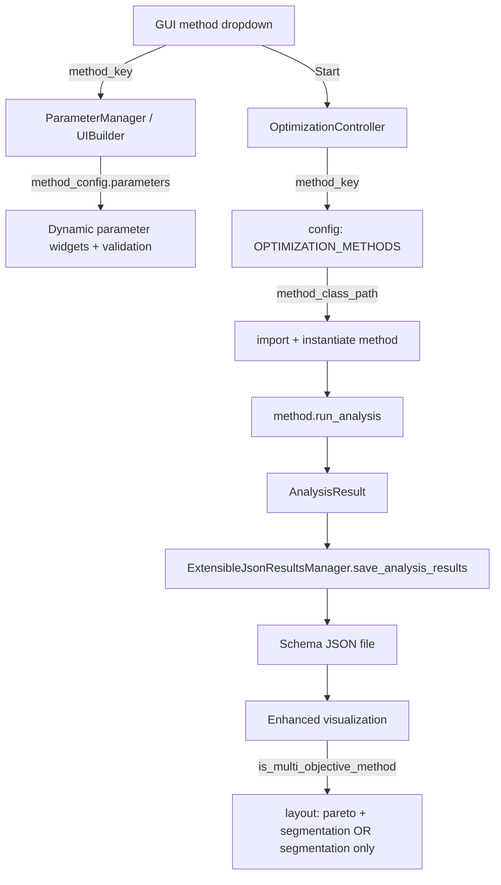
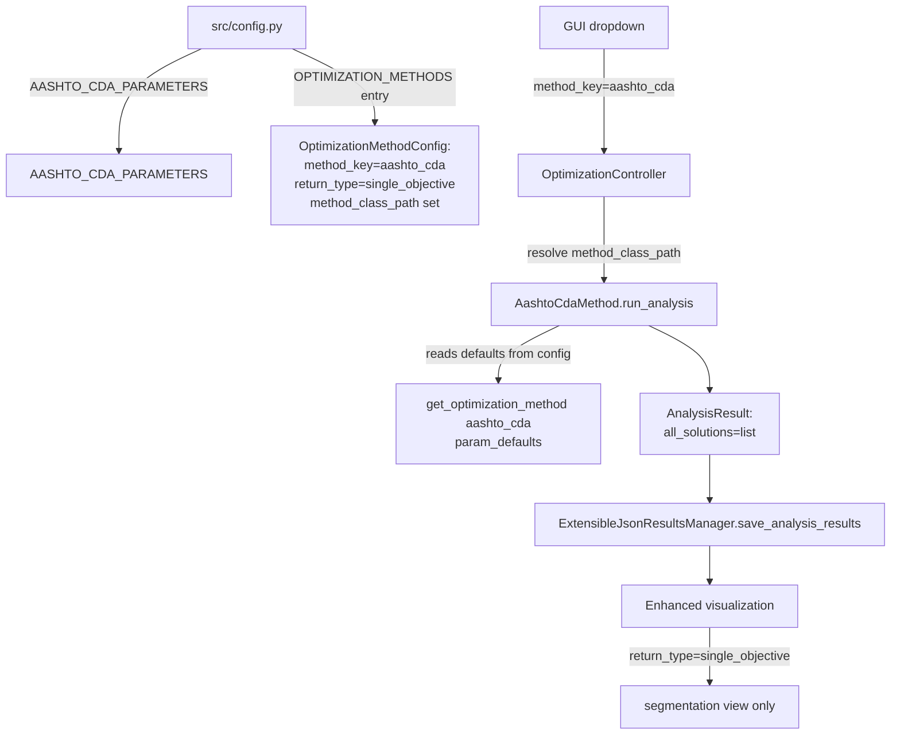

# Configuring a New Analysis Method (Extensible Architecture Guide)

Audience: Python developers extending the Highway Segmentation GA application.

This document is **not** about how your algorithm works internally. It is about **how to connect your algorithm to the system** so that:

- it appears in the GUI,
- its parameters are validated and rendered dynamically,
- it can run across single-route or multi-route datasets,
- it produces standardized outputs (`AnalysisResult`),
- it exports schema-compliant JSON, and
- it displays correctly in the enhanced visualization.

We use **AASHTO CDA** as the concrete example of a **single-objective (single-result) method**.

Section 6 includes the **multi-objective** example (showing Pareto outputs and multi-file utilities).

---

## 1) What this software does (purpose)

At its core, this application turns a stream of route data (an $x$ axis like milepoint and a measured $y$ value) into a **segmentation** of the route.

In practice that means each analysis method produces:

- A **list of breakpoint locations** (milepoints) that define the segment boundaries.
- (Optionally) per-segment statistics (length, mean value, etc.).

The whole point of the extensible architecture is that you can implement **your own breakpoint-selection method** (GA, NSGA-II, statistical CDA, ML, rules-based, etc.) and then register it so it appears in the GUI, runs under the controller, exports JSON, and visualizes correctly.

## 2) The extensible design (what is configurable?)

At a high level the application is split into:

1. **Method configuration (declarative)**
   - Defines what methods exist and what parameters they expose.
   - Lives primarily in `src/config.py` via `OPTIMIZATION_METHODS` and per-method parameter lists.

2. **Method implementation (imperative)**
   - The actual algorithm, implemented as a class deriving from `AnalysisMethodBase`.
   - Lives in `src/analysis/methods/<your_method>.py`.

3. **Controller dispatch (runtime wiring)**
    - Chooses which method to instantiate and run based on the GUI-selected `method_key`.
    - In the current architecture, this is **config-driven** via `OptimizationMethodConfig.method_class_path` (no per-method `elif` branches).
    - Lives in `src/optimization_controller.py` (dispatch) and `src/config.py` (registry + class resolver).

4. **Results export**
    - JSON schema output is written by `ExtensibleJsonResultsManager`.
    - Lives in `src/extensible_results_manager.py`.

5. **Visualization behavior**
   - Determines whether to show Pareto plots based on the configured `return_type`.
   - Lives in `src/enhanced_visualization.py`.

### 1.1 Runtime flow (mental model)

The diagram below is intentionally **generic**. When you add a method, it plugs into the same dispatch / results / export pipeline.



---

### 1.2 AASHTO CDA wiring (single-objective example)

This diagram focuses only on the **AASHTO CDA** method and the specific configuration points it uses.



---

## 3) The “extension points” you must touch

When you add a new method, the system expects you to provide **four** things:

1. A **unique `method_key`** string (internal identifier)
2. A **parameter list** (`List[ParameterDefinition]`) for dynamic UI + validation
3. A **method implementation** deriving from `AnalysisMethodBase` that returns an `AnalysisResult`
4. A **config registry entry** that points at your implementation via `method_class_path`

Note: with Option 2A, you do **not** add per-method branches in the controller.

---

### 3.1 Configuration reference (what you can configure)

This section lists the *available configuration knobs* in `src/config.py` that control method registration, parameter UI/validation, and (for multi-objective) Pareto plotting.

#### `OptimizationMethodConfig` (method registry entry)

Each method registered in `OPTIMIZATION_METHODS` is an `OptimizationMethodConfig`:

- `method_key` (str): Internal identifier. This is what the GUI/controller store and what JSON export persists as the analysis method.
- `display_name` (str): User-facing name shown in the dropdown.
- `description` (str): Help/tooltip text shown in the UI.
- `runner_function` (str): Name of a runner function. Note: retained for backward compatibility/documentation, but the controller does not use it for dispatch.
- `method_class_path` (optional str): Importable Python path to the analysis method class (example: `"analysis.methods.aashto_cda.AashtoCdaMethod"`). This is the **preferred dispatch mechanism** (Option 2A).
- `parameters` (`List[ParameterDefinition]`): The complete list of method-specific parameters.
  - This drives both dynamic UI creation and validation.
- `return_type` (str): Controls high-level behavior.
  - Supported values in this repo: `"single_objective"` and `"multi_objective"`.
- `objective_names` / `objective_descriptions` (optional): Backwards-compatible objective metadata.
  - Note: These fields exist in config but are not currently consumed by the enhanced visualization.
- `objective_plot_configs` (optional): The preferred, per-objective plotting configuration for multi-objective methods.

#### `ParameterDefinition` and parameter types (method parameters)

All method parameters are declared using `ParameterDefinition` subclasses. Common fields across all parameter types:

- `name` (str): Key used in parameter dicts and passed into methods (e.g., `"alpha"`, `"population_size"`).
- `display_name` (str): UI label text.
- `description` (str): Help text.
- `group` (str): Logical group name used to organize dynamic UI sections.
- `order` (int): Sort order within a group.
- `default_value` (Any): Default used for UI initialization and fallback.
- `required` (bool): Whether the parameter must be present.

Parameter types available in `src/config.py`:

- `NumericParameter`
  - Additional fields: `min_value`, `max_value`, `decimal_places`, `widget_width`.
  - Validation behavior:
    - Enforces bounds if `min_value`/`max_value` are set.
    - If `decimal_places == 0`, the value must be an integer.
- `OptionalNumericParameter`
  - Like `NumericParameter`, but also accepts `None`.
  - Additional fields: `none_text` (what the UI shows for `None`).
  - Validation behavior:
    - `None` is always valid.
    - Otherwise, bounds and integer-ness rules apply.
- `SelectParameter`
  - Additional field: `options: List[Tuple[str, Any]]` where each tuple is `(display_text, value)`.
  - Validation behavior:
    - The value must match one of the `value` entries in `options`.
- `BoolParameter`
  - Checkbox-style boolean parameter.
  - Validation behavior:
    - Must be a Python `bool`.
- `TextParameter`
  - String parameter.
  - Additional fields include `min_length`, `max_length`, `allowed_chars` (regex), `multiline`.

#### `ObjectivePlotConfig` (multi-objective plotting)

For multi-objective methods, `objective_plot_configs` can define how each objective is displayed in the Pareto plot.

Fields:

- `name` (str): Axis label.
- `description` (str): Intended for tooltips/help.
- `transform` (optional str): Transformation to apply before plotting.
  - Implemented in the current enhanced visualization:
    - `"negate"` only.
  - Behavior for `transform="negate"`:
    - Values are multiplied by `-1` before plotting.
    - This is used for the NSGA-II method where deviation is stored as a negative number (GA maximizes a negative value to minimize deviation).
- `reverse_scale` (bool): Defined in config, but not currently used by the enhanced visualization.

Concrete implementation detail (current behavior): the enhanced visualization checks `transform == 'negate'` and negates the objective values before plotting.

## 4) Step-by-step: AASHTO CDA as a single-objective method

### Step 0 — Choose your `method_key` and `return_type`

Your `method_key` is used everywhere:

- GUI selection stores a method key
- JSON export writes `analysis_metadata.analysis_method = method_key`
- visualization checks whether a method is multi-objective

AASHTO CDA uses:

- `method_key = "aashto_cda"`
- `return_type = "single_objective"`

You can see this in `src/config.py` in the `OPTIMIZATION_METHODS` registry:

```python
# src/config.py
OptimizationMethodConfig(
    method_key="aashto_cda",
    display_name="AASHTO CDA Statistical Analysis",
    description="Enhanced AASHTO Cumulative Difference Approach for deterministic statistical change point detection. Fast, statistically-justified segmentation without evolutionary computation.",
    runner_function="run_aashto_cda",
    parameters=AASHTO_CDA_PARAMETERS,
    return_type="single_objective",  # Shows segmentation graph only
    method_class_path="analysis.methods.aashto_cda.AashtoCdaMethod",
)
```

Notes:

- The controller resolves and imports the configured `method_class_path`.
- `return_type` is crucial for visualization behavior (e.g., whether a Pareto panel is shown).

---

### Step 1 — Define your method parameters (dynamic UI + validation)

Parameters are defined as `ParameterDefinition` instances in `src/config.py`. AASHTO CDA provides a concrete pattern for a non-GA deterministic method.

AASHTO CDA parameter list:

```python
# src/config.py
AASHTO_CDA_PARAMETERS = [
    NumericParameter(
        name="alpha", display_name="Significance Level",
        description="Statistical significance level for change point detection (lower = more conservative)",
        group="statistical_analysis", order=1, default_value=0.05,
        min_value=0.001, max_value=0.49, decimal_places=3
    ),
    SelectParameter(
        name="method", display_name="Error Estimation Method",
        description="Method for estimating standard deviation of measurement error",
        group="statistical_analysis", order=2, default_value=2,
        options=[
            ("MAD with Normal Distribution", 1),
            ("Std Dev of Differences (Recommended)", 2),
            ("Std Dev of Measurements", 3)
        ]
    ),
    BoolParameter(
        name="use_segment_length", display_name="Use Segment-Specific Length",
        description="Use individual segment lengths (recommended) vs. total data length in statistical calculations",
        group="statistical_analysis", order=3, default_value=True
    ),
    NumericParameter(
        name="min_segment_datapoints", display_name="Min Segment Datapoints",
        description="Minimum number of datapoints required per segment",
        group="segment_constraints", order=1, default_value=3,
        min_value=3, max_value=1000, decimal_places=0
    ),
    OptionalNumericParameter(
        name="max_segments", display_name="Max Segments",
        description="Maximum number of segments allowed (None=no limit, algorithm may find fewer)",
        group="segment_constraints", order=2, default_value=None,
        min_value=2, max_value=10000, decimal_places=0
    ),
    NumericParameter(
        name="min_section_difference", display_name="Min Section Difference",
        description="Minimum difference in average values between adjacent segments (0=disabled)",
        group="segment_constraints", order=3, default_value=0.0,
        min_value=0.0, max_value=10.0, decimal_places=3
    ),
    BoolParameter(
        name="enable_diagnostic_output", display_name="Diagnostic Output",
        description="Enable detailed diagnostic information during processing",
        group="processing", order=1, default_value=False
    )
]
```

Parameter meaning (AASHTO CDA):

- `alpha` (`NumericParameter`): Significance level for change-point detection.
  - Lower values are more conservative (fewer change points).
- `method` (`SelectParameter`): Error estimation method.
  - Options map display text to numeric codes (1/2/3).
- `use_segment_length` (`BoolParameter`): Controls whether the CDA statistical calculations use segment-specific length vs. total length.
- `min_segment_datapoints` (`NumericParameter`, integer): Minimum required datapoints per segment (enforced in the CDA method implementation).
- `max_segments` (`OptionalNumericParameter`): Optional upper bound on number of segments.
  - If `None`, the algorithm has no configured hard cap.
- `min_section_difference` (`NumericParameter`): Minimum difference between adjacent segment means (0 disables this filter).
- `enable_diagnostic_output` (`BoolParameter`): Enables additional diagnostic printing (primarily for debugging).

What this configuration buys you:

- GUI can render parameter widgets dynamically (grouped + ordered)
- validation is declarative (`param_def.validate_value(...)`)
- methods can obtain defaults from config consistently (single source of truth)

Where it is used:

- `src/parameter_manager.py` validates parameters by iterating `method_config.parameters`
- `src/ui_builder.py` creates parameter widgets dynamically from the same list

Example (validation loop):

```python
# src/parameter_manager.py
method_config = get_optimization_method(method_key)
params = self.get_optimization_parameters()

for param_def in method_config.parameters:
    if param_def.name not in params:
        if getattr(param_def, 'required', True):
            errors.append(f"Missing required parameter: {param_def.display_name}")
        continue

    ok, msg = param_def.validate_value(params.get(param_def.name))
    if not ok and msg:
        errors.append(msg)
```

---

### Step 2 — Register your method in the config registry

To make the method appear in the GUI dropdown and be recognized system-wide, you must add an entry to `OPTIMIZATION_METHODS`.

AASHTO CDA’s entry (abridged):

```python
# src/config.py
OPTIMIZATION_METHODS = [
    # ... other methods ...
    OptimizationMethodConfig(
        method_key="aashto_cda",
        display_name="AASHTO CDA Statistical Analysis",
        description="...",
        runner_function="run_aashto_cda",
        parameters=AASHTO_CDA_PARAMETERS,
        return_type="single_objective",
        method_class_path="analysis.methods.aashto_cda.AashtoCdaMethod"
    )
]
```

Important fields:

- `method_key`: must be unique
- `display_name`: what the user sees in the dropdown
- `parameters`: drives UI + validation
- `return_type`: drives visualization behavior
- `method_class_path`: tells the controller what class to import and run

---

### Step 3 — Implement the method (derive from `AnalysisMethodBase`)

All methods should implement:

- `method_name` property
- `method_key` property
- `run_analysis(...)` that returns an `AnalysisResult`

AASHTO CDA defines a method class in `src/analysis/methods/aashto_cda.py`:

```python
# src/analysis/methods/aashto_cda.py
class AashtoCdaMethod(AnalysisMethodBase):
    @property
    def method_name(self) -> str:
        return "AASHTO CDA Statistical Analysis"

    @property
    def method_key(self) -> str:
        return "aashto_cda"

    def run_analysis(self,
                    data,  # RouteAnalysis object (primary) or DataFrame (fallback)
                    route_id: str,
                    x_column: str,
                    y_column: str,
                    gap_threshold: float,
                    **kwargs) -> AnalysisResult:
        # ... implementation ...
        return AnalysisResult(...)
```

#### 3.1 Pull parameter defaults from config (single source of truth)

AASHTO CDA intentionally **does not hardcode literals** for defaults; it reads defaults from `config.py`:

```python
# src/analysis/methods/aashto_cda.py
method_config = get_optimization_method('aashto_cda')
param_defaults = {param.name: param.default_value for param in method_config.parameters}

alpha = kwargs.get('alpha', param_defaults['alpha'])
method = kwargs.get('method', param_defaults['method'])
use_segment_length = kwargs.get('use_segment_length', param_defaults['use_segment_length'])
```

This pattern is recommended for new methods.

#### 3.2 Return results in the unified `AnalysisResult` format

Your method must return an `AnalysisResult` such that:

- `method_key` matches your registry entry
- `all_solutions` is always a list
  - for single-objective: `[best_solution]`
  - for multi-objective: `[{...}, {...}, ...]` (Pareto front)

AASHTO CDA returns a deterministic single result:

```python
# src/analysis/methods/aashto_cda.py
return AnalysisResult(
    method_name=self.method_name,
    method_key=self.method_key,
    route_id=route_id,
    all_solutions=[{
        'chromosome': all_breakpoints.tolist(),
        'fitness': 0.0,
        'avg_segment_length': ...,
        'num_segments': len(segment_stats)
    }],
    mandatory_breakpoints=list(mandatory_breakpoints),
    optimization_stats=diagnostics,
    input_parameters={
        'alpha': alpha,
        'method': method,
        'use_segment_length': use_segment_length,
        'min_segment_datapoints': min_segment_datapoints,
        'max_segments': max_segments,
        'min_section_difference': min_section_difference,
        'gap_threshold': gap_threshold
    },
    data_summary={...}
)
```

Practical guidance for new methods:

- Required output contract: each solution must include breakpoint locations in `'chromosome'` (sorted list of milepoints including start and end).
- Optional: include per-segment records/stats if your method already computes them (useful for export and downstream reporting).
- Always include `input_parameters` for traceability.

---

### Step 4 — No controller wiring required (Option 2A)

With Option 2A enabled, you do **not** add per-method branches to `src/optimization_controller.py`.

Instead:

- You add `method_class_path="analysis.methods.your_method.YourMethod"` in `OPTIMIZATION_METHODS`.
- The controller imports and instantiates that class at runtime.

The established calling convention remains the same:

- The framework passes `(data, route_id, x_column, y_column, gap_threshold)` positionally.
- Everything else flows through `**kwargs`.

Implementation detail (current behavior): the application validates all configured `method_class_path` values at startup (see `validate_optimization_method_registry()` in `src/config.py`, called from `src/gui_main.py`).

---

### Step 5 — Ensure visualization behavior matches your return type

The enhanced visualization decides whether to show the Pareto panel using the configured method return type:

```python
# src/enhanced_visualization.py
analysis_method = self.json_results.get('analysis_metadata', {}).get('analysis_method', 'single')
from config import is_multi_objective_method
self.is_multi_objective = is_multi_objective_method(analysis_method)
```

So for new methods:

- if your method is single-result: set `return_type="single_objective"`
- if your method returns a Pareto front: set `return_type="multi_objective"`

---

## 5) Checklist: adding your own new single-objective method

Use this checklist when you build your own method (not CDA):

1. **Config**: add `YOUR_METHOD_PARAMETERS` in `src/config.py`
2. **Config**: add `OptimizationMethodConfig(method_key="your_key", ..., return_type="single_objective", method_class_path="analysis.methods.your_method.YourMethod")`
3. **Implementation**: create `src/analysis/methods/your_method.py` implementing `AnalysisMethodBase`
4. **Startup check**: run the app (or tests) to confirm registry validation passes (bad import paths fail fast with a clear error)

---

## 6) Multi-objective example (NSGA-II)

This section shows how the existing **multi-objective** method is wired and how it differs from the single-objective CDA example.

The core differences are:

- The method is configured as `return_type="multi_objective"`.
- The method returns **multiple solutions** (a Pareto front) in `AnalysisResult.all_solutions`.
- The visualization shows a **Pareto panel** in addition to the segmentation view.

### 6.1 Configuration: return type + objective plot semantics

The method is registered in `src/config.py` as:

```python
# src/config.py
OptimizationMethodConfig(
    method_key="multi",
    display_name="Multi-Objective NSGA-II",
    description="Pareto front optimization exploring trade-offs between total deviation and average segment length. Multiple optimal solutions.",
    runner_function="run_nsga2",
    parameters=MULTI_OBJECTIVE_NSGA2_PARAMETERS,
    return_type="multi_objective",  # Shows pareto front + segmentation graph
    method_class_path="analysis.methods.multi_objective.MultiObjectiveMethod",
    objective_names=["Total Deviation", "Average Segment Length"],
    objective_descriptions=[
        "Total deviation from target values (algorithm maximizes negative deviation for minimization)",
        "Average length of highway segments (algorithm maximizes positive length)"
    ],
    objective_plot_configs=[
        ObjectivePlotConfig(
            name="Total Deviation",
            description="Total deviation - convert negative GA value to positive for minimization display",
            transform="negate"
        ),
        ObjectivePlotConfig(
            name="Average Segment Length",
            description="Average segment length - use positive GA value directly for maximization display"
        )
    ]
)
```

Key takeaway:

- The method returns raw GA objective values (including negative deviation), and the **configuration** provides the plotting/interpretation transforms.

What `transform="negate"` means (current implementation):

- In the enhanced visualization (`update_pareto_graph`), if an objective config has `transform == 'negate'`, the plotted values are negated before display.
- This lets the GA store “minimize deviation” as “maximize negative deviation” internally, while still showing a positive deviation axis to the user.
- Today, `"negate"` is the only transform implemented in the visualization.

### 6.2 Dispatch behavior (config-driven)

For multi-objective methods, the controller still invokes `run_analysis(...)` the same way, but it selects the implementation class via `method_class_path`.

What matters for adding your own multi-objective method:

- Keep the same `run_analysis(data, route_id, x_column, y_column, gap_threshold, **kwargs)` calling convention.
- Put the **full Pareto set** in `AnalysisResult.all_solutions`.
- In config, set `return_type="multi_objective"` so the visualization shows the Pareto panel.

### 6.3 Method implementation: building a Pareto front into `AnalysisResult.all_solutions`

The method itself lives in `src/analysis/methods/multi_objective.py` and builds a list of solution dictionaries from the final Pareto front indices:

```python
# src/analysis/methods/multi_objective.py
final_fronts, final_fitness_values = ga.fast_non_dominated_sort(population)
pareto_front_indices = final_fronts[0] if final_fronts else []

all_solutions = []
for idx in pareto_front_indices:
    chromosome = population[idx]
    negative_deviation, avg_segment_length = final_fitness_values[idx]

    solution_info = {
        'chromosome': chromosome,
        'fitness': [negative_deviation, avg_segment_length],
        'objective_values': [negative_deviation, avg_segment_length],
        'deviation_fitness': negative_deviation,
        'segment_fitness': avg_segment_length,
        'num_segments': segment_count,
        'avg_segment_length': calculated_avg_length,
        'segment_lengths': segments
    }
    all_solutions.append(solution_info)

return AnalysisResult(
    method_name=self.method_name,
    method_key=self.method_key,
    route_id=route_id,
    all_solutions=all_solutions,
    optimization_stats=optimization_stats,
    mandatory_breakpoints=sorted(list(ga.mandatory_breakpoints)),
    processing_time=time.time() - start_time,
    input_parameters=input_parameters,
    data_summary=data_summary
)
```

Recommended pattern for your own multi-objective method:

- Put the objective vector in both `fitness` and `objective_values` as a list in a consistent order.
- Put any “human-meaningful” derived metrics (like segment count, average segment length) as separate scalar fields.

### 6.4 Multi-file utilities: where shared GA logic lives

Multi-objective methods in this repo deliberately call into shared utility modules rather than re-implementing operators.

#### Shared operators and NSGA-II helpers

`src/analysis/utils/ga_utilities.py` contains reusable functions used by `MultiObjectiveMethod`:

```python
# src/analysis/methods/multi_objective.py
from ..utils.ga_utilities import (
    nsga2_tournament_selection, fast_non_dominated_sort, calculate_crowding_distance,
    crossover_with_retries, mutation_with_retries, analyze_population_diversity
)
```

Those utilities implement common pieces like:

- NSGA-II tournament selection (`nsga2_tournament_selection`)
- Retry-based operators (`crossover_with_retries`, `mutation_with_retries`)

#### The core GA engine

The heavy lifting (data prep, constraints, caching, and fitness evaluation) lives in `src/analysis/utils/genetic_algorithm.py` as `HighwaySegmentGA`.

`MultiObjectiveMethod` uses it directly:

```python
# src/analysis/methods/multi_objective.py
from analysis.utils.genetic_algorithm import HighwaySegmentGA

ga = HighwaySegmentGA(
    actual_data, x_column, y_column,
    min_length=min_length, max_length=max_length,
    population_size=population_size,
    crossover_rate=crossover_rate,
    mutation_rate=mutation_rate,
    gap_threshold=gap_threshold,
)
```

How to apply this pattern to your own new method:

- Put any reusable operators/statistics in `src/analysis/utils/<something>.py`.
- Keep `src/analysis/methods/<your_method>.py` focused on orchestration and producing a correct `AnalysisResult`.
