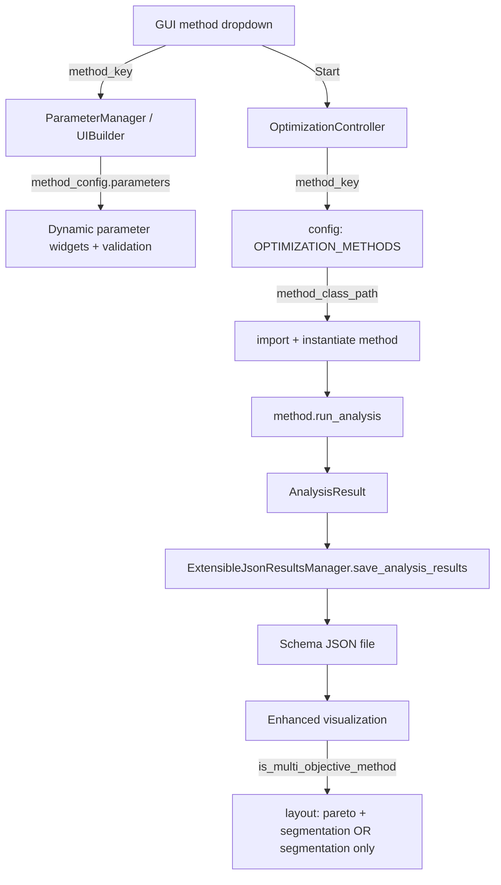
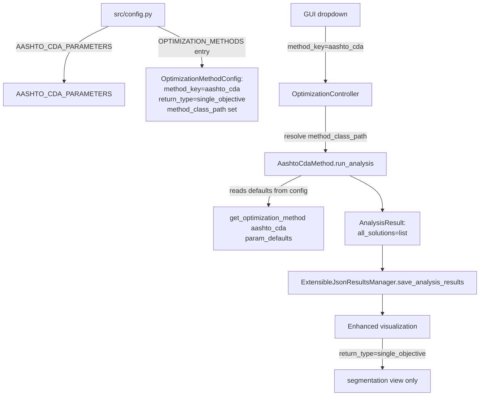

# Configuring a New Analysis Method (Extensible Architecture Guide)

Audience: Python developers extending the Highway Segmentation Tool application.

This document describes **how to connect a new analysis method to the system** so that:

- it appears in the GUI,
- its parameters are validated and rendered dynamically,
- it can run across single-route or multi-route datasets,
- it produces standardized outputs (`AnalysisResult`),
- it exports schema-compliant JSON, and
- it displays correctly in the enhanced visualization.

We use **AASHTO CDA** as the concrete example of a **single-objective (single-result) method**.

We also include an example of a **constrained GA variant** implemented as a *new method* (Deb feasibility rules) to illustrate how to explore alternative algorithms without disrupting existing methods.

Section 6 includes the **multi-objective** example (showing Pareto outputs and multi-file utilities).

---

## 1) Method inputs and outputs

Each analysis method consumes route data and produces a segmentation.

In practice, each analysis method produces:

- A **list of breakpoint locations** (milepoints) that define the segment boundaries.
- (Optionally) per-segment statistics (length, mean value, etc.).

You can implement **your own breakpoint-selection method** (GA, NSGA-II, statistical CDA, ML, rules-based, etc.) and register it so it appears in the GUI, runs under the controller, exports JSON, and visualizes correctly.

### 1.1 Where analysis methods fit in the processing chain

Analysis methods operate on **preprocessed, segmented route data** and produce optimal breakpoint locations. Understanding where they fit in the overall pipeline helps clarify what inputs they receive and what preprocessing has already occurred.

```text
┌───────────────────────────────────────────────────────────────────────┐
│ 1. DATA LOADING                                                       │
│    - Load CSV/Excel file                                              │
│    - Convert columns, filter invalid values                           │
└────────────────────┬──────────────────────────────────────────────────┘
                     │
                     ▼
┌───────────────────────────────────────────────────────────────────────┐
│ 2. ROUTE FILTERING                                                    │
│    - filter_data_by_route()                                           │
│    - Separate data by route_column                                    │
└────────────────────┬──────────────────────────────────────────────────┘
                     │
                     ▼
        ╔═══════════════════════════════════════════════════════════╗
        ║  FOR EACH ROUTE (per-route processing):                   ║
        ╚═══════════════════════════════════════════════════════════╝
                     │
                     ▼
┌───────────────────────────────────────────────────────────────────────┐
│ 3. PRE-GAP PREPROCESSING (optional)                                   │
│    Phase: "pre_gap"                                                   │
│    Configuration: preprocessing.pre_gap_method                        │
│    - Applied to raw route data before gap analysis                    │
│    - Rare use case: data cleaning, interpolation preparation          │
└────────────────────┬──────────────────────────────────────────────────┘
                     │
                     ▼
┌───────────────────────────────────────────────────────────────────────┐
│ 4. GAP ANALYSIS                                                       │
│    - Detect data gaps using gap_threshold                             │
│    - Create mandatory breakpoints at gap boundaries                   │
│    - Identify valid_x_values (excluding gap interiors)                │
│    - Build initial RouteAnalysis object                               │
└────────────────────┬──────────────────────────────────────────────────┘
                     │
                     ▼
┌───────────────────────────────────────────────────────────────────────┐
│ 5. EARLY ATTRIBUTE BREAKS                                             │
│    Configuration: input.early_attribute_columns                       │
│    - Early set of attribute-based breakpoints                         │
│    - Examples: Pavement_Type, Functional_Class, Lanes                 │
│    - Creates mandatory breakpoints at attribute changes               │
│    - Used for per-segment preprocessing statistics                    │
└────────────────────┬──────────────────────────────────────────────────┘
                     │
                     ▼
┌───────────────────────────────────────────────────────────────────────┐
│ 6. PRIMARY PREPROCESSING (optional)                                   │
│    Phase: "primary"                                                   │
│    Configuration: preprocessing.primary_method                        │
│    - Applied after gaps and early attribute breaks                    │
│    - Operates within segments defined by gaps + early attributes      │
│    - Example: Tukey Fences outlier detection/removal                  │
└────────────────────┬──────────────────────────────────────────────────┘
                     │
                     ▼
┌───────────────────────────────────────────────────────────────────────┐
│ 7. LATE ATTRIBUTE BREAKS                                              │
│    Configuration: input.late_attribute_columns                        │
│    - Late set of attribute-based breakpoints                          │
│    - Examples: County, District, Maintenance_Zone                     │
│    - Creates final mandatory segment boundaries                       │
└────────────────────┬──────────────────────────────────────────────────┘
                     │
                     ▼
┌───────────────────────────────────────────────────────────────────────┐
│ 8. SECONDARY PREPROCESSING / POSTPROCESSING (optional)                │
│    Phase: "secondary" (shown as "Postprocessing" in the UI)         │
│    Configuration: preprocessing.secondary_method                      │
│    - Applied after all attribute breaks                               │
│    - Final data preparation before analysis                           │
└────────────────────┬──────────────────────────────────────────────────┘
                     │
                     ▼
┌───────────────────────────────────────────────────────────────────────┐
│ 9. FINALIZE RouteAnalysis OBJECT                                      │
│    - route_data: DataFrame (preprocessed if enabled)                  │
│    - gap_segments, mandatory_breakpoints, valid_x_values              │
│    - preprocessing_results: List[PreprocessingResult] (if used)       │
└────────────────────┬──────────────────────────────────────────────────┘
                     │
                     ▼
╔═══════════════════════════════════════════════════════════════════════╗
║ 10. ANALYSIS METHOD EXECUTION ← YOUR NEW METHOD RUNS HERE             ║
║     - Receives finalized RouteAnalysis with preprocessed data         ║
║     - Receives mandatory_breakpoints (cannot place breakpoints here)  ║
║     - Receives valid_x_values (candidate breakpoint locations)        ║
║     - Produces optimal breakpoint locations                           ║
║     - Returns AnalysisResult with solutions                           ║
╚═══════════════════════════════════════════════════════════════════════╝
                     │
                     ▼
┌───────────────────────────────────────────────────────────────────────┐
│ 11. RESULTS & VISUALIZATION                                           │
│     - JSON export with complete metadata                              │
│     - Enhanced visualization with segmentation plot                   │
│     - Pareto plot (if multi-objective method)                         │
│     - Preprocessing overlay (if preprocessing was used)               │
└───────────────────────────────────────────────────────────────────────┘
```

**Key points for analysis method developers:**

- **Your method receives a `RouteAnalysis` object** that contains:
  - `route_data`: DataFrame with preprocessed data (if preprocessing was enabled)
  - `mandatory_breakpoints`: Set of x-values where breakpoints are required (gaps, route edges, attribute changes)
  - `valid_x_values`: List of all valid x-coordinates where breakpoints can be placed
  - `gap_segments`: List of data gaps (periods with no measurements)
  - `preprocessing_results`: List of preprocessing operations applied (if any)

- **Mandatory breakpoints are non-negotiable**: Your method must include these in any solution. They represent:
  - Gap boundaries (no data collection periods)
  - Route edges (start and end)
  - Early attribute change points (structural boundaries like pavement type changes)
  - Late attribute change points (administrative boundaries like county lines)

- **Understanding Early vs Late attribute breaks**:
  - **Early attribute breaks** (Step 3 in the UI) are applied **before primary preprocessing** to create segments based on **structural characteristics** like `Pavement_Type`, `Functional_Class`, or `Lanes`. These define the segments within which preprocessing operates, ensuring that outlier detection and data cleaning are performed separately for each structural type (preventing inappropriate statistical mixing across different pavement types, lane configurations, etc.).
  - **Late attribute breaks** (Step 5 in the UI) are applied **after primary preprocessing** to create **administrative boundaries** like `County`, `District`, or `Maintenance_Zone`. These define the final segment boundaries for analysis and reporting purposes, not for preprocessing statistics.
  - **Why this matters for your method**: The `mandatory_breakpoints` you receive include both types. Early breaks ensure data within each segment is statistically homogeneous (same structural characteristics), while late breaks ensure your segmentation respects administrative reporting boundaries. Your analysis method optimizes breakpoint placement within these constraints.

- **Data is already cleaned**: If preprocessing was configured, outliers may have been removed, values capped, or data smoothed. Your method works with the final processed data.

- **Analysis is per-route**: The framework calls your method once per route. Multi-route datasets are processed independently, then combined in results.

**Backward compatibility:** All preprocessing is optional. If no preprocessing is configured, your method receives the original data as in previous versions.

## 2) Files and configuration involved

The application is split into:

1. **Method configuration (declarative)**
   - Defines what methods exist and what parameters they expose.
   - Lives primarily in `src/config.py` via `OPTIMIZATION_METHODS` and per-method parameter lists.

2. **Method implementation (imperative)**
   - The actual algorithm, implemented as a class deriving from `AnalysisMethodBase`.
   - Lives in `src/analysis/methods/<your_method>.py`.

3. **Controller dispatch (runtime method selection)**
   - Chooses which method to instantiate and run based on the GUI-selected `method_key`.
   - Dispatch is **config-driven** via `OptimizationMethodConfig.method_class_path`.
   - Lives in `src/optimization_controller.py` (dispatch) and `src/config.py` (registry + class resolver).

        Notes on extensibility:
     - Method dispatch is already fully config-driven.
     - Any new `method_key` should be considered valid as long as it exists in `OPTIMIZATION_METHODS`.
         Avoid hard-coded method-key lists in UI logic.
     - After `run_analysis()` returns an `AnalysisResult`, the controller calls
         `analysis_result.to_route_result_dict()` to produce the flat result dict.
         **No controller code changes are needed for new methods** — all method-specific
         serialization is handled by `AnalysisResult.to_route_result_dict()` in `src/analysis/base.py`.

4. **Results export**
   - JSON schema output is written by `ExtensibleJsonResultsManager`.
   - Lives in `src/extensible_results_manager.py`.

5. **Visualization behavior**
   - Determines whether to show Pareto plots based on the configured `return_type`.
   - Lives in `src/visualization_ui.py`.

6. **Method documentation (optional but recommended)**
   - If you add a per-method README at `src/analysis/methods/docs/{method_key}/README.md`,
       the application Help dialog will automatically offer an “Open in Browser” option for that method.
     - The method list is configuration-driven from `OPTIMIZATION_METHODS` in `src/config.py` and filtered
         to methods with an existing README at the path above.

### 2.1 Runtime flow


```mermaid
flowchart TD
  GUI[GUI method dropdown] -->|method_key| PM[ParameterManager / UIBuilder]
  PM -->|method_config.parameters| UI[Dynamic parameter widgets + validation]

  GUI -->|Start| OC[OptimizationController]
    OC -->|method_key| CFG[config: OPTIMIZATION_METHODS]
    CFG -->|method_class_path| IMPORT[import + instantiate method]
    IMPORT --> CALL[method.run_analysis]
    CALL --> AR[AnalysisResult]

  AR --> J[ExtensibleJsonResultsManager.save_analysis_results]
  J --> JSON[Schema JSON file]

  JSON --> VIZ[Enhanced visualization]
    VIZ -->|is_multi_objective_method| LAYOUT[layout: pareto + segmentation OR segmentation only]
```

---

### 2.2 AASHTO CDA integration (single-objective example)

This diagram focuses on the **AASHTO CDA** method and the configuration points it uses.


```mermaid
flowchart TD
    CFG[src/config.py] -->|AASHTO_CDA_PARAMETERS| PARAMS[AASHTO_CDA_PARAMETERS]
    CFG -->|OPTIMIZATION_METHODS entry| REG[OptimizationMethodConfig:<br/>method_key=aashto_cda<br/>return_type=single_objective<br/>method_class_path set]

    GUI[GUI dropdown] -->|method_key=aashto_cda| OC[OptimizationController]
    OC -->|resolve method_class_path| CALL[AashtoCdaMethod.run_analysis]

    CALL -->|reads defaults from config| DEFAULTS[get_optimization_method aashto_cda<br/>param_defaults]
    CALL --> AR[AnalysisResult:<br/>all_solutions=list]

    AR --> JSON[ExtensibleJsonResultsManager.save_analysis_results]
    JSON --> VIZ[Enhanced visualization]
    VIZ -->|return_type=single_objective| LAYOUT[segmentation view only]
```

---

## 3) Extension points

When you add a new method, the system expects you to provide **four** things:

1. A **unique `method_key`** string (internal identifier)
2. A **parameter list** (`List[ParameterDefinition]`) for dynamic UI + validation
3. A **method implementation** deriving from `AnalysisMethodBase` that returns an `AnalysisResult`
4. A **config registry entry** that points at your implementation via `method_class_path`

The controller dispatches methods by importing the class specified by `OptimizationMethodConfig.method_class_path`.

Method registry entries are validated at app startup via `validate_optimization_method_registry()` (called from `src/gui_main.py`).

---

## 3.2 Example: adding a constrained GA variant (Deb feasibility rules)

This repo already contains a penalty-based constrained method (`method_key="constrained"`).
To explore alternative constraint-handling strategies without changing the existing method, add a second method with its own `method_key` and implementation file.

Deb feasibility rules (constraint domination) compare two candidates as:

1. Feasible dominates infeasible
2. If both feasible: compare objective only (base fitness)
3. If both infeasible: smaller constraint violation dominates (tie-break by objective)

In this repo, the Deb-feasibility constrained GA is implemented as:

- Implementation: `src/analysis/methods/deb_feasibility_constrained.py`
- Method key: `constrained_deb`
- Config registration:
  - Parameter list: `DEB_FEASIBILITY_CONSTRAINED_PARAMETERS` in `src/config.py`
  - Registry entry: `OptimizationMethodConfig(method_key="constrained_deb", ... method_class_path="analysis.methods.deb_feasibility_constrained.DebFeasibilityConstrainedMethod")`

Design goals for this example:

- Additive-only (no behavior changes to existing methods)
- Reuse `analysis/utils` GA utilities
- Avoid penalty-weight tuning by using explicit feasibility comparisons

If you add additional method keys beyond the original set, ensure the GUI settings migration treats any registry method key as valid.
See the method-key migration helper in `src/gui_main.py`.

### 3.1 Configuration reference (what you can configure)

This section lists the *available configuration knobs* in `src/config.py` that control method registration, parameter UI/validation, and (for multi-objective) Pareto plotting.

#### `OptimizationMethodConfig` (method registry entry)

Each method registered in `OPTIMIZATION_METHODS` is an `OptimizationMethodConfig`:

- `method_key` (str): Internal identifier. This is what the GUI/controller store and what JSON export persists as the analysis method.
- `display_name` (str): User-facing name shown in the dropdown.
- `description` (str): Help/tooltip text shown in the UI.
- `method_class_path` (str): Importable Python path to the analysis method class (example: `"analysis.methods.aashto_cda.AashtoCdaMethod"`). Used for dispatch.
- `parameters` (`List[ParameterDefinition]`): The complete list of method-specific parameters.
  - This drives both dynamic UI creation and validation.
- `return_type` (str): Controls high-level behavior.
  - Supported values in this repo: `"single_objective"` and `"multi_objective"`.
- `objective_names` / `objective_descriptions` (optional): Objective metadata.
  - These fields exist in config but are not currently consumed by the enhanced visualization.
- `objective_plot_configs` (optional): The preferred, per-objective plotting configuration for multi-objective methods (see `ObjectivePlotConfig` below).

#### `ParameterDefinition` and parameter types (method parameters)

Design note (core extensibility principle):

- Parameter definitions are intended to be primarily **declarative** (name, defaults, validation rules, UI grouping).
- The GUI renders and edits parameters dynamically using `UIBuilder`/`ParameterManager` based on the parameter list.
- The `config.py` module is kept safe to import in non-GUI contexts (tests/headless) by avoiding importing `tkinter` at import time. Any widget helper methods on parameter definitions perform `tkinter` imports lazily when called.

All method parameters are declared using `ParameterDefinition` subclasses. Common fields across all parameter types:

- `name` (str): Key used in parameter dicts and passed into methods (e.g., `"alpha"`, `"population_size"`).
- `display_name` (str): UI label text.
- `description` (str): Help text.
- `group` (str): Logical group name used to organize dynamic UI sections.
- `order` (int): Sort order within a group.
- `default_value` (Any): Default used for UI initialization and fallback.
- `required` (bool): Whether the parameter must be present.

Parameter types available in `src/config.py`:

### Quick Reference: Parameter Types

| Type | Purpose | Key Fields | Accepts None? | Common Use Cases |
| ---- | ------- | ---------- | ------------- | ---------------- |
| `NumericParameter` | Numeric input with bounds | `min_value`, `max_value`, `decimal_places` | No | Population sizes, thresholds, rates, iteration counts |
| `OptionalNumericParameter` | Optional numeric input | Same as above + `none_text` | Yes | Optional limits (max segments, timeouts, caps) |
| `SelectParameter` | Dropdown selection | `options` (list of tuples) | No | Algorithm variants, enum-style choices, modes |
| `ColumnSelectParameter` | CSV column selector | None (dynamic from data) | No | Additional data columns (weights, classifications) |
| `BoolParameter` | Boolean checkbox | None | No | Feature toggles, diagnostic flags, processing options |
| `TextParameter` | Text input (single/multi-line) | `min_length`, `max_length`, `allowed_chars`, `multiline` | No | Labels, identifiers, notes, custom metadata |

---

- `NumericParameter`
  - Additional fields: `min_value`, `max_value`, `decimal_places`, `widget_width`.
  - Validation behavior:
    - Enforces bounds if `min_value`/`max_value` are set.
    - If `decimal_places == 0`, the value must be an integer.
  - **Example:**

    ```python
    NumericParameter(
        name="threshold",
        display_name="Detection Threshold",
        description="Sensitivity for change detection (0.0-1.0)",
        group="detection",
        order=1,
        default_value=0.5,
        min_value=0.0,
        max_value=1.0,
        decimal_places=2
    )
    ```

- `OptionalNumericParameter`
  - Like `NumericParameter`, but also accepts `None`.
  - Additional fields: `none_text` (what the UI shows for `None`).
  - Validation behavior:
    - `None` is always valid.
    - Otherwise, bounds and integer-ness rules apply.
  - **Example:**

    ```python
    OptionalNumericParameter(
        name="max_segments",
        display_name="Max Segments",
        description="Maximum number of segments (None=unlimited)",
        group="constraints",
        order=2,
        default_value=None,
        min_value=2,
        max_value=100,
        decimal_places=0,
        none_text="No Limit"
    )
    ```

- `SelectParameter`
  - Additional field: `options: List[Tuple[str, Any]]` where each tuple is `(display_text, value)`.
  - Validation behavior:
    - The value must match one of the `value` entries in `options`.
  - **Example:**

    ```python
    SelectParameter(
        name="error_method",
        display_name="Error Estimation Method",
        description="Statistical method for estimating error",
        group="statistical",
        order=1,
        default_value="mad",
        options=[
            ("Median Absolute Deviation", "mad"),
            ("Standard Deviation", "std"),
            ("Interquartile Range", "iqr")
        ]
    )
    ```

- `ColumnSelectParameter`
  - Use when a method needs the user to pick an additional input column (beyond `route`, `x`, and `y`).
  - Stored value is the selected column *header name* (string), not the data.
  - UI behavior:
    - The widget is rendered as a dropdown populated from the currently loaded CSV headers (same source as the X/Y dropdowns).
    - If the user loads a different file, the available header list changes accordingly.
  - Validation behavior:
    - Basic required/non-empty validation is declarative.
    - When CSV headers are available, the app additionally validates that the selected name exists in the loaded file.
    - Any deeper validation (numeric vs categorical, missing values, domain rules) should be performed by the method implementation.
  - **Example:**

    ```python
    ColumnSelectParameter(
        name="weight_column",
        display_name="Weight Column",
        description="Column containing segment weights (optional)",
        group="data_columns",
        order=3,
        default_value="",
        required=False
    )
    ```

- `BoolParameter`
  - Checkbox-style boolean parameter.
  - Validation behavior:
    - Must be a Python `bool`.
  - **Example:**

    ```python
    BoolParameter(
        name="enable_diagnostics",
        display_name="Enable Diagnostic Output",
        description="Show detailed processing information",
        group="processing",
        order=10,
        default_value=False
    )
    ```

- `TextParameter`
  - String parameter for text input (single-line or multi-line).
  - Additional fields: `min_length`, `max_length`, `allowed_chars` (regex pattern), `multiline`, `placeholder`.
  - Validation behavior:
    - If `required=True`, validates non-empty after stripping whitespace.
    - If `min_length` is set, validates string length is >= `min_length`.
    - If `max_length` is set, validates string length is <= `max_length`.
    - If `allowed_chars` is set (regex pattern string), validates the entire string matches the pattern.
  - UI behavior:
    - Renders as single-line `Entry` widget if `multiline=False` (default).
    - Renders as multi-line `Text` widget if `multiline=True`.
    - Displays `placeholder` text when empty (if provided).
  - **Example use cases:**
    - Custom identifiers or labels that must follow naming conventions (`allowed_chars`)
    - Comments or descriptions requiring multiple lines (`multiline=True`)
    - Analysis notes or metadata fields
  - **Example:**

    ```python
    TextParameter(
        name="analysis_label",
        display_name="Analysis Label",
        description="Custom identifier for this analysis run (alphanumeric, underscore, hyphen only)",
        group="metadata",
        order=1,
        default_value="baseline_analysis",
        min_length=3,
        max_length=50,
        allowed_chars=r"^[A-Za-z0-9_-]+$",
        placeholder="e.g., sensitivity_test_01"
    )
    ```

### 3.1.1 Selecting additional columns (beyond X/Y)

Most methods only need `x_column` and `y_column`, but some methods may require additional input columns (e.g., weights, grouping keys, lane counts, classifications).

Recommended pattern:

1. Declare a `ColumnSelectParameter` in your method's parameter list (in `src/config.py`).
2. The user selects a column header from the loaded CSV.
3. Your method receives the selected header string via `**kwargs`.
4. Your method reads the data from the provided `RouteAnalysis.route_data` DataFrame.

Example (conceptual):

- Config parameter name: `weight_column`
- Method code:
  - `weight_column = kwargs.get("weight_column")`
  - `weights = route_analysis.route_data[weight_column]`

This keeps configuration ("which column") separate from data (the DataFrame already passed into the method).

**Deeper validation example** (in your method implementation):

```python
import pandas as pd

# In your method's run_analysis():
weight_column = kwargs.get("weight_column")

if weight_column:
    # Column existence is already validated by the framework
    weights = route_analysis.route_data[weight_column]
    
    # Validate the column contains numeric data
    if not pd.api.types.is_numeric_dtype(weights):
        raise ValueError(
            f"Weight column '{weight_column}' must contain numeric data, "
            f"but has dtype: {weights.dtype}"
        )
    
    # Check for missing values
    if weights.isna().any():
        missing_count = weights.isna().sum()
        raise ValueError(
            f"Weight column '{weight_column}' contains {missing_count} missing values. "
            f"Please clean the data or choose a different column."
        )
    
    # Domain-specific validation (example: weights must be positive)
    if (weights < 0).any():
        raise ValueError(
            f"Weight column '{weight_column}' contains negative values. "
            f"Weights must be non-negative."
        )
    
    # Use the validated weights in your algorithm
    # ...
else:
    # Handle case where no weight column was specified (if optional)
    weights = None
```

### 3.1.2 Framework-level must-break columns (attribute-driven mandatory breakpoints)

Separately from *method parameters*, the application supports a framework-level setting that forces mandatory breakpoints whenever selected attribute values change.

- **Concept**: `must_break_columns` is a list of input column headers (strings).
- **Behavior**: when the value in any of these columns changes along the x-axis, the framework inserts a **mandatory breakpoint** (the analysis cannot span across that change).
- **Where it is configured**:
  - **GUI**: the user selects Must-Break Columns in the main app.
  - **CLI run spec**: `input.must_break_columns` (optional array of strings).
- **Where it appears in results JSON** (when set):
  - `input_parameters.route_processing.must_break_columns` (only present when configured)
  - `route_results[*].input_data_analysis.attribute_break_analysis` (per-route analysis/diagnostics)

**Example output** (when `must_break_columns=["LANE_COUNT", "SURFACE_TYPE"]` is configured):

```json
{
  "input_parameters": {
    "route_processing": {
      "must_break_columns": ["LANE_COUNT", "SURFACE_TYPE"]
    }
  },
  "route_results": [
    {
      "route_id": "I-40",
      "input_data_analysis": {
        "attribute_break_analysis": {
          "detected_breaks": [1.5, 3.2, 5.8],
          "break_reasons": {
            "1.5": ["LANE_COUNT: 2 -> 4"],
            "3.2": ["SURFACE_TYPE: 'Asphalt' -> 'Concrete'"],
            "5.8": ["LANE_COUNT: 4 -> 2", "SURFACE_TYPE: 'Concrete' -> 'Asphalt'"]
          },
          "total_attribute_breaks": 3
        }
      }
    }
  ]
}
```

Design note:

- This is intentionally **not** a `ParameterDefinition` in a method’s parameter list.
- Methods receive a `RouteAnalysis` that already includes mandatory breakpoints; methods should treat these as non-negotiable route boundaries.

#### `ObjectivePlotConfig` (multi-objective plotting)

For multi-objective methods, `objective_plot_configs` can define how each objective is displayed in the Pareto plot.

Fields:

- `name` (str): Axis label.
- `description` (str): Intended for tooltips/help.
- `transform` (optional str): Transformation to apply before plotting.
  - Currently supported: `"negate"` only.
  - **When to use `"negate"`**: Many optimization algorithms (including GAs) are designed to maximize fitness values. When you want to minimize a metric (e.g., total deviation from target), a common pattern is to maximize its negative value during optimization. The `"negate"` transform reverses this for display—it multiplies stored values by `-1` so the Pareto plot shows the original (non-negated) metric that users expect.
  - **Example**: If your GA maximizes `-total_deviation` (stored as negative values like `-150.5`), set `transform="negate"` so the plot displays `total_deviation` as positive values (`150.5`) that users can interpret naturally as "lower deviation is better."
  - **Implementation note**: The transform is applied only for plotting; the underlying solution data remains unchanged.
- `reverse_scale` (bool): Defined in config, but not currently used by the enhanced visualization.

## 4) Step-by-step: AASHTO CDA as a single-objective method

### Step 1 — Choose your `method_key` and `return_type`

Your `method_key` is used everywhere:

- GUI selection stores a method key
- JSON export writes `analysis_metadata.analysis_method = method_key`
- visualization checks whether a method is multi-objective

AASHTO CDA uses:

- `method_key = "aashto_cda"`
- `return_type = "single_objective"`

You can see this in `src/config.py` in the `OPTIMIZATION_METHODS` registry:

```python
# src/config.py
OptimizationMethodConfig(
    method_key="aashto_cda",
    display_name="AASHTO CDA Statistical Analysis",
    description="Enhanced AASHTO Cumulative Difference Approach for deterministic statistical change point detection. Fast, statistically-justified segmentation without evolutionary computation.",
    parameters=AASHTO_CDA_PARAMETERS,
    return_type="single_objective",  # Shows segmentation graph only
    method_class_path="analysis.methods.aashto_cda.AashtoCdaMethod",
)
```

Notes:

- The controller resolves and imports the configured `method_class_path`.
- `return_type` is crucial for visualization behavior (e.g., whether a Pareto panel is shown).

---

### Step 2 — Define your method parameters (dynamic UI + validation)

Parameters are defined as `ParameterDefinition` instances in `src/config.py`. AASHTO CDA provides a concrete pattern for a non-GA deterministic method.

AASHTO CDA parameter list:

```python
# src/config.py
AASHTO_CDA_PARAMETERS = [
    NumericParameter(
        name="alpha", display_name="Significance Level",
        description="Statistical significance level for change point detection (lower = more conservative)",
        group="statistical_analysis", order=1, default_value=0.05,
        min_value=0.001, max_value=0.49, decimal_places=3
    ),
    SelectParameter(
        name="method", display_name="Error Estimation Method",
        description="Method for estimating standard deviation of measurement error",
        group="statistical_analysis", order=2, default_value=2,
        options=[
            ("MAD with Normal Distribution", 1),
            ("Std Dev of Differences (Recommended)", 2),
            ("Std Dev of Measurements", 3)
        ]
    ),
    BoolParameter(
        name="use_segment_length", display_name="Use Segment-Specific Length",
        description="Use individual segment lengths (recommended) vs. total data length in statistical calculations",
        group="statistical_analysis", order=3, default_value=True
    ),
    NumericParameter(
        name="min_segment_datapoints", display_name="Min Segment Datapoints",
        description="Minimum number of datapoints required per segment",
        group="segment_constraints", order=1, default_value=3,
        min_value=3, max_value=1000, decimal_places=0
    ),
    OptionalNumericParameter(
        name="max_segments", display_name="Max Segments",
        description="Maximum number of segments allowed (None=no limit, algorithm may find fewer)",
        group="segment_constraints", order=2, default_value=None,
        min_value=2, max_value=10000, decimal_places=0
    ),
    NumericParameter(
        name="min_section_difference", display_name="Min Section Difference",
        description="Minimum difference in average values between adjacent segments (0=disabled)",
        group="segment_constraints", order=3, default_value=0.0,
        min_value=0.0, max_value=10.0, decimal_places=3
    ),
    BoolParameter(
        name="enable_diagnostic_output", display_name="Diagnostic Output",
        description="Enable detailed diagnostic information during processing",
        group="processing", order=1, default_value=False
    )
]
```

Parameter meaning (AASHTO CDA):

- `alpha` (`NumericParameter`): Significance level for change-point detection.
  - Lower values are more conservative (fewer change points).
- `method` (`SelectParameter`): Error estimation method.
  - Options map display text to numeric codes (1/2/3).
- `use_segment_length` (`BoolParameter`): Controls whether the CDA statistical calculations use segment-specific length vs. total length.
- `min_segment_datapoints` (`NumericParameter`, integer): Minimum required datapoints per segment (enforced in the CDA method implementation).
- `max_segments` (`OptionalNumericParameter`): Optional upper bound on number of segments.
  - If `None`, the algorithm has no configured hard cap.
- `min_section_difference` (`NumericParameter`): Minimum difference between adjacent segment means (0 disables this filter).
- `enable_diagnostic_output` (`BoolParameter`): Enables additional diagnostic printing (primarily for debugging).

What this configuration buys you:

- GUI can render parameter widgets dynamically (grouped + ordered)
- validation is declarative (`param_def.validate_value(...)`)
- methods can obtain defaults from config consistently (single source of truth)

Where it is used:

- `src/parameter_manager.py` validates parameters by iterating `method_config.parameters`
- `src/ui_builder.py` creates parameter widgets dynamically from the same list

---

### Step 3 — Register your method in the config registry

To make the method appear in the GUI dropdown and be recognized system-wide, you must add an entry to `OPTIMIZATION_METHODS`.

AASHTO CDA’s entry (abridged):

```python
# src/config.py
OPTIMIZATION_METHODS = [
    # ... other methods ...
    OptimizationMethodConfig(
        method_key="aashto_cda",
        display_name="AASHTO CDA Statistical Analysis",
        description="...",
        parameters=AASHTO_CDA_PARAMETERS,
        return_type="single_objective",
        method_class_path="analysis.methods.aashto_cda.AashtoCdaMethod"
    )
]
```

Important fields:

- `method_key`: must be unique
- `display_name`: what the user sees in the dropdown
- `parameters`: drives UI + validation
- `return_type`: drives visualization behavior
- `method_class_path`: tells the controller what class to import and run

Dispatch configuration (no controller code changes):

- You add `method_class_path="analysis.methods.your_method.YourMethod"` in `OPTIMIZATION_METHODS`.
- The controller imports and instantiates that class at runtime (and the app validates these paths at startup).

---

### Step 4 — Implement the method (derive from `AnalysisMethodBase`)

All methods should implement:

- `method_name` property
- `method_key` property
- `run_analysis(...)` that returns an `AnalysisResult`

AASHTO CDA defines a method class in `src/analysis/methods/aashto_cda.py`:

```python
# src/analysis/methods/aashto_cda.py
class AashtoCdaMethod(AnalysisMethodBase):
    @property
    def method_name(self) -> str:
        return "AASHTO CDA Statistical Analysis"

    @property
    def method_key(self) -> str:
        return "aashto_cda"
    def run_analysis(self,
                    data,  # RouteAnalysis object
                    route_id: str,
                    x_column: str,
                    y_column: str,
                    gap_threshold: float,
                    **kwargs) -> AnalysisResult:
        # ... implementation ...
        return AnalysisResult(...)
```

#### 4.1 Pull parameter defaults from config

AASHTO CDA reads defaults from `config.py`:

```python
# src/analysis/methods/aashto_cda.py
method_config = get_optimization_method('aashto_cda')
param_defaults = {param.name: param.default_value for param in method_config.parameters}

alpha = kwargs.get('alpha', param_defaults['alpha'])
method = kwargs.get('method', param_defaults['method'])
use_segment_length = kwargs.get('use_segment_length', param_defaults['use_segment_length'])
```

#### 4.2 Return results in the unified `AnalysisResult` format

Your method must return an `AnalysisResult` such that:

- `method_key` matches your registry entry
- `all_solutions` is always a list
  - for single-objective: `[best_solution]`
  - for multi-objective: `[{...}, {...}, ...]` (Pareto front)

AASHTO CDA returns a deterministic single result:

```python
# src/analysis/methods/aashto_cda.py
return AnalysisResult(
    method_name=self.method_name,
    method_key=self.method_key,
    route_id=route_id,
    all_solutions=[{
        'chromosome': all_breakpoints.tolist(),
        'fitness': 0.0,
        'avg_segment_length': ...,
        'num_segments': len(segment_stats)
    }],
    mandatory_breakpoints=list(mandatory_breakpoints),
    optimization_stats=diagnostics,
    input_parameters={
        'alpha': alpha,
        'method': method,
        'use_segment_length': use_segment_length,
        'min_segment_datapoints': min_segment_datapoints,
        'max_segments': max_segments,
        'min_section_difference': min_section_difference,
        'gap_threshold': gap_threshold
    },
    data_summary={...}
)
```

Output contract:

- Each solution must include breakpoint locations in `'chromosome'` (sorted list of milepoints including start and end).
- Include `input_parameters` for reproducibility.

**How the controller reads your result:**

After `run_analysis()` returns, the controller calls `analysis_result.to_route_result_dict()`
(`src/analysis/base.py`) to produce the flat dict used for JSON export and visualization.
You do **not** need to modify the controller for a new method. The serialization logic in
`to_route_result_dict()` automatically adds:

- Base keys for all methods (route_id, best_fitness, chromosome, segments, etc.)
- Pareto front keys when `is_multi_objective()` returns `True`
- Constraint keys (`best_unconstrained_fitness`, `length_deviation`) when present in `best_solution`
- AASHTO statistical keys when `method_key == 'aashto_cda'`
- Convergence history when present in `optimization_stats`

If your method produces output that doesn't fit any of these patterns, add the new keys to
`to_route_result_dict()` in `src/analysis/base.py` — not to the controller.

---

### Step 4.3 — Progress reporting and logging

Analysis methods receive a `log_callback` via `**kwargs`. Use it to stream progress messages to the GUI right panel (or stdout when running headless/tests).

**Pattern to follow in every method:**

```python
def run_analysis(self, data, route_id, x_column, y_column, gap_threshold, **kwargs):
    log = kwargs.get('log_callback') or print  # falls back to print in tests/CLI

    log(f"Starting {self.method_name} for route {route_id}...")

    for generation in range(num_generations):
        # ... algorithm work ...
        if generation % 10 == 0:
            log(f"  Generation {generation}/{num_generations} — best fitness: {best:.4f}")

    log(f"  Done: {len(chromosome)} breakpoints found.")
```

**Rules:**

- **Never call `print()` directly** — use `log(...)` so output routes correctly in both GUI and CLI.
- **Never import `logger.py` or use `create_logger()`** — that module has been removed.
- **Use stdlib `logging` for unexpected errors** (not progress messages):

  ```python
  import logging
  _logger = logging.getLogger(__name__)

  try:
      result = risky_computation()
  except ValueError as e:
      _logger.warning("Unexpected value in segment %s: %s", seg_id, e)
      # handle or re-raise
  ```

  Stdlib `WARNING+` records are automatically forwarded to the GUI right panel by the framework; no extra wiring needed.

- **`log_callback` is always provided** when running under the GUI controller. It is `None` only in direct unit-test calls — the `or print` fallback handles that transparently.

**What NOT to do:**

```python
# ❌ Hard-codes stdout — breaks in GUI context
print(f"Generation {i}...")

# ❌ Removed module — will raise ImportError
from logger import create_logger
logger = create_logger(callback=log_callback)
log = logger.log
```

---

### Step 5 — Ensure visualization behavior matches your return type

The enhanced visualization decides whether to show the Pareto panel using the configured method return type:

```python
# src/visualization_ui.py
analysis_method = self.json_results.get('analysis_metadata', {}).get('analysis_method', 'single')
from config import is_multi_objective_method
self.is_multi_objective = is_multi_objective_method(analysis_method)
```

So for new methods:

- if your method is single-result: set `return_type="single_objective"`
- if your method returns a Pareto front: set `return_type="multi_objective"`

---

## 5) Checklist: adding your own new single-objective method

Use this checklist when you build your own method (not CDA):

1. **Config**: add `YOUR_METHOD_PARAMETERS` in `src/config.py`
2. **Config**: add `OptimizationMethodConfig(method_key="your_key", ..., return_type="single_objective", method_class_path="analysis.methods.your_method.YourMethod")`
3. **Implementation**: create `src/analysis/methods/your_method.py` implementing `AnalysisMethodBase`
4. **Startup check**: run the app (or tests) to confirm registry validation passes (bad import paths fail fast with a clear error)

---

## 6) Multi-objective example (NSGA-II)

This section shows how the existing **multi-objective** method is configured and how it differs from the single-objective CDA example.

The core differences are:

- The method is configured as `return_type="multi_objective"`.
- The method returns **multiple solutions** (a Pareto front) in `AnalysisResult.all_solutions`.
- The visualization shows a **Pareto panel** in addition to the segmentation view.

### 6.1 Configuration: return type + objective plot semantics

The method is registered in `src/config.py` as:

```python
# src/config.py
OptimizationMethodConfig(
    method_key="multi",
    display_name="Multi-Objective NSGA-II",
    description="Pareto front optimization exploring trade-offs between total deviation and average segment length. Multiple optimal solutions.",
    parameters=MULTI_OBJECTIVE_NSGA2_PARAMETERS,
    return_type="multi_objective",  # Shows pareto front + segmentation graph
    method_class_path="analysis.methods.multi_objective.MultiObjectiveMethod",
    objective_names=["Total Deviation", "Average Segment Length"],
    objective_descriptions=[
        "Total deviation from target values (algorithm maximizes negative deviation for minimization)",
        "Average length of highway segments (algorithm maximizes positive length)"
    ],
    objective_plot_configs=[
        ObjectivePlotConfig(
            name="Total Deviation",
            description="Total deviation - convert negative GA value to positive for minimization display",
            transform="negate"
        ),
        ObjectivePlotConfig(
            name="Average Segment Length",
            description="Average segment length - use positive GA value directly for maximization display"
        )
    ]
)
```

The method returns raw GA objective values (including negative deviation). The configuration provides plotting/interpretation transforms.

What `transform="negate"` means (current implementation):

- In the enhanced visualization (`update_pareto_graph`), if an objective config has `transform == 'negate'`, the plotted values are negated before display.
- `"negate"` is the only transform implemented in the visualization.

### 6.2 Dispatch behavior (config-driven)

For multi-objective methods, the controller still invokes `run_analysis(...)` the same way, but it selects the implementation class via `method_class_path`.

Requirements:

- Keep the same `run_analysis(data, route_id, x_column, y_column, gap_threshold, **kwargs)` calling convention.
- Put the **full Pareto set** in `AnalysisResult.all_solutions`.
- In config, set `return_type="multi_objective"` so the visualization shows the Pareto panel.

### 6.3 Method implementation: building a Pareto front into `AnalysisResult.all_solutions`

The method itself lives in `src/analysis/methods/multi_objective.py` and builds a list of solution dictionaries from the final Pareto front indices:

```python
# src/analysis/methods/multi_objective.py
final_fronts, final_fitness_values = ga.fast_non_dominated_sort(population)
pareto_front_indices = final_fronts[0] if final_fronts else []

all_solutions = []
for idx in pareto_front_indices:
    chromosome = population[idx]
    negative_deviation, avg_segment_length = final_fitness_values[idx]

    solution_info = {
        'chromosome': chromosome,
        'fitness': [negative_deviation, avg_segment_length],
        'objective_values': [negative_deviation, avg_segment_length],
        'deviation_fitness': negative_deviation,
        'segment_fitness': avg_segment_length,
        'num_segments': segment_count,
        'avg_segment_length': calculated_avg_length,
        'segment_lengths': segments
    }
    all_solutions.append(solution_info)

return AnalysisResult(
    method_name=self.method_name,
    method_key=self.method_key,
    route_id=route_id,
    all_solutions=all_solutions,
    optimization_stats=optimization_stats,
    mandatory_breakpoints=sorted(list(ga.mandatory_breakpoints)),
    processing_time=time.time() - start_time,
    input_parameters=input_parameters,
    data_summary=data_summary
)
```

Multi-objective output structure:

- Put the objective vector in both `fitness` and `objective_values` as a list in a consistent order.
- Put derived metrics (e.g., segment count, average segment length) as separate scalar fields.

### 6.4 Multi-file utilities: where shared GA logic lives

Multi-objective methods in this repo call shared utility modules for common operators.

#### Shared operators and NSGA-II helpers

`src/analysis/utils/ga_utilities.py` contains reusable functions used by `MultiObjectiveMethod`:

```python
# src/analysis/methods/multi_objective.py
from ..utils.ga_utilities import (
    nsga2_tournament_selection, fast_non_dominated_sort, calculate_crowding_distance,
    crossover_with_retries, mutation_with_retries, analyze_population_diversity
)
```

Those utilities implement common pieces like:

- NSGA-II tournament selection (`nsga2_tournament_selection`)
- Retry-based operators (`crossover_with_retries`, `mutation_with_retries`)

#### The core GA engine

The heavy lifting (data prep, constraints, caching, and fitness evaluation) lives in `src/analysis/utils/genetic_algorithm.py` as `HighwaySegmentGA`.

`MultiObjectiveMethod` uses it directly:

```python
# src/analysis/methods/multi_objective.py
from analysis.utils.genetic_algorithm import HighwaySegmentGA

ga = HighwaySegmentGA(
    actual_data, x_column, y_column,
    min_length=min_length, max_length=max_length,
    population_size=population_size,
    crossover_rate=crossover_rate,
    mutation_rate=mutation_rate,
    gap_threshold=gap_threshold,
)
```

How to apply this pattern to your own new method:

- Put any reusable operators/statistics in `src/analysis/utils/<something>.py`.
- Keep `src/analysis/methods/<your_method>.py` focused on orchestration and producing a correct `AnalysisResult`.

---

## Appendix A — Single Objective output Template

Copy/paste starter for a new *single-objective (single-result)* method implementation.

Filename to create:

- `src/analysis/methods/<new_analysis_method>.py`

Required behavior summary:

- Must implement `AnalysisMethodBase`.
- Must expose `method_name` and `method_key`.
- Must implement `run_analysis(data, route_id, x_column, y_column, gap_threshold, **kwargs)`.
- Framework runtime passes `data` as a `RouteAnalysis` (with `.route_data`, `.mandatory_breakpoints`, `.gap_segments`, etc.).
- Must return an `AnalysisResult` with exactly **one primary solution** in `all_solutions`.
- The primary solution must include `'chromosome'` (sorted breakpoints including start/end).

```python
"""<New Analysis Method> (Single Objective)

Template for implementing a single-objective analysis method under the
config-driven dispatch architecture.

How to register this method in the application:
1) Add a method entry in `src/config.py` with:
   - method_key="<your_key>"
   - return_type="single_objective"
   - method_class_path="analysis.methods.<new_analysis_method>.<NewMethodClass>"
2) Add `List[ParameterDefinition]` in `src/config.py` and reference it from the
   `OptimizationMethodConfig.parameters` field.

Notes:
- Avoid hardcoding parameter defaults; read them from config.
- Keep results schema-friendly: always include `input_parameters` and `data_summary`.
"""

from __future__ import annotations

import time
from typing import Any, Dict

import numpy as np

from analysis.base import AnalysisMethodBase, AnalysisResult
from config import get_optimization_method


class <NewMethodClass>(AnalysisMethodBase):
    @property
    def method_name(self) -> str:
        return "<New Analysis Method (Single)>"

    @property
    def method_key(self) -> str:
        return "<your_method_key>"  # Must match config registry

    def run_analysis(
        self,
        data: Any,
        route_id: str,
        x_column: str,
        y_column: str,
        gap_threshold: float,
        **kwargs,
    ) -> AnalysisResult:
        """Run the analysis for one route.

        Required inputs (provided by the framework/controller):
        - data: RouteAnalysis (required)
        - route_id: str route identifier
        - x_column/y_column: column names for RouteAnalysis.route_data
        - gap_threshold: framework-level gap detection threshold

        Method-specific inputs:
        - passed via **kwargs and should map to ParameterDefinition names.
        """
        start_time = time.time()
        log = kwargs.get('log_callback') or print

        # 1) Resolve parameter defaults from config (single source of truth)
        method_config = get_optimization_method(self.method_key)
        if not method_config:
            raise ValueError(f"Method configuration not found for '{self.method_key}'")

        param_defaults = {p.name: p.default_value for p in method_config.parameters}

        # 2) Read method parameters (example placeholders)
        # NOTE: Keep these in sync with the config parameter list.
        min_length = kwargs.get("min_length", param_defaults.get("min_length"))
        max_length = kwargs.get("max_length", param_defaults.get("max_length"))
        enable_diagnostic_output = kwargs.get(
            "enable_diagnostic_output", param_defaults.get("enable_diagnostic_output", False)
        )

        # 3) Normalize/prepare input data
        # RouteAnalysis-only contract: gap analysis is performed upstream by the framework.
        if not (hasattr(data, "route_data") and hasattr(data, "mandatory_breakpoints")):
            raise TypeError(
                "Expected RouteAnalysis input (with route_data and mandatory_breakpoints). "
                "The controller provides this automatically; if calling directly, build one via analyze_route_gaps(...)."
            )

        route_analysis = data
        route_df = route_analysis.route_data
        mandatory_breakpoints = sorted(list(route_analysis.mandatory_breakpoints))

        log(f"Starting {self.method_name} for route {route_id}...")

        # 4) TODO: run your algorithm
        # Output must be a sorted list of breakpoints including start and end.
        x_values = np.asarray(route_df.iloc[:, 0])
        route_start = float(x_values.min())
        route_end = float(x_values.max())

        # Example placeholder: trivial segmentation (replace with your algorithm)
        # Progress: log at meaningful milestones (not every iteration)
        chromosome = [route_start, route_end]
        log(f"  Done: {len(chromosome) - 1} segment(s) found in {time.time() - start_time:.1f}s.")

        # 5) Build the standardized solution payload
        # REQUIRED: 'chromosome'
        # RECOMMENDED: 'fitness', 'objective_values', derived stats
        solution: Dict[str, Any] = {
            "chromosome": chromosome,
            "fitness": 0.0,
            "objective_values": [0.0],
            "num_segments": max(0, len(chromosome) - 1),
            "avg_segment_length": float(route_end - route_start) if route_end > route_start else 0.0,
        }

        # 6) Return AnalysisResult (single-objective => list of exactly 1 solution)
        input_parameters = {
            "gap_threshold": gap_threshold,
            "min_length": min_length,
            "max_length": max_length,
            "enable_diagnostic_output": enable_diagnostic_output,
        }

        data_summary = {
            "route_id": route_id,
            "num_points": int(len(route_df)),
            "x_min": float(route_start),
            "x_max": float(route_end),
            "mandatory_breakpoints": mandatory_breakpoints,
        }

        return AnalysisResult(
            method_name=self.method_name,
            method_key=self.method_key,
            route_id=route_id,
            all_solutions=[solution],
            mandatory_breakpoints=mandatory_breakpoints,
            processing_time=float(time.time() - start_time),
            optimization_stats={},
            input_parameters=input_parameters,
            data_summary=data_summary,
        )
```

---

## Appendix B — Multi-Objective Output Template

Copy/paste starter for a new *multi-objective (Pareto front)* method implementation.

Filename to create:

- `src/analysis/methods/<new_analysis_method>.py`

Required behavior summary:

- Must implement `AnalysisMethodBase`.
- Must return an `AnalysisResult` where `all_solutions` is a **Pareto set** (length ≥ 1).
- Each solution must include:
  - `'chromosome'`: sorted breakpoints
  - `'objective_values'`: a list of floats in a consistent order (length = number of objectives)
  - `'fitness'`: typically identical to `'objective_values'` (kept for compatibility)
- In `src/config.py`, set:
  - `return_type="multi_objective"`
  - `objective_plot_configs=[...]` so the Pareto plot knows transforms/labels.

Runtime note:

- The controller passes `data` as a `RouteAnalysis` object. Your method should not perform gap detection itself.

```python
"""<New Analysis Method> (Multi Objective)

Template for implementing a multi-objective analysis method that returns a Pareto
front in `AnalysisResult.all_solutions`.

Configuration requirements:
- `OptimizationMethodConfig.return_type = "multi_objective"`
- `OptimizationMethodConfig.method_class_path` points at this class
- `OptimizationMethodConfig.objective_plot_configs` defines labels/transforms
"""

from __future__ import annotations

import time
from typing import Any, Dict, List

import numpy as np

from analysis.base import AnalysisMethodBase, AnalysisResult
from config import get_optimization_method


class <NewMethodClass>(AnalysisMethodBase):
    @property
    def method_name(self) -> str:
        return "<New Analysis Method (Multi)>"

    @property
    def method_key(self) -> str:
        return "<your_method_key>"  # Must match config registry

    def run_analysis(
        self,
        data: Any,
        route_id: str,
        x_column: str,
        y_column: str,
        gap_threshold: float,
        **kwargs,
    ) -> AnalysisResult:
        start_time = time.time()
        log = kwargs.get('log_callback') or print

        method_config = get_optimization_method(self.method_key)
        if not method_config:
            raise ValueError(f"Method configuration not found for '{self.method_key}'")
        param_defaults = {p.name: p.default_value for p in method_config.parameters}

        # Example placeholders — update to your actual parameters.
        min_length = kwargs.get("min_length", param_defaults.get("min_length"))
        max_length = kwargs.get("max_length", param_defaults.get("max_length"))

        # Normalize/prepare input (RouteAnalysis-only at framework runtime)
        if not (hasattr(data, "route_data") and hasattr(data, "mandatory_breakpoints")):
            raise TypeError(
                "Expected RouteAnalysis input (with route_data and mandatory_breakpoints). "
                "The controller provides this automatically; if calling directly, build one via analyze_route_gaps(...)."
            )

        route_analysis = data
        route_df = route_analysis.route_data
        mandatory_breakpoints = sorted(list(route_analysis.mandatory_breakpoints))

        log(f"Starting {self.method_name} for route {route_id}...")

        x_values = np.asarray(route_df.iloc[:, 0])
        route_start = float(x_values.min())
        route_end = float(x_values.max())

        # TODO: run your multi-objective algorithm and produce a Pareto front.
        # The objective vector ordering must match the method's config plotting metadata.
        # Example objective order:
        #   objective_values = [objective_1_value, objective_2_value]
        pareto_solutions: List[Dict[str, Any]] = []

        # Example placeholder: one trivial solution (replace with actual Pareto set)
        # Log progress at key milestones, e.g. every N generations:
        #   if generation % 10 == 0: log(f"  Generation {generation}/{num_generations}...")
        chromosome = [route_start, route_end]
        objective_values = [0.0, 0.0]
        pareto_solutions.append(
            {
                "chromosome": chromosome,
                "objective_values": objective_values,
                "fitness": objective_values,
                "num_segments": max(0, len(chromosome) - 1),
                "avg_segment_length": float(route_end - route_start) if route_end > route_start else 0.0,
            }
        )

        input_parameters = {
            "gap_threshold": gap_threshold,
            "min_length": min_length,
            "max_length": max_length,
        }
        data_summary = {
            "route_id": route_id,
            "num_points": int(len(route_df)),
            "x_min": float(route_start),
            "x_max": float(route_end),
            "mandatory_breakpoints": mandatory_breakpoints,
        }

        return AnalysisResult(
            method_name=self.method_name,
            method_key=self.method_key,
            route_id=route_id,
            all_solutions=pareto_solutions,
            mandatory_breakpoints=mandatory_breakpoints,
            processing_time=float(time.time() - start_time),
            optimization_stats={},
            input_parameters=input_parameters,
            data_summary=data_summary,
        )
```

---

## Appendix C — Adding regression tests for a new method (GUI + CLI)

This repo already has a regression-testing framework that exercises methods end-to-end via:

1. **GUI / production controller path** (uses `OptimizationController` + consolidated save on a representative subset)
2. **CLI run-spec path** (uses `cli.main([...])` + `run_spec` + `cli_runner`)
3. **Optional structure parity check** (ensures CLI and GUI JSON outputs have the same nested key/type shape when persisted artifacts are enabled)

The key design goal is:

- It’s OK if **values differ** for nondeterministic methods.
- We want the **results JSON structure** to stay consistent (schema-compliant and equivalent between GUI and CLI).

### C.1 Where to add a new method to the regression matrix

The regression test matrix (methods + datasets + baseline params) is driven by:

- `tests/regression/test_parameters_template.json`

The regression suite discovers methods like this:

- Always includes baseline methods: `single` and `multi`
- Adds **any additional `method_key`** that appears under `method_specific` in the template

So, to include a new method in both GUI and CLI regressions:

1. Add a new block under `method_specific`:

```json
{
    "method_specific": {
        "your_method_key": {
            "some_param": 123,
            "another_param": true
        }
    }
}
```

1. Keep the parameters in this block **minimal and fast**.
   - Regression runs should complete quickly and reliably.
   - Prefer smaller populations/generation counts (or deterministic settings) if applicable.

2. Make sure the method is registered in `src/config.py` (in `OPTIMIZATION_METHODS`) with the same `method_key`.

### C.2 GUI regression test (production path)

The GUI regression suite runs end-to-end through production code paths:

- `tests/regression/test_complete_workflow_regression.py`

This test:

- Loads test data
- Calls the production optimization controller for each method+dataset
- Writes results using `ExtensibleJsonResultsManager`
- Validates output structure and schema compliance

Notes:

- The GUI regression suite is intentionally a representative subset, not the exhaustive matrix.
- The CLI regression suite is the exhaustive method x dataset coverage.

When your method is included in the template (see C.1), it will be picked up automatically.

### C.3 CLI regression test (run-spec path)

The CLI regression suite runs the same method+dataset matrix through the CLI pipeline:

- `tests/regression/test_cli_workflow_regression.py`

This test:

- Builds a run-spec from `tests/regression/test_parameters_template.json`
- Calls `cli.main(["run", "--spec", ...])` (no subprocess)
- Validates the output JSON against the schema
- Uses isolated temporary outputs by default
- Persists artifacts under `tests/regression/outputs/json/` with a `cli_` filename prefix only when `HST_KEEP_REGRESSION_ARTIFACTS=1`

When your method is included in the template (see C.1), it will be picked up automatically.

### C.4 CLI vs GUI JSON structure parity test

There is an additional regression check to ensure the CLI and GUI results are structurally equivalent:

- `tests/regression/test_zz_cli_gui_structure_equivalence.py`

Notes:

- It compares **shape only** (keys/types), not values.
- It is skipped unless `HST_KEEP_REGRESSION_ARTIFACTS=1` is enabled, because it compares persisted GUI/CLI outputs.
- The filename is prefixed with `zz_` so it runs after the two suites that generate persisted artifacts.

### C.5 Recommended commands

For the normal branch-quality gate, run:

```powershell
& .venv\Scripts\python.exe run_tests.py --regression
```

If you are actively developing a method and want the faster local lane first, run:

```powershell
& .venv\Scripts\python.exe run_tests.py --smoke
```

If you specifically need the persisted-artifact parity check, enable artifact retention and run the regression suite in a single invocation:

```powershell
$env:HST_KEEP_REGRESSION_ARTIFACTS = "1"
& .venv\Scripts\python.exe -m pytest -q tests\regression\test_complete_workflow_regression.py tests\regression\test_cli_workflow_regression.py tests\regression\test_zz_cli_gui_structure_equivalence.py
```

### C.6 Troubleshooting tips (common failures)

If your method fails regression tests, typical causes are:

- **Parameter validation mismatch**
  - The template uses param names that don’t exist in your method config.
  - Fix: align `tests/regression/test_parameters_template.json` with your method’s `ParameterDefinition` names.

- **Schema failures**
  - Your `AnalysisResult` output is missing required structure.
  - Fix: always return `AnalysisResult(all_solutions=[...])` and include a solution with at least:
    - `chromosome` (sorted breakpoints)
    - `fitness` / `objective_values` (even if placeholders for deterministic methods)

- **CLI vs GUI structural differences**
  - This usually means the CLI and GUI pipelines are feeding different-shaped solution dicts into the results writer.
  - Fix: ensure both pathways provide solutions with consistent fields (and rely on the shared JSON writer to build derived sections like `segmentation` and `segment_details`).

- **Windows file locking during persisted-artifact runs**
  - Excel/OneDrive can lock files under `tests/regression/outputs/excel` when `HST_KEEP_REGRESSION_ARTIFACTS=1` is enabled.
  - Fix: close any open spreadsheets and rerun.

### C.7 Optional: validate regression artifacts after a run

You can validate all JSON outputs under `tests/regression/outputs/json` after a persisted-artifact run with:

```powershell
$env:HST_KEEP_REGRESSION_ARTIFACTS = "1"
& .venv\Scripts\python.exe tests\regression\validate_regression_outputs.py
```
