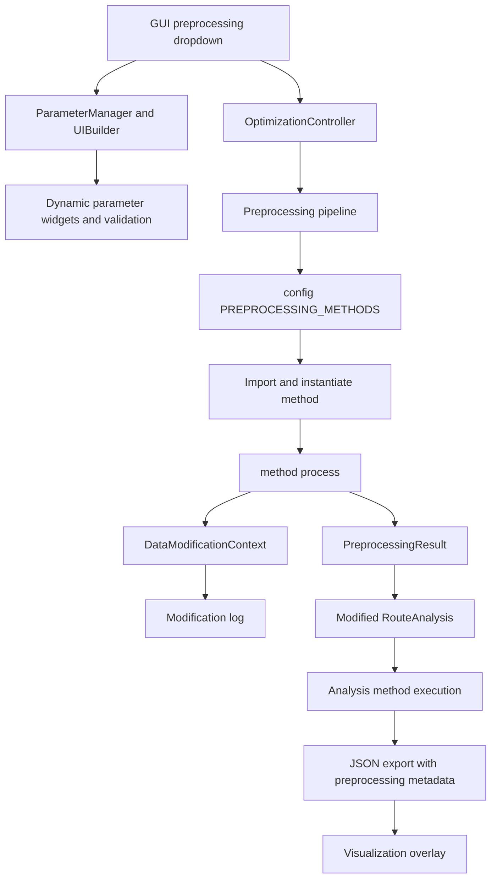
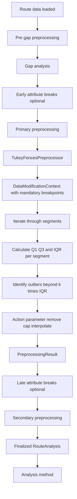

# Configuring a New Preprocessing Method (Extensible Architecture Guide)

**Audience:** Python developers extending the Highway Segmentation Tool's preprocessing framework.

This document describes **how to connect a new preprocessing method to the system** so that:

- it appears in the GUI preprocessing dropdowns,
- its parameters are validated and rendered dynamically,
- it uses automatic modification logging for traceability,
- it produces standardized outputs (`PreprocessingResult`),
- it integrates with the three-phase preprocessing pipeline,
- it respects mandatory breakpoint constraints,
- it displays correctly in the visualization overlay.

We use **Tukey Fences outlier detection** as the concrete example of a preprocessing method.

---

## Why Preprocessing?

Highway data collection often produces measurements with **anomalies, outliers, and noise** that can adversely affect segmentation analysis. Preprocessing provides a systematic way to **review and improve input data quality** before segmentation algorithms process it. By detecting and handling problematic data points—whether through removal, adjustment, or smoothing—preprocessing methods ensure that segmentation analysis works with clean, reliable data. This leads to more accurate breakpoint detection and segment boundaries that better reflect true pavement conditions rather than measurement artifacts.

The preprocessing framework supports **optional, transparent data quality improvements** that are fully logged and visualized, allowing you to understand exactly what modifications were applied and evaluate their impact on the final segmentation results.

**When can preprocessing occur?** The framework provides **three independent phases** where preprocessing can be applied:

1. **Pre-gap preprocessing** (before gap analysis): Rare use case for data cleaning that might affect gap detection itself, such as filling small measurement gaps or correcting timestamps.
2. **Primary preprocessing** (after gap analysis and initial mandatory-boundary setup): **Most common phase** for data quality improvements. Primary preprocessing operates within framework-provided mandatory boundaries, and this is the recommended phase for most outlier detection and smoothing work.
3. **Secondary preprocessing** (after additional mandatory-boundary updates): Final polishing phase for conservative adjustments after later route-processing steps. Use this phase for light smoothing or normalization on already constrained data.

For preprocessing method authors, the practical rule is unchanged across phases: consume `route_analysis.mandatory_breakpoints` as immutable constraints, regardless of how they were produced upstream.

Each preprocessing phase is optional and independent—you can use one, multiple, or none depending on your data quality needs. Most preprocessing methods target the **primary phase**, where structural segment boundaries are clearly defined but administrative segmentation and final analysis haven't begun.

---

## 1) Preprocessing Method Inputs and Outputs

### 1.1 What preprocessing does

Preprocessing methods improve data quality **before segmentation analysis** by:

- Detecting and removing outliers
- Smoothing noisy data
- Capping extreme values
- Interpolating missing or erroneous data points
- Normalizing or transforming data

Each preprocessing method consumes a `RouteAnalysis` object (with route data, gaps, and mandatory breakpoints) and produces a modified `RouteAnalysis` with complete modification logs.

**Key design principle:** Preprocessing is **optional and transparent** to analysis methods. Analysis algorithms see preprocessed data but don't need to know preprocessing occurred.

### 1.2 Where preprocessing fits in the processing chain

The preprocessing framework provides **three independent phases** where preprocessing can occur:

```text
┌───────────────────────────────────────────────────────────────────────┐
│ 1. DATA LOADING                                                       │
│    - Load CSV/Excel file                                              │
│    - Convert columns, filter invalid values                           │
└────────────────────┬──────────────────────────────────────────────────┘
                     │
                     ▼
┌───────────────────────────────────────────────────────────────────────┐
│ 2. ROUTE FILTERING                                                    │
│    - filter_data_by_route()                                           │
│    - Separate data by route_column                                    │
└────────────────────┬──────────────────────────────────────────────────┘
                     │
                     ▼
        ╔═══════════════════════════════════════════════════════════╗
        ║  FOR EACH ROUTE (per-route processing):                   ║
        ╚═══════════════════════════════════════════════════════════╝
                     │
                     ▼
┌───────────────────────────────────────────────────────────────────────┐
│ 3. PRE-GAP PREPROCESSING (optional)                                   │
│    Phase: "pre_gap"                                                   │
│    Configuration: preprocessing.pre_gap_method                        │
│    - Applied to raw route data before gap analysis                    │
│    - Rare use case: data cleaning, interpolation preparation          │
│    - Can affect what gaps are detected                                │
│    - Example: Fill small interpolation gaps                           │
│    Input:  Raw DataFrame for single route                             │
│    Output: Modified DataFrame                                         │
└────────────────────┬──────────────────────────────────────────────────┘
                     │
                     ▼
┌───────────────────────────────────────────────────────────────────────┐
│ 4. GAP ANALYSIS                                                       │
│    - Detect data gaps using gap_threshold                             │
│    - Create mandatory breakpoints at gap boundaries                   │
│    - Identify valid_x_values (excluding gap interiors)                │
│    - Build initial RouteAnalysis object                               │
└────────────────────┬──────────────────────────────────────────────────┘
                     │
                     ▼
┌───────────────────────────────────────────────────────────────────────┐
│ 5. EARLY ATTRIBUTE BREAKS (optional)                                  │
│    Configuration: input.early_attribute_columns                       │
│    - Early set of attribute-based breakpoints                         │
│    - Examples: Pavement_Type, Functional_Class, Lanes                 │
│    - Detect changes in early_attribute_columns                        │
│    - Add attribute breakpoints to mandatory_breakpoints set           │
│    - Rationale: Different structures have different distributions     │
└────────────────────┬──────────────────────────────────────────────────┘
                     │
                     ▼
┌───────────────────────────────────────────────────────────────────────┐
│ 6. PRIMARY PREPROCESSING (optional) ← MOST COMMON PHASE               │
│    Phase: "primary"                                                   │
│    Configuration: preprocessing.primary_method                        │
│    - Applied after gaps and early attribute breaks                    │
│    - Operates within segments defined by gaps + early attributes      │
│    - Example: Tukey Fences outlier detection/removal                  │
│    - Rationale: Statistics computed per segment for accuracy          │
│    Input:  RouteAnalysis with gap_segments + first breakpoints        │
│    Output: Modified RouteAnalysis with preprocessing metadata         │
└────────────────────┬──────────────────────────────────────────────────┘
                     │
                     ▼
┌───────────────────────────────────────────────────────────────────────┐
│ 7. LATE ATTRIBUTE BREAKS (optional)                                   │
│    Configuration: input.late_attribute_columns                        │
│    - Late set of attribute-based breakpoints                          │
│    - Examples: County, District, Maintenance_Zone                     │
│    - Applied AFTER primary preprocessing                              │
│    - Creates final segment boundaries for analysis                    │
└────────────────────┬──────────────────────────────────────────────────┘
                     │
                     ▼
┌───────────────────────────────────────────────────────────────────────┐
│ 8. SECONDARY PREPROCESSING (optional)                                 │
│    Phase: "secondary"                                                 │
│    Configuration: preprocessing.secondary_method                      │
│    - Applied after all attribute breaks                               │
│    - Final data preparation before analysis                           │
│    - Example: Moving average smoothing, normalization                 │
│    - Operates on fully segmented data                                 │
│    Input:  RouteAnalysis with all breakpoints finalized               │
│    Output: Modified RouteAnalysis                                     │
└────────────────────┬──────────────────────────────────────────────────┘
                     │
                     ▼
┌───────────────────────────────────────────────────────────────────────┐
│ 9. FINALIZE RouteAnalysis OBJECT                                      │
│    - route_data: DataFrame (preprocessed if enabled)                  │
│    - gap_segments, mandatory_breakpoints, valid_x_values              │
│    - preprocessing_results: List[PreprocessingResult] (if used)       │
└────────────────────┬──────────────────────────────────────────────────┘
                     │
                     ▼
┌───────────────────────────────────────────────────────────────────────┐
│ 10. ANALYSIS METHOD EXECUTION                                         │
│     - Analysis methods receive preprocessed data transparently        │
│     - Methods unaware preprocessing occurred (clean separation)       │
└────────────────────┬──────────────────────────────────────────────────┘
                     │
                     ▼
┌───────────────────────────────────────────────────────────────────────┐
│ 11. RESULTS & VISUALIZATION                                           │
│     - JSON export with preprocessing metadata                         │
│     - Visualization overlay shows original vs preprocessed data       │
└───────────────────────────────────────────────────────────────────────┘
```

**Key timing points:**

- **Pre-gap (Step 3):** Before gap detection - rare, can affect gap identification
- **Primary (Step 6):** After gaps and early attributes - **most common**, operates on well-defined segments
- **Secondary (Step 8):** After all segmentation - final polishing before analysis

**Backward compatibility:** All preprocessing is optional. If no preprocessing configured, system behaves exactly as before.

### 1.3 PreprocessingResult structure

Each preprocessing method returns a `PreprocessingResult` containing:

```python
@dataclass
class PreprocessingResult:
  processed_route_analysis: RouteAnalysis      # Modified RouteAnalysis object
  modification_log: List[DataModification]     # Complete modification log
  preprocessing_metadata: Dict[str, Any]       # Parameters, stats, summary details
  original_y_values: List[float]               # Original Y values for comparison
  modifications_summary: str                   # Human-readable one-line summary
```

**The modification log** (`modification_log`) contains every data change:

```python
@dataclass
class DataModification:
    modification_type: str       # "point_removed", "y_value_capped", "point_interpolated", etc.
    x_value: float              # Where modification occurred
    original_y_value: float     # Original value
    new_y_value: Optional[float]  # New value (None for removals)
    reason: Optional[str]       # Why this change was made
    timestamp: Optional[str]    # When it happened (ISO format)
```

This structure ensures **complete traceability** - every preprocessing action is logged with context.

### 1.4 DataModificationContext API capabilities

The preprocessing framework provides a controlled API for modifying route data with two fundamental operations:

**Two core operations:**

1. **Remove points** - Delete data point entirely
   - Removes both x and y values from dataset
   - Reduces total data point count
   - Affects breakpoint pool for analysis (fewer available locations)
   - Method: `ctx.remove_point(x_value, reason=...)`

2. **Modify Y-values** - Change y-value while preserving x-coordinate
   - X-coordinate remains unchanged (immutable)
   - Only y-value is updated
   - Preserves data point locations
   - Method: `ctx.modify_y_value(x_value, new_y_value, reason=..., modification_type=...)`
   - Customize `modification_type` to describe the operation ("y_value_capped", "point_interpolated", etc.)

**Key constraints:**

- ✅ **X-coordinates are immutable** - Cannot be changed, only removed
- ✅ **Automatic logging** - All modifications tracked with reason, timestamp
- ✅ **Mandatory breakpoint protection** - Cannot remove gap boundaries, route edges, or attribute change points
- ✅ **Traceability** - Complete audit trail for reproducibility

**Method-specific decisions:**

Individual preprocessing methods decide **how to use these API operations**:

- Tukey Fences offers three "actions": `remove`, `cap`, `interpolate` (user choice)
- Other methods might only use removal, or only use modification
- Methods can combine operations (e.g., remove extreme outliers, cap moderate ones)

### 1.5 Automatic modification logging

**Why automatic logging matters:**

- **Reproducibility:** Understand exactly what changed and why
- **Auditability:** Complete trail for regulatory/quality requirements
- **Debugging:** Identify if preprocessing helped or hurt analysis
- **Visualization:** Overlay shows before/after comparison

**How it works:**

1. Method creates `DataModificationContext(df, x_column, y_column, mandatory_breakpoints)`
2. Method calls API methods: `ctx.remove_point(...)`, `ctx.modify_y_value(...)`
3. Context automatically creates `DataModification` entries with timestamp
4. Method retrieves log: `ctx.get_modification_log()`
5. Method includes log in `PreprocessingResult.modification_log`

**Developer benefit:** You focus on algorithm logic; logging happens automatically.

---

## 2) Files and Configuration Involved

The preprocessing system follows the same architecture as the analysis method framework:

1. **Base Class:** `PreprocessingMethodBase` (src/preprocessing/base.py)
2. **Configuration Registry:** `PREPROCESSING_METHODS` (src/config.py)
3. **Parameter System:** Reuses `ParameterDefinition` classes
4. **Method Resolution:** `resolve_preprocessing_class(method_key)` (src/config.py)
5. **UI Generation:** `UIBuilder` + `ParameterManager` (automatic from parameter definitions)
6. **Controller Integration:** `OptimizationController` dispatches preprocessing before analysis

### 2.1 Runtime flow



**Config-driven dispatch:**

- Adding a new method requires **only** a config entry - no controller changes
- `method_class_path` points to your implementation class
- Controller imports and instantiates automatically
- Same pattern as analysis methods (80% code reuse)

### 2.2 Tukey Fences integration (concrete example)



**Key points:**

- Tukey Fences typically runs in **primary phase** (after gaps + early attributes)
- Uses per-segment processing (respects mandatory breakpoints)
- Offers user choice of action (remove/cap/interpolate)
- Returns complete modification log automatically

### 2.3 Three preprocessing phases explained

#### Pre-gap preprocessing (Step 3 in pipeline)

**When:** Before gap analysis  
**Input:** Raw DataFrame for single route  
**Output:** Modified DataFrame  

**Use cases (rare):**

- Data cleaning that affects gap detection
- Filling small interpolation gaps before analysis
- Timestamp correction or resampling

**Caution:** Can change which gaps are detected. Most methods should use primary phase instead.

#### Primary preprocessing (Step 6 in pipeline) ← **MOST COMMON**

**When:** After gaps and early attribute breaks  
**Input:** `RouteAnalysis` with gap segments and early attribute breakpoints  
**Output:** Modified `RouteAnalysis`  

**Use cases (common):**

- **Outlier detection/removal** (Tukey Fences, z-score, etc.)
- **Data smoothing** (moving average, Savitzky-Golay)
- **Value capping** (IQR fences, percentile bounds)

**Why this phase is most common:**

- Operates on well-defined segments (gaps + early attributes)
- Per-segment statistics are accurate (different pavement types separated)
- Doesn't affect attribute break detection

**Example:** Tukey Fences removes outliers after pavement types are separated (concrete vs asphalt have different IRI distributions).

#### Secondary preprocessing (Step 8 in pipeline)

**When:** After all attribute breaks (gaps + first + second)  
**Input:** `RouteAnalysis` with all breakpoints finalized  
**Output:** Modified `RouteAnalysis`  

**Use cases (final polishing):**

- **Final smoothing** on fully segmented data
- **Normalization** or standardization
- **Derived feature calculation**

**Why use secondary instead of primary:**

- Need all segmentation finalized first
- Applied to final analysis segments
- Conservative cleanup after aggressive primary preprocessing

**Example:** After aggressive outlier removal (primary), apply light smoothing (secondary) to reduce noise.

### 2.4 Mandatory breakpoint handling (developer view)

Preprocessing methods should be implemented against a single contract:

- `route_analysis.mandatory_breakpoints` already contains all mandatory boundaries known at that phase.
- Your method must preserve them (do not move/remove them).
- Your method does not need to distinguish whether a breakpoint originated from gaps, route edges, or prior route-processing/preprocessing steps.

If you need provenance details for diagnostics or reporting, refer to the developer guide and JSON schema documentation.

---

## 3) Extension Points

When you add a new preprocessing method, the system expects you to provide **four** things:

### 3.1 Four things you must provide

1. **Unique `method_key` string** (internal identifier)
   - Lowercase, underscores (e.g., `"tukey_fences"`, `"moving_average"`)
   - Used in GUI selection, JSON export, results metadata
   - Must be unique across all preprocessing methods

2. **Parameter list** (`List[ParameterDefinition]`) for dynamic UI + validation
   - Declarative parameters using `NumericParameter`, `SelectParameter`, etc.
   - Drives automatic UI generation
   - Provides built-in validation
   - Same parameter system as analysis methods

3. **Method implementation** deriving from `PreprocessingMethodBase`
   - Located in `src/preprocessing/methods/<your_method>.py`
   - Implements required interface: `preprocess_name`, `preprocess_key`, `process()`
   - Uses `DataModificationContext` for all data changes
   - Returns `PreprocessingResult`

4. **Config registry entry** with `method_class_path`
   - Entry in `PREPROCESSING_METHODS` in `src/config.py`
   - Points to your implementation class via `method_class_path`
   - Enables config-driven dispatch (no controller changes)

**Total implementation:** ~65-115 lines per method (vs ~300-400 for custom approach)

### 3.2 Automatic logging contract

**All data modifications MUST go through `DataModificationContext` API.**

**Why this is required:**

- Ensures complete traceability
- Enables visualization overlay
- Supports debugging and auditing
- Required for JSON export metadata

**Anti-pattern (DON'T DO THIS):**

```python
# ❌ WRONG - Direct DataFrame modification
df.loc[df[y_column] > threshold, y_column] = threshold
```

**Correct pattern:**

```python
# ✅ CORRECT - Use DataModificationContext API
ctx = DataModificationContext(df, x_column, y_column, mandatory_breakpoints)

for x_val in outliers:
    ctx.remove_point(x_val, reason="beyond 3*IQR fence")

modified_df = ctx.get_modified_data()
log = ctx.get_modification_log()
```

**Benefits of using the API:**

- Automatic logging with timestamps
- Mandatory breakpoint protection (enforced at API level)
- Type-specific modification tracking (removed vs modified)
- Descriptive reasons for each change

### 3.3 Mandatory breakpoint protection

The `DataModificationContext` API **automatically enforces** that mandatory breakpoints cannot be removed.

**What are mandatory breakpoints:**

- Gap boundaries (no data collection periods)
- Route edges (start/end)
- Attribute change points (pavement type switches, etc.)

**Protection mechanism:**

```python
# Pass mandatory breakpoints to context
ctx = DataModificationContext(
    df, x_column, y_column,
    mandatory_breakpoints=route_analysis.mandatory_breakpoints  # ← Protection enabled
)

# If you try to remove a mandatory breakpoint:
ctx.remove_point(0.0, reason="outlier")  # If 0.0 is a mandatory breakpoint...

# ❌ Raises ValueError:
# "Cannot remove point at x=0.0: this is a mandatory breakpoint
#  (gap boundary, route edge, or attribute change).
#  Mandatory breakpoints must be preserved for segmentation."
```

**API-level enforcement benefits:**

- Fail-fast with clear error message
- No validation needed in method implementation
- Automatic protection for all preprocessing methods
- Enforces framework design contract

---

## 4) Step-by-Step: Tukey Fences as a Preprocessing Method Example

### Step 1 — Choose your `method_key`

**Tukey Fences uses:** `method_key = "tukey_fences"`

**Naming conventions:**

- Lowercase, underscores for spaces
- Descriptive but concise
- No special characters except underscore

**Where it appears:**

1. **GUI:** Preprocessing method dropdowns (pre-gap, primary, secondary phases)
2. **JSON export:** `preprocessing_results[].method_key`
3. **Results metadata:** Identifies which method was used
4. **Config registry:** Key for looking up method configuration

**Must match exactly:** The `method_key` returned by your method's property must match the `method_key` in the config registry entry.

### Step 2 — Define your method parameters

Parameters are defined as `ParameterDefinition` instances in `src/config.py`. Tukey Fences provides a concrete pattern.

#### 2.1 Parameter types available

All preprocessing parameters use the same parameter system as analysis methods:

- **`NumericParameter`**: Bounded numeric input (int or float)
  - Fields: `min_value`, `max_value`, `decimal_places`
  - Example: `k_factor` (IQR multiplier)

- **`SelectParameter`**: Dropdown selection from options
  - Fields: `options` (list of tuples: `(display_text, value)`)
  - Example: `action` (remove/cap/interpolate)

- **`OptionalNumericParameter`**: Numeric input that can be None
  - Fields: Same as `NumericParameter` + `none_text`
  - Example: Optional window size

- **`BoolParameter`**: Boolean checkbox
  - Example: Enable diagnostic output

- **`ColumnSelectParameter`**: CSV column selector
  - Populated from loaded file headers
  - Example: Weight column for weighted smoothing

- **`TextParameter`**: Text input (single/multi-line)
  - Fields: `min_length`, `max_length`, `allowed_chars`, `multiline`
  - Example: Custom identifier or notes

#### 2.2 Tukey Fences parameter walkthrough

```python
# src/config.py
TUKEY_FENCES_PARAMETERS = [
    NumericParameter(
        name="k_factor",
        display_name="K Factor",
        description="IQR multiplier for fence bounds (1.5=mild outliers, 3.0=extreme outliers)",
      group="01_detection",
        order=1,
        default_value=1.5,
        min_value=0.5,
        max_value=5.0,
        decimal_places=1
    ),
    SelectParameter(
        name="action",
        display_name="Outlier Action",
        description="How to handle detected outliers",
      group="02_handling",
        order=2,
        default_value="remove",
        options=[
          ("Remove", "remove"),
          ("Cap to Fence", "cap"),
          ("Interpolate", "interpolate")
        ]
    )
]
```

**Parameter meanings:**

- **`k_factor`** (`NumericParameter`): IQR multiplier
  - **Lower values (1.5):** More aggressive outlier detection, more points flagged
  - **Higher values (3.0):** More conservative, only extreme outliers flagged
  - **Statistical standard:** 1.5 is the classic Tukey Fences threshold
  - **Validation:** Must be between 0.1 and 5.0, one decimal place

- **`action`** (`SelectParameter`): How to handle outliers
  - **`"remove"`**: Delete outlier points entirely
    - Reduces data point count
    - Affects breakpoint pool for analysis
    - Most aggressive approach
  - **`"cap"`**: Replace outlier y-value with fence boundary
    - Preserves x-coordinate (data point location)
    - Conservative approach
    - Maintains data density
  - **`"interpolate"`**: Replace outlier with value estimated from neighbors
    - Requires neighbors on both sides
    - Cannot interpolate at segment boundaries
    - Smoothest result

#### 2.3 Grouping and ordering in the GUI

Parameters support **logical grouping** for UI organization:

```python
NumericParameter(
    name="k_factor",
  group="01_detection",       # ← Logical group key (sorted alphabetically)
    order=1,                     # ← Display order within group
    # ...
)
```

**Benefits:**

- Related parameters displayed together
- Clear visual organization
- Professional appearance
- Consistent with analysis method UI

**UI rendering (treeview table):**

- Parameters are sorted by `group` first (alphabetical)
- Within each group, parameters are sorted by `order`
- If you want groups to appear in a specific sequence, use sortable prefixes in group names (for example: `01_detection`, `02_handling`, `03_output`)

### Step 3 — Register your method in the config registry

#### 3.1 Adding to `PREPROCESSING_METHODS` in `src/config.py`

```python
# src/config.py

# First, define your parameter list (see Step 2)
TUKEY_FENCES_PARAMETERS = [...]

# Then, add entry to PREPROCESSING_METHODS registry
PREPROCESSING_METHODS = [
    PreprocessingMethodConfig(
        method_key="tukey_fences",
      display_name="Tukey Fences Outlier Detection",
      description="IQR-based outlier detection with configurable thresholds and actions",
        parameters=TUKEY_FENCES_PARAMETERS,
        method_class_path="preprocessing.methods.tukey_fences.TukeyFencesPreprocessor"
        # allowed_stages not set → method appears in all three slots
    ),
    # ... other methods
]
```

**Registry fields:**

- **`method_key`**: Internal identifier, must match your implementation
- **`display_name`**: What users see in GUI dropdown
- **`description`**: Help text shown in UI
- **`parameters`**: Your parameter list (drives UI + validation)
- **`method_class_path`**: Import path to your implementation class
- **`allowed_stages`** *(optional)*: List of pipeline slots where this method may be used. Valid values: `"pre_gap"`, `"primary"`, `"secondary"`. Omit or set to `None` to allow the method in all slots.

#### 3.1a `allowed_stages` — restricting a method to specific pipeline slots

By default, every preprocessing method appears in all three slot dropdowns (pre-gap, primary, secondary) and can be assigned to any slot in a CLI run spec. Set `allowed_stages` to limit where a method can run:

```python
PreprocessingMethodConfig(
    method_key="invalid_data_handler",
    display_name="Invalid Data Handler",
    description="Handles missing or non-numeric Y values. Must be configured in the Pre-Gap slot.",
    parameters=INVALID_DATA_HANDLER_PARAMETERS,
    method_class_path="preprocessing.methods.invalid_data_handler.InvalidDataHandlerPreprocessor",
    allowed_stages=["pre_gap"],   # Only appears in the Step 1 dropdown; rejected elsewhere
)
```

**GUI enforcement**: Each preprocessing panel knows its own stage name and filters the method dropdown to exclude entries whose `allowed_stages` does not include that panel's stage. Incompatible methods simply don't appear in the dropdown.

**CLI enforcement**: When parsing a run spec, the CLI validates each configured method against its `allowed_stages`. If the assigned slot is not in the list, a `RunSpecError` is raised before any analysis runs:

```text
RunSpecError: Preprocessing method 'invalid_data_handler' cannot be used in the 'primary' slot
(allowed stages: "pre_gap").
```

**When to use `allowed_stages`**:

- Your method depends on raw, unprocessed data (e.g., it cleans NaN values before gap detection)
- Your method would produce incorrect results in certain phases (e.g., per-segment statistics don't make sense before segments exist)
- You want to prevent user misconfiguration rather than silently producing wrong output

#### 3.2 Setting `method_class_path` for config-driven dispatch

**Format:** `"module.path.ClassName"`

**Example:** `"preprocessing.methods.tukey_fences.TukeyFencesPreprocessor"`

**How it works:**

1. User selects "Tukey Fences Outlier Detection" in GUI
2. Controller retrieves config entry by `method_key="tukey_fences"`
3. Controller dynamically imports class from `method_class_path`
4. Controller instantiates: `TukeyFencesPreprocessor()`
5. Controller calls: `instance.process(route_analysis, x_column, y_column, log_callback=log_callback, **parameters)`

**No controller changes needed** - dispatch is 100% config-driven.

#### 3.3 Validation at app startup

The application validates all preprocessing method registrations on startup:

```python
# Called from src/gui_main.py
validate_preprocessing_method_registry()
```

**What it checks:**

- All `method_class_path` entries are importable
- Imported classes extend `PreprocessingMethodBase`
- All required methods/properties exist
- No duplicate `method_key` values

**Benefits:**

- Catches configuration errors early (before user tries to use method)
- Clear error messages if import fails
- Prevents runtime surprises

**Example error message:**

```text
Configuration Error: Preprocessing method 'tukey_fences' has invalid method_class_path:
'preprocessing.methods.tukey_fences.TukeyFencesPreprocessor'
Error: No module named 'preprocessing.methods.tukey_fences'
```

### Step 4 — Implement the method (derive from `PreprocessingMethodBase`)

#### 4.1 Required interface

All preprocessing methods must implement:

```python
# src/preprocessing/methods/tukey_fences.py

from typing import Dict, Any
from preprocessing.base import PreprocessingMethodBase, PreprocessingResult

class TukeyFencesPreprocessor(PreprocessingMethodBase):
    @property
  def preprocess_name(self) -> str:
        """User-facing display name"""
    return "Tukey Fences Outlier Detection"
  
    @property
  def preprocess_key(self) -> str:
        """Internal identifier - must match config registry"""
        return "tukey_fences"
  
    def process(
        self,
        route_analysis: 'RouteAnalysis',
        x_column: str,
        y_column: str,
        log_callback=None,
        **parameters
    ) -> PreprocessingResult:
        """
        Process route data to detect and handle outliers.

        Args:
            route_analysis: Complete route analysis with gap/attribute context
            x_column: Name of X-axis column (e.g., "Milepoint")
            y_column: Name of Y-axis column (e.g., "IRI")
            log_callback: Optional callable for progress messages routed to the GUI
                right panel (or stdout in CLI/test contexts). Use like:
                ``log = log_callback or _logger.debug; log("Processing segment 3/17...")``.
            **parameters: Method-specific parameters from user/config

        Returns:
            PreprocessingResult with modifications and logs
        """
        # Implementation goes here...
        pass
```

**Key points:**

- **`preprocess_name`**: Must be user-friendly (used in UI/reports)
- **`preprocess_key`**: Must exactly match config registry entry
- **`process()` signature**: Standardized across all methods
  - Takes full `RouteAnalysis` (not just DataFrame)
  - Receives gap segments, mandatory breakpoints, etc.
  - Parameters passed as `**parameters` keyword arguments (not a dict)

#### 4.2 Using `DataModificationContext` for automatic logging

**Step-by-step usage pattern:**

```python
def process(self, route_analysis, x_column, y_column, log_callback=None, **parameters):
    log = log_callback or print  # routes to GUI right panel or stdout in tests

    # 1. Extract parameters
    k_factor = parameters.get('k_factor', 1.5)
    action = parameters.get('action', 'remove')
  
    # 2. Get data
    df = route_analysis.route_data
    y_values = df[y_column].values
    x_values = df[x_column].values
  
    # 3. Create modification context with mandatory breakpoint protection
    ctx = DataModificationContext(
        df,
        x_column,
        y_column,
        route_analysis.mandatory_breakpoints  # ← Enables automatic protection
    )
  
    # 4. Your algorithm logic here...
    # Calculate outliers, etc.
  
    # 5. Modify data using API (automatic logging)
    for x_val in outliers:
        if action == 'remove':
            ctx.remove_point(x_val, reason=f"outlier beyond {k_factor}*IQR fence")
        elif action == 'cap':
            ctx.modify_y_value(x_val, fence_value,
                             reason=f"capped to {bound_type} bound",
                             modification_type="y_value_capped")
        elif action == 'interpolate':
            ctx.modify_y_value(x_val, interpolated_value,
                             reason="interpolated from neighbors",
                             modification_type="point_interpolated")
  
    # 6. Get modified data and log
    modified_df = ctx.get_modified_data()
    modification_log = ctx.get_modification_log()  # Automatic!
  
    # 7. Build result
    return PreprocessingResult(...)
```

**Available modification methods:**

**`ctx.remove_point(x_value, reason=None)`**

- Deletes data point entirely
- Automatically logs: `modification_type="point_removed"`
- Raises `ValueError` if x_value is a mandatory breakpoint
- Raises `ValueError` if x_value not found

**`ctx.modify_y_value(x_value, new_y_value, reason=None, modification_type="y_value_changed")`**

- Changes y-value, preserves x-coordinate
- Automatically logs with original and new values
- `modification_type` can be customized to describe the operation:
  - `"y_value_capped"` - for capping operations
  - `"point_interpolated"` - for interpolation
  - `"y_value_smoothed"` - for smoothing
  - Any descriptive string appropriate for your method

**API-level mandatory breakpoint protection:**

The context automatically validates each `remove_point()` call:

```python
ctx = DataModificationContext(df, x_column, y_column, mandatory_breakpoints)

# This will raise ValueError if 12.5 is a mandatory breakpoint:
ctx.remove_point(12.5, reason="outlier")

# Error message:
# "Cannot remove point at x=12.5: this is a mandatory breakpoint
#  (gap boundary, route edge, or attribute change).
#  Mandatory breakpoints must be preserved for segmentation."
```

**No validation needed in your method** - protection is automatic!

#### 4.3 Per-segment processing pattern

**Why per-segment matters:**

Highway routes are **heterogeneous** - different pavement types have different statistical properties:

- **Concrete pavement:** Lower IRI values (smoother), tighter distribution
- **Asphalt pavement:** Higher IRI values (rougher), wider distribution

**Global statistics fail:**

```python
# ❌ WRONG - Treats all data as one population
q1, q3 = np.percentile(all_y_values, [25, 75])  # Mixes concrete + asphalt
iqr = q3 - q1
# Result: Concrete "outliers" incorrectly flagged (they're just naturally lower)
```

**Per-segment statistics succeed:**

```python
# ✅ CORRECT - Calculate statistics per segment (per pavement type)
for each segment between mandatory breakpoints:
    segment_y_values = y_values in this segment
    q1, q3 = np.percentile(segment_y_values, [25, 75])  # Only this pavement type
    iqr = q3 - q1
    # Result: Accurate outlier detection within each material type
```

**Tukey Fences implementation pattern:**

```python
# Get mandatory breakpoints (define segments)
mandatory_bps = sorted(list(route_analysis.mandatory_breakpoints or []))

# Handle edge case: no segments defined
if not mandatory_bps:
    mandatory_bps = [float(x_values.min()), float(x_values.max())]

# Process each analyzable segment independently
for i in range(len(mandatory_bps) - 1):
    seg_start = mandatory_bps[i]
    seg_end = mandatory_bps[i + 1]
  
    # Get points in this segment only
    seg_mask = (x_values >= seg_start) & (x_values <= seg_end)
    seg_y_values = y_values[seg_mask]
    seg_indices = np.where(seg_mask)[0]
  
    # Skip if insufficient data
    MIN_POINTS_FOR_IQR = 4  # Need at least 4 points for Q1, Q2, Q3
    if len(seg_y_values) < MIN_POINTS_FOR_IQR:
        continue
  
    # Calculate IQR bounds FOR THIS SEGMENT ONLY
    q1, q3 = np.percentile(seg_y_values, [25, 75])
    iqr = q3 - q1
  
    if iqr == 0:
        continue  # All values identical - skip outlier detection
  
    lower_bound = q1 - k_factor * iqr
    upper_bound = q3 + k_factor * iqr
  
    # Identify outliers IN THIS SEGMENT
    outlier_mask = (seg_y_values < lower_bound) | (seg_y_values > upper_bound)
    segment_outlier_indices = seg_indices[outlier_mask]
  
    # Apply action to each outlier
    for idx in segment_outlier_indices:
        x_val = x_values[idx]
        y_val = y_values[idx]
  
        if action == 'remove':
            ctx.remove_point(x_val, reason=f"outlier beyond {k_factor}*IQR in segment [{seg_start:.1f}-{seg_end:.1f}]")
        # ... handle cap/interpolate actions
```

**Key design choices:**

- **Iterate through mandatory breakpoints:** Each gap, route edge, and attribute change creates a segment
- **Calculate per-segment statistics:** Q1, Q3, IQR computed separately for each segment
- **Minimum points check:** Skip segments with < 4 points (can't reliably calculate quartiles)
- **Descriptive reasons:** Include segment range in modification reason for traceability

#### 4.4 Boundary handling for interpolation

**Problem:** Interpolation requires neighbors on both sides.

**At segment boundaries:**

- Segment start: No left neighbor (only neighbors to the right)
- Segment end: No right neighbor (only neighbors to the left)

**Wrong approach:**

```python
# ❌ BAD - Uses same neighbor twice at boundaries
left_neighbor = seg_y_values[local_idx - 1] if local_idx > 0 else seg_y_values[local_idx]
right_neighbor = seg_y_values[local_idx + 1] if local_idx < len - 1 else seg_y_values[local_idx]
interpolated = (left_neighbor + right_neighbor) / 2
# At start: uses same point twice (not a true interpolation)
```

**Correct approach - skip boundaries:**

```python
# ✅ CORRECT - Skip interpolation at segment start/end
elif action == 'interpolate':
    for idx in segment_outlier_indices:
        # Find position within segment
        local_idx = np.where(seg_indices == idx)[0][0]
  
        # Skip if at segment boundary - can't get true neighbors on both sides
        if local_idx == 0 or local_idx == len(seg_indices) - 1:
            # Outlier at segment start/end - leave unchanged
            # Alternative: could fall back to remove or cap
            continue
  
        # Get true neighbors (guaranteed to exist)
        left_neighbor_idx = seg_indices[local_idx - 1]
        right_neighbor_idx = seg_indices[local_idx + 1]
  
        left_y = y_values[left_neighbor_idx]
        right_y = y_values[right_neighbor_idx]
  
        # Simple linear interpolation
        interpolated_y = (left_y + right_y) / 2
  
        ctx.modify_y_value(x_values[idx], interpolated_y,
                          reason="interpolated from neighbors",
                          modification_type="point_interpolated")
```

**Design decision:** Leave boundary outliers unchanged rather than using invalid interpolation. Alternative: fall back to `remove` or `cap` action for boundary points.

#### 4.5 Building the helper function for RouteAnalysis reconstruction

**Problem:** After modifying data, you need to create a new `RouteAnalysis` object with the modified DataFrame. This requires ~18 lines of boilerplate code.

**Without helper function (verbose):**

```python
# ❌ Repetitive boilerplate (18 lines)
modified_df = ctx.get_modified_data()

from data_loader import analyze_route_gaps

processed_route_analysis = analyze_route_gaps(
    modified_df,
    x_column,
    y_column,
    route_id=route_analysis.route_id,
    gap_threshold=route_analysis.gap_threshold,
    route_column=route_analysis.route_column,
    must_break_columns=route_analysis.must_break_columns_used,
    first_attribute_columns=route_analysis.first_attribute_columns,
    second_attribute_columns=route_analysis.second_attribute_columns,
    # ... more parameters
)
```

**With helper function (concise):**

```python
# ✅ Clean, one-line call
from preprocessing.base import create_processed_route_analysis

processed_route_analysis = create_processed_route_analysis(
    original_route_analysis=route_analysis,
    modified_df=ctx.get_modified_data(),
    x_column=x_column,
    y_column=y_column
)
```

**Helper function benefits:**

- **DRY principle:** Single source of truth for reconstruction logic
- **Reduces errors:** No forgotten parameters
- **Maintainability:** Changes to `RouteAnalysis` structure handled in one place
- **Clarity:** Intent is obvious from function name

**Implementation (already in `src/preprocessing/base.py`):**

```python
def create_processed_route_analysis(
    original_route_analysis: 'RouteAnalysis',
    modified_df: pd.DataFrame,
    x_column: str,
    y_column: str
) -> 'RouteAnalysis':
    """
    Helper function to reconstruct RouteAnalysis with modified data.
  
    Reuses gap analysis logic to ensure consistency with framework.
    Preserves all configuration from original RouteAnalysis.
  
    Args:
        original_route_analysis: Original RouteAnalysis before preprocessing
        modified_df: Modified DataFrame (from DataModificationContext)
        x_column: X-axis column name
        y_column: Y-axis column name
  
    Returns:
        New RouteAnalysis with modified data and updated metadata
    """
    from data_loader import analyze_route_gaps
  
    return analyze_route_gaps(
        modified_df,
        x_column,
        y_column,
        route_id=original_route_analysis.route_id,
        gap_threshold=original_route_analysis.gap_threshold or 1.0,
        route_column=original_route_analysis.route_column,
        must_break_columns=original_route_analysis.must_break_columns_used,
        first_attribute_columns=original_route_analysis.first_attribute_columns,
        second_attribute_columns=original_route_analysis.second_attribute_columns,
        log_callback=None
    )
```

#### 4.6 Return `PreprocessingResult` with complete metadata

**Complete example:**

```python
def process(self, route_analysis, x_column, y_column, log_callback=None, **parameters):
    start_time = time.time()
    log = log_callback or _logger.debug

    # ... algorithm implementation ...
  
    # Reconstruct RouteAnalysis with modified data
    processed_route_analysis = create_processed_route_analysis(
        original_route_analysis=route_analysis,
        modified_df=ctx.get_modified_data(),
        x_column=x_column,
        y_column=y_column
    )
  
    # Build complete result
    modification_log = ctx.get_modification_log()
    stats = {
      'total_modifications': len(modification_log),
      'points_removed': sum(1 for m in modification_log if m.modification_type == 'point_removed'),
      'points_modified': sum(
        1 for m in modification_log if m.modification_type in ['y_value_capped', 'point_interpolated']
      ),
      'outlier_count': total_outlier_count,
      'segments_processed': len(mandatory_bps) - 1,
    }

    return PreprocessingResult(
      processed_route_analysis=processed_route_analysis,
      modification_log=modification_log,
      preprocessing_metadata={
        'method_key': self.preprocess_key,
        'method_name': self.preprocess_name,
        'input_parameters': {
          'k_factor': k_factor,
          'action': action,
          'gap_threshold': route_analysis.gap_threshold,
        },
        'statistics': stats,
        'processing_time': time.time() - start_time,
        'warnings': warnings,
      },
      original_y_values=route_analysis.route_data[y_column].astype(float).tolist(),
      modifications_summary=f"Modified {len(modification_log)} point(s)",
    )
```

**Required fields:**

- **`processed_route_analysis`**: Modified RouteAnalysis object
- **`modification_log`**: Complete log from context
- **`preprocessing_metadata`**: Method metadata, parameters, and summary stats
- **`original_y_values`**: Original y-series for comparison/overlay
- **`modifications_summary`**: Human-readable summary line

**Best practices:**

- **Include detailed statistics:** Helps users understand what changed
- **Preserve input parameters:** Critical for reproducibility
- **Add warnings for important edge cases:** E.g., skipped segments, boundary issues
- **Track processing time:** Helps identify performance bottlenecks

#### 4.7 Progress reporting and logging

Preprocessing methods receive a `log_callback` as an explicit named parameter. Use it to stream progress messages to the GUI right panel (or stdout when running headless/tests).

**Standard pattern:**

```python
def process(self, route_analysis, x_column, y_column, log_callback=None, **parameters):
    log = log_callback or print  # GUI right panel in app, stdout in tests/CLI

    log(f"Tukey Fences: processing {len(mandatory_bps) - 1} segments...")

    for i, (seg_start, seg_end) in enumerate(segments):
        # ... process segment ...
        log(f"  Segment {i + 1}/{len(segments)}: {outlier_count} outlier(s) found.")

    log(f"Complete: {total_outlier_count} total outlier(s) handled.")
```

**Rules:**

- **Never call `print()` directly** — use `log(...)` so output routes correctly in both GUI and CLI contexts.
- **Never import `logger.py` or use `create_logger()`** — that module has been removed.
- **Use stdlib `logging` for unexpected errors** (not progress messages):

  ```python
  import logging
  _logger = logging.getLogger(__name__)

  try:
      result = compute_iqr(seg_values)
  except Exception as e:
      _logger.warning("IQR calculation failed for segment [%.1f-%.1f]: %s", seg_start, seg_end, e)
      continue  # skip segment gracefully
  ```

  Stdlib `WARNING+` records are automatically forwarded to the GUI right panel by the framework.

- **`log_callback` falls back to `_logger.debug`** — unit tests that call `process()` directly without passing `log_callback` produce no visible output (debug level); add a `log_callback` argument when you need to capture progress in test assertions.

**What NOT to do:**

```python
# ❌ Hard-codes stdout — breaks in GUI context
print(f"Processing segment {i}...")

# ❌ Removed module — will raise ImportError
from logger import create_logger
log = create_logger(callback=log_callback).log
```

### Step 5 — Visualization overlay behavior

#### 5.1 How the overlay works

The enhanced visualization automatically shows preprocessing results when present:

**Three visual layers:**

1. **Main line plot:** Final processed data (what analysis sees)
2. **Red scatter points:** Original outliers that were removed or modified
3. **Cyan scatter points:** Preprocessed/corrected values (cap/interpolate actions)

**Example visualization:**

```text
IRI vs Milepoint (with preprocessing overlay)

200 ┤                                     ● (red - original outlier)
    │  
150 ┤     ━━━━━━━━━━━━━━━━━━━━━━━━━━━  (blue line - processed data)
    │  
100 ┤                    ◆ (cyan - capped value)
    │  
 50 ┤━━━━━━━━━━━━━━━━━━━━━━━━━━━━━━━━
    └────────────────────────────────────
    0        5       10       15       20
              Milepoint
```

**Checkbox controls:**

- "Show Preprocessing Overlay" (default: ON)
  - When ON: Shows red (original) and cyan (corrected) points
  - When OFF: Shows only processed data line

#### 5.2 Overlay uses modification logs

The visualization reads `preprocessing_modification_log` from route results JSON to build the overlay:

```python
# Pseudocode from visualization_ui.py

for modification in route_results.get('preprocessing_modification_log', []):
  if modification.get('modification_type') == 'point_removed':
        # Plot red point at original location
    ax.scatter(modification.get('x_value'),
          modification.get('original_y_value'),
                  color='red', marker='o', label='Removed outlier')
  
  elif modification.get('modification_type') in ['y_value_capped', 'point_interpolated']:
        # Plot red point (original) and cyan point (corrected)
    ax.scatter(modification.get('x_value'),
          modification.get('original_y_value'),
                  color='red', marker='o', label='Original outlier')
    ax.scatter(modification.get('x_value'),
          modification.get('new_y_value'),
                  color='cyan', marker='D', label='Corrected value')
```

**Why this works:**

- No special visualization code needed in your method
- Just provide complete modification log
- Framework handles all visualization automatically

#### 5.3 Toggle controls

**GUI controls for preprocessing visualization:**

1. **"Show Preprocessing Overlay"** checkbox
   - Controls visibility of red/cyan scatter points
   - Default: ON (visible)
   - Main processed line always shown

2. **Solution selector** (for multi-objective methods)
   - Preprocessing applies to selected solution only
   - Each Pareto solution has independent preprocessing

**Implementation note:** The overlay is automatically created when `RouteAnalysis.preprocessing_results` is populated. Your method doesn't need to handle visualization - just return complete logs.

---

## 5) Checklist: Adding Your Own New Preprocessing Method

Copy this checklist when implementing a new preprocessing method:

### Configuration

- [ ] **Create parameter list** in `src/config.py`
  - [ ] Use appropriate `ParameterDefinition` subclasses
  - [ ] Set meaningful `display_name` and `description` for each parameter
  - [ ] Provide sensible `default_value` for each parameter
  - [ ] Set `group` and `order` for UI organization
  - [ ] Define validation rules (`min_value`, `max_value`, etc.)

- [ ] **Add registry entry** in `PREPROCESSING_METHODS`
  - [ ] Unique `method_key` (lowercase, underscores)
  - [ ] Clear `display_name` (what users see)
  - [ ] Informative `description` (help text)
  - [ ] Reference your parameter list
  - [ ] Set `method_class_path` pointing to your implementation
  - [ ] Set `allowed_stages` if the method must only run in specific pipeline slots (omit for unrestricted)

### Implementation

- [ ] **Create implementation file** `src/preprocessing/methods/your_method.py`
  - [ ] Import `PreprocessingMethodBase`, `PreprocessingResult`, `DataModificationContext`
  - [ ] Import `create_processed_route_analysis` helper
  - [ ] Define class extending `PreprocessingMethodBase`

- [ ] **Implement required interface**
  - [ ] `method_name` property (user-facing name)
  - [ ] `method_key` property (must match config exactly)
  - [ ] `process(route_analysis, x_column, y_column, parameters)` method

- [ ] **Use DataModificationContext for all data changes**
  - [ ] Create context: `ctx = DataModificationContext(df, x_column, y_column, mandatory_breakpoints)`
  - [ ] Pass `route_analysis.mandatory_breakpoints` to enable protection
  - [ ] Use API methods: `ctx.remove_point()`, `ctx.modify_y_value()`, etc.
  - [ ] Provide descriptive `reason` strings for each modification
  - [ ] Retrieve log: `ctx.get_modification_log()`

- [ ] **Consider per-segment processing** (if applicable)
  - [ ] Iterate through `route_analysis.mandatory_breakpoints`
  - [ ] Calculate segment-specific statistics
  - [ ] Handle edge cases (segments with insufficient data)

- [ ] **Return PreprocessingResult**
  - [ ] Include `processed_route_analysis` (use helper function)
  - [ ] Include complete `modification_log`
  - [ ] Include `preprocessing_metadata` with `method_key`, `method_name`, parameters, and stats
  - [ ] Include `original_y_values` for overlay/comparison
  - [ ] Include concise `modifications_summary`

### Testing

- [ ] **Unit tests for method logic**
  - [ ] Test parameter validation
  - [ ] Test each action/mode your method supports
  - [ ] Test edge cases (empty segments, single point, boundary conditions)
  - [ ] Test error handling

- [ ] **Integration tests**
  - [ ] Test through OptimizationController
  - [ ] Verify JSON export includes preprocessing metadata
  - [ ] Check visualization overlay renders correctly
  - [ ] Test in all three phases (pre-gap, primary, secondary)

- [ ] **Validation checks**
  - [ ] Mandatory breakpoints preserved (automatic API protection)
  - [ ] Modification logs complete and accurate
  - [ ] Each change has descriptive reason
  - [ ] Original and new values recorded correctly
  - [ ] RouteAnalysis reconstruction correct
  - [ ] Gap segments unchanged
  - [ ] Valid x-values updated appropriately

### Startup & UI

- [ ] **Run application to verify**
  - [ ] Registry validation passes (no import errors)
  - [ ] Method appears in GUI dropdowns (all three phases)
  - [ ] Parameter widgets render correctly
  - [ ] Validation works (try invalid values)
  - [ ] Default values populated correctly
  - [ ] Tooltips/descriptions display properly

- [ ] **End-to-end test**
  - [ ] Load test data
  - [ ] Configure your preprocessing method
  - [ ] Run analysis
  - [ ] Check results JSON has preprocessing section
  - [ ] Verify visualization overlay shows correctly
  - [ ] Toggle preprocessing overlay checkbox

---

## 6) Advanced Topics

### 6.1 Chaining preprocessing methods (primary + secondary)

#### Use cases for two-phase preprocessing

**Separation of concerns:**

- Phase 1 (primary): Aggressive data quality improvement
- Phase 2 (secondary): Conservative polishing

**Example workflow:**

```json
{
  "preprocessing": {
    "primary_method": "tukey_fences",
    "primary_parameters": {
      "k_factor": 1.5,
      "action": "remove",
      "comment": "Remove extreme outliers first"
    },
  
    "secondary_method": "moving_average",
    "secondary_parameters": {
      "window_size": 5,
      "comment": "Smooth remaining noise"
    }
  }
}
```

**Why chain methods:**

- Different algorithms for different issues
- Avoid single method becoming too complex
- Maintain clear separation of concerns
- Progressive refinement approach

#### How results cascade

**Data flow:**

1. Original data → **Primary method** → Modified data A
2. Modified data A → **Secondary method** → Modified data B
3. Modified data B → Analysis

**Both logs preserved:**

```json
{
  "preprocessing_results": [
    {
      "phase": "primary",
      "method_key": "tukey_fences",
      "statistics": {
        "points_removed": 15
      }
    },
    {
      "phase": "secondary",
      "method_key": "moving_average",
      "statistics": {
        "points_smoothed": 247
      }
    }
  ]
}
```

**Important:** Each method sees the cumulative result of prior preprocessing.

#### When to use multiple phases

**Good use cases:**

✅ Outlier removal (primary) + smoothing (secondary)  
✅ Aggressive cleaning (primary) + conservative normalization (secondary)  
✅ Statistical preprocessing (primary) + final adjustments (secondary)

**Avoid:**

❌ Redundant operations (same algorithm twice with similar parameters)  
❌ Conflicting operations (smooth then immediately remove smoothed points)  
❌ Over-processing (too many transformations reduce interpretability)

### 6.2 Action-specific considerations

#### Remove action

**What it does:**

- Deletes data point entirely (both x and y)
- Reduces total data point count
- Affects breakpoint pool for analysis

**When to use:**

- Outliers are definitively erroneous (measurement errors)
- Data quality is paramount
- Sparse data is acceptable

**Trade-offs:**

- ✅ **Pro:** Cleanest removal of bad data
- ✅ **Pro:** Doesn't introduce artificial values
- ❌ **Con:** Reduces data density
- ❌ **Con:** Fewer available locations for breakpoints
- ❌ **Con:** Can create small gaps

**Example:** IRI sensor malfunction produced values > 1000 (physically impossible).

#### Cap action

**What it does:**

- Replaces outlier y-value with fence boundary
- Preserves x-coordinate (data point location)
- Maintains data density

**When to use:**

- Outliers might contain location information
- Need to preserve data density
- Conservative approach preferred

**Trade-offs:**

- ✅ **Pro:** Preserves all x-coordinates
- ✅ **Pro:** Maintains data density
- ✅ **Pro:** Available breakpoint pool unchanged
- ❌ **Con:** Introduces artificial y-values
- ❌ **Con:** Creates "flat spots" at fence boundaries
- ❌ **Con:** May hide true variability

**Example:** Extreme IRI spikes where location is significant (bridge expansions), but magnitude is less important.

#### Interpolate action

**What it does:**

- Replaces outlier with value estimated from neighbors
- Requires neighbors on both sides
- Smoothest result

**When to use:**

- Continuity is important
- Outliers are isolated
- Have reliable neighbors

**Trade-offs:**

- ✅ **Pro:** Smoothest result (no discontinuities)
- ✅ **Pro:** Preserves data trends
- ✅ **Pro:** Maintains data density
- ❌ **Con:** Cannot interpolate at segment boundaries
- ❌ **Con:** Introduces estimated (not measured) values
- ❌ **Con:** May hide abrupt real changes

**Example:** Single outlier in otherwise smooth data where local trend is clear.

#### Boundary handling

**Problem at segment boundaries:**

```text
Segment: [0.0 ─────────────────────── 10.0]
         │ outlier here - no left neighbor!
```

**Solutions:**

1. **Skip interpolation** (Tukey Fences approach)

   ```python
   if local_idx == 0 or local_idx == len(seg_indices) - 1:
       continue  # Leave boundary outliers unchanged
   ```

2. **Fall back to different action**

   ```python
   if local_idx == 0 or local_idx == len(seg_indices) - 1:
       ctx.remove_point(x_val, reason="boundary outlier - cannot interpolate")
   ```

3. **One-sided estimation**

   ```python
   if local_idx == 0:
       estimated = seg_y_values[1]  # Use next value
   elif local_idx == len - 1:
       estimated = seg_y_values[-2]  # Use previous value
   ```

**Recommended:** Skip or fall back to remove/cap. One-sided estimation is not true interpolation.

### 6.3 Performance considerations

#### Per-segment processing overhead

**Cost:**

- Each segment processed independently
- Statistics calculated separately per segment
- More segments = more computational work

**Mitigation strategies:**

1. **Vectorized operations within segments**

   ```python
   # ✅ Fast - NumPy vectorization
   outlier_mask = (seg_y_values < lower_bound) | (seg_y_values > upper_bound)
   outlier_indices = seg_indices[outlier_mask]
  
   # ❌ Slow - Python loops
   for i, y_val in enumerate(seg_y_values):
       if y_val < lower_bound or y_val > upper_bound:
           outlier_indices.append(i)
   ```

2. **Skip tiny segments**

   ```python
   MIN_POINTS_FOR_IQR = 4
   if len(seg_y_values) < MIN_POINTS_FOR_IQR:
       continue  # Not enough data for reliable statistics
   ```

3. **Early exit on homogeneous data**

   ```python
   if iqr == 0:
       continue  # All values identical - no outliers possible
   ```

#### When to use vectorized operations

**NumPy advantages:**

- 10-100x faster than Python loops for numeric operations
- Operates on entire arrays at once
- Compiled C code under the hood

**Example - outlier detection:**

```python
# ✅ FAST - Vectorized NumPy
outlier_mask = (y_values < lower) | (y_values > upper)
outlier_x = x_values[outlier_mask]

# ❌ SLOW - Python loop
outliers = []
for i in range(len(y_values)):
    if y_values[i] < lower or y_values[i] > upper:
        outliers.append(x_values[i])
```

**When to use loops:**

- Modifying data via API (each call must be logged individually)
- Complex conditional logic per point
- Calls to external functions per point

**Hybrid approach:**

```python
# Fast: vectorized detection
outlier_mask = (seg_y_values < lower_bound) | (seg_y_values > upper_bound)
segment_outlier_indices = seg_indices[outlier_mask]

# Necessary: loop for API calls (automatic logging)
for idx in segment_outlier_indices:
    ctx.remove_point(x_values[idx], reason="...")
```

#### Caching segment masks

**When to cache:**

- Processing same segments multiple times
- Computing multiple statistics per segment
- Segment boundaries don't change

**Example:**

```python
# Compute masks once
segment_masks = {}
for i in range(len(mandatory_bps) - 1):
    seg_start = mandatory_bps[i]
    seg_end = mandatory_bps[i + 1]
    segment_masks[i] = (x_values >= seg_start) & (x_values <= seg_end)

# Reuse masks
for i, mask in segment_masks.items():
    seg_y_values = y_values[mask]
    # Process segment...
```

**Trade-off:** Memory vs computation. Only worth it if reusing masks multiple times.

### 6.4 Statistical considerations

#### Why per-segment statistics matter

**Problem with global statistics:**

Highway data is **heterogeneous** - mixing different populations produces invalid statistics.

**Example scenario:**

```text
Route US-101:
Miles 0-10:  Concrete pavement, mean IRI = 80, std = 10
Miles 10-20: Asphalt pavement, mean IRI = 120, std = 15

Global statistics (WRONG):
- Global mean = 100, global std = 25
- "Outliers": Any value < 50 or > 150

Result: Many concrete values (70-90) incorrectly flagged as outliers!
        Many asphalt values (105-135) incorrectly accepted!
```

**Per-segment statistics (CORRECT):**

```text
Segment 1 (Concrete, 0-10):
- Mean = 80, IQR = 10
- Outliers: < 65 or > 95
- Correct detection within concrete distribution

Segment 2 (Asphalt, 10-20):
- Mean = 120, IQR = 15
- Outliers: < 97.5 or > 142.5
- Correct detection within asphalt distribution
```

**Why mandatory breakpoints matter:**

- Gap boundaries: Prevent analysis across missing data
- Attribute changes: Separate different material types / structures
- Route edges: Natural start/end boundaries

**Preprocessing respects these boundaries** because they define statistically meaningful segments.

#### Minimum points for reliable statistics

**IQR calculation requires 4 points minimum:**

- Q1 (25th percentile): Needs data below
- Q2 (50th percentile / median): Needs data on both sides
- Q3 (75th percentile): Needs data above

**With fewer points:**

- 1 point: No distribution to analyze
- 2 points: Cannot define quartiles
- 3 points: Q1 = Q2 or Q2 = Q3 (degenerate)

**Implementation:**

```python
# Define constant at module level
MIN_POINTS_FOR_IQR = 4

# Check before calculating IQR
if len(seg_y_values) < MIN_POINTS_FOR_IQR:
    continue  # Skip segment - insufficient data for reliable statistics
```

**Other statistics:**

- **Mean:** 1 point sufficient (but not meaningful)
- **Standard deviation:** 2 points minimum (1 point gives 0)
- **Moving average:** Window size + 1 minimum
- **Regression:** Depends on polynomial degree (linear = 2 minimum)

**General principle:** Define minimum points as a constant and validate before processing.

---

## 7) Appendix A — Preprocessing Method Template

AI usage note:

- If you use this template as an AI prompt, ask the model to preserve the `process(...)` signature and the `PreprocessingResult` field names exactly, and only replace placeholders/algorithm steps.

Complete starter code for implementing a new preprocessing method:

```python
"""<Your Method Name> Preprocessing Method

<Brief description of what this method does>

Example use cases:
- <Use case 1>
- <Use case 2>

Author: <Your name>
Date: <Date>
"""

from typing import Dict, Any
import time
import numpy as np

from preprocessing.base import (
    PreprocessingMethodBase,
    PreprocessingResult,
    DataModificationContext,
    create_processed_route_analysis,
)


class YourMethodPreprocessor(PreprocessingMethodBase):
    """
    <Detailed description of your preprocessing method>
  
    This method implements <algorithm/technique> to <goal>.
  
    Algorithm overview:
    1. <Step 1>
    2. <Step 2>
    3. <Step 3>
  
    Parameters (defined in config.py):
        param1: <Description>
        param2: <Description>
  
    References:
    - <Citation or documentation link if applicable>
    """
  
    @property
    def preprocess_name(self) -> str:
        """User-facing display name"""
        return "<Your Method Name>"
  
    @property
    def preprocess_key(self) -> str:
        """Internal identifier - must match config registry"""
        return "your_method_key"
  
    def process(
        self,
        route_analysis: 'RouteAnalysis',
        x_column: str,
        y_column: str,
        log_callback=None,
        **parameters
    ) -> PreprocessingResult:
        """
        Process route data using <your algorithm>.

        Args:
            route_analysis: Complete route analysis with gap/attribute context
            x_column: Name of X-axis column (e.g., "Milepoint")
            y_column: Name of Y-axis column (e.g., "IRI")
            log_callback: Optional callable for progress messages routed to the GUI
                right panel (or stdout in CLI/test contexts).
            **parameters: Method-specific parameters from user/config

        Returns:
            PreprocessingResult with modifications and logs
        """
        start_time = time.time()
        log = log_callback or print  # routes to GUI right panel or stdout in tests

        # 1. Extract parameters (with defaults from config)
        param1 = parameters.get('param1', default_value)
        param2 = parameters.get('param2', default_value)

        # 2. Get data
        df = route_analysis.route_data
        y_values = df[y_column].values
        x_values = df[x_column].values

        # 3. Create modification context with mandatory breakpoint protection
        ctx = DataModificationContext(
            df,
            x_column,
            y_column,
            route_analysis.mandatory_breakpoints  # ← Enables automatic protection
        )

        # 4. YOUR ALGORITHM IMPLEMENTATION GOES HERE

        # Example: Per-segment processing pattern
        mandatory_bps = sorted(list(route_analysis.mandatory_breakpoints or []))
        if not mandatory_bps:
            mandatory_bps = [float(x_values.min()), float(x_values.max())]

        num_segments = len(mandatory_bps) - 1
        log(f"<YourMethod>: processing {num_segments} segment(s)...")

        total_modifications = 0
        warnings = []

        # Process each segment independently
        for i in range(num_segments):
            seg_start = mandatory_bps[i]
            seg_end = mandatory_bps[i + 1]

            # Get segment data
            seg_mask = (x_values >= seg_start) & (x_values <= seg_end)
            seg_y_values = y_values[seg_mask]
            seg_indices = np.where(seg_mask)[0]

            # Check minimum data requirement
            MIN_POINTS = 4  # Adjust based on your algorithm
            if len(seg_y_values) < MIN_POINTS:
                warnings.append(f"Segment [{seg_start:.1f}-{seg_end:.1f}] skipped: only {len(seg_y_values)} points")
                continue

            # YOUR ALGORITHM LOGIC HERE
            # Example: Identify points to modify
            # ...
  
            # Modify data using API (automatic logging)
            for idx in points_to_modify:
                x_val = x_values[idx]
                y_val = y_values[idx]
  
                # Choose appropriate modification based on your algorithm
                if <condition_for_removal>:
                    ctx.remove_point(x_val, reason="<why>")
                    total_modifications += 1
  
                elif <condition_for_modification>:
                    new_y = <calculate_new_value>
                    ctx.modify_y_value(x_val, new_y, reason="<why>")
                    total_modifications += 1
  
        log(f"  Complete: {total_modifications} modification(s) applied.")

        # 5. Get modified data and log
        modified_df = ctx.get_modified_data()
        modification_log = ctx.get_modification_log()

        # 6. Reconstruct RouteAnalysis with modified data
        processed_route_analysis = create_processed_route_analysis(
            original_route_analysis=route_analysis,
            modified_df=modified_df,
            x_column=x_column,
            y_column=y_column
        )
  
        # 7. Build result with complete metadata
        stats = {
          'total_modifications': total_modifications,
          'points_removed': sum(1 for m in modification_log if m.modification_type == 'point_removed'),
          'points_modified': sum(
            1 for m in modification_log if m.modification_type in ['y_value_capped', 'point_interpolated']
          ),
          'segments_processed': len(mandatory_bps) - 1,
          'segments_skipped': len([w for w in warnings if 'skipped' in w]),
        }

        return PreprocessingResult(
          processed_route_analysis=processed_route_analysis,
          modification_log=modification_log,
          preprocessing_metadata={
            'method_key': self.preprocess_key,
            'method_name': self.preprocess_name,
            'input_parameters': {
              'param1': param1,
              'param2': param2,
              'gap_threshold': route_analysis.gap_threshold,
            },
            'statistics': stats,
            'processing_time': time.time() - start_time,
            'warnings': warnings,
          },
          original_y_values=route_analysis.route_data[y_column].astype(float).tolist(),
          modifications_summary=f"Modified {total_modifications} point(s)",
        )
```

**Usage in config.py:**

```python
# src/config.py

from config import (
    PreprocessingMethodConfig,
    NumericParameter,
    SelectParameter,
    # ... other parameter types
)

# Define parameters
YOUR_METHOD_PARAMETERS = [
    NumericParameter(
        name="param1",
        display_name="Parameter 1",
        description="Description of what this parameter controls",
      group="01_algorithm_settings",
        order=1,
        default_value=1.0,
        min_value=0.0,
        max_value=10.0,
        decimal_places=1
    ),
    SelectParameter(
        name="param2",
        display_name="Parameter 2",
        description="Choose processing mode",
      group="01_algorithm_settings",
        order=2,
        default_value="mode_a",
        options=[
            ("Mode A", "mode_a"),
            ("Mode B", "mode_b"),
            ("Mode C", "mode_c")
        ]
    )
]

# Add to registry
PREPROCESSING_METHODS = [
    # ... existing methods ...
    PreprocessingMethodConfig(
        method_key="your_method_key",
        display_name="<Your Method Name>",
        description="<Brief description for GUI>",
        parameters=YOUR_METHOD_PARAMETERS,
        method_class_path="preprocessing.methods.your_method.YourMethodPreprocessor",
        # allowed_stages=["pre_gap"],  # Uncomment to restrict to a specific slot
    ),
]
```

---

## 8) Appendix B — Testing Your Preprocessing Method

Recommended order while developing a new preprocessing method:

1. Run the narrow unit file for the method you are adding.
2. Run the preprocessing integration slice that exercises orchestration behavior.
3. Run the preprocessing regression file.
4. Run the full regression gate before merging behavior changes.

Useful commands:

```powershell
& .venv\Scripts\python.exe -m pytest tests\test_tukey_fences.py -q
& .venv\Scripts\python.exe -m pytest tests\test_data_loader_preprocessing.py tests\test_cli_preprocessing.py -q
& .venv\Scripts\python.exe -m pytest tests\regression\test_preprocessing_workflow_regression.py -q
& .venv\Scripts\python.exe run_tests.py --regression
```

### B.1 Unit tests for method logic

**Test file location:** `tests/test_preprocessing_your_method.py`

**Basic test structure:**

```python
import pytest
import pandas as pd
import numpy as np
from src.preprocessing.methods.your_method import YourMethodPreprocessor
from src.data_loader import RouteAnalysis

def test_basic_preprocessing():
    """Test basic preprocessing functionality"""
    # Create test data
    test_data = pd.DataFrame({
        'Milepoint': [0.0, 1.0, 2.0, 3.0, 4.0],
        'IRI': [100, 105, 500, 110, 115]  # 2.0 is outlier
    })
  
    # Create minimal RouteAnalysis
    route_analysis = RouteAnalysis(
        route_id="TEST-001",
        route_data=test_data,
        gap_segments=[],
        mandatory_breakpoints={0.0, 5.0},
        # ... other required fields
    )
  
    # Instantiate method
    preprocessor = YourMethodPreprocessor()
  
    # Run preprocessing (log_callback omitted → falls back to print in tests)
    result = preprocessor.process(
        route_analysis=route_analysis,
        x_column='Milepoint',
        y_column='IRI',
        param1=1.5
    )
  
    # Assertions
    assert result.preprocessing_metadata['method_key'] == "your_method_key"
    assert len(result.modification_log) > 0
    assert result.preprocessing_metadata['statistics']['total_modifications'] > 0

def test_parameter_validation():
    """Test that parameters are correctly applied"""
    # Test with different parameter values
    pass

def test_edge_cases():
    """Test edge cases (empty data, single point, etc.)"""
    # Test with minimal data
    # Test with boundary conditions
    pass

def test_mandatory_breakpoint_protection():
    """Test that mandatory breakpoints cannot be removed"""
    # Verify ValueError raised if attempting to remove mandatory breakpoint
    pass
```

### B.2 Integration tests with controller

**Test full pipeline:**

```python
def test_full_pipeline_with_preprocessing():
    """Test preprocessing through OptimizationController"""
    from src.optimization_controller import OptimizationController
    from src.file_manager import FileManager
  
    # Load test data
    file_manager = FileManager()
    file_manager.load_file("test_data.csv")
  
    # Configure preprocessing
    preprocessing_config = PreprocessingRunConfig(
        primary_method="your_method_key",
        primary_parameters={'param1': 1.5}
    )
  
    # Run controller
    controller = OptimizationController(
        # ... configuration
    )
  
    results = controller.run_analysis()
  
    # Verify preprocessing occurred
    assert results[0].preprocessing_results is not None
    assert len(results[0].preprocessing_results) > 0
  
    # Verify JSON export includes preprocessing
    # Verify visualization overlay works
```

For current repo coverage, add or extend tests in the existing preprocessing-focused files before creating new broad suites:

- `tests/test_data_loader_preprocessing.py` for orchestration and phase-order behavior
- `tests/test_cli_preprocessing.py` for run-spec and export behavior
- `tests/regression/test_preprocessing_workflow_regression.py` for end-to-end regression scenarios

### B.3 Validation checklist

Use this checklist after implementation:

#### Data integrity

- [ ] **Mandatory breakpoints preserved**
  - No mandatory breakpoints removed
  - API raises `ValueError` if attempted
  - Test by trying to remove a known mandatory breakpoint

- [ ] **Data consistency**
  - Modified DataFrame has valid structure
  - No NaN or inf values introduced (unless intentional)
  - X-values sorted and unique (if required by analysis)

#### Modification logs

- [ ] **Modification logs complete**
  - Every data change has corresponding `DataModification` entry
  - No changes occur outside DataModificationContext API
  - Log count matches actual changes made

- [ ] **Modification logs accurate**
  - `original_y_value` matches actual original value
  - `new_y_value` correct for modifications (None for removals)
  - `modification_type` categorizes change correctly
  - `reason` is descriptive and helpful

- [ ] **Timestamps present**
  - Each modification has timestamp
  - Timestamps in ISO format

#### RouteAnalysis reconstruction

- [ ] **Modified data correct**
  - Processed data matches expected results
  - Changes applied as intended
  - No unintended side effects

- [ ] **Gap segments unchanged**
  - Gap boundaries preserved
  - Gap count same as original
  - Gap locations unchanged

- [ ] **Mandatory breakpoints unchanged**
  - All original mandatory breakpoints still present
  - No new mandatory breakpoints added (unless algorithm requires)
  - Set comparison: `original_bps == processed_bps`

- [ ] **Valid x-values updated**
  - If points removed, valid_x_values reduced accordingly
  - All remaining x-values still in valid_x_values list

#### Visualization

- [ ] **Overlay displays correctly**
  - Red points show original outliers (removed or modified)
  - Cyan points show corrected values (cap/interpolate)
  - Main line shows final processed data
  - Toggle checkbox works

- [ ] **No visualization errors**
  - No crashes when showing overlay
  - Handles empty modification logs gracefully
  - Works with multiple preprocessing phases

#### Export

- [ ] **JSON export includes preprocessing**
  - `route_results[*].preprocessing_results` populated
  - Modification logs present in export
  - Input parameters recorded
  - Statistics included
  - Phase indicated correctly (pre_gap/primary/secondary)

- [ ] **Schema validation passes**
  - Export conforms to JSON schema
  - All required fields present
  - Data types correct

- [ ] **Regression lane passes**
  - Narrow preprocessing regression file passes: `tests/regression/test_preprocessing_workflow_regression.py`
  - Full branch regression gate passes: `run_tests.py --regression`

- [ ] **Artifact-dependent checks only when needed**
  - Persist artifacts only for manual debugging or structure inspection
  - Enable with `HST_KEEP_REGRESSION_ARTIFACTS=1`

---

## 9) Appendix C — DataModificationContext API Reference

### C.1 Constructor

```python
DataModificationContext(
    df: pd.DataFrame,
    x_column: str,
    y_column: str,
    mandatory_breakpoints: Optional[List[float]] = None
)
```

**Purpose:** Create modification context with automatic logging and mandatory breakpoint protection

**Parameters:**

- **`df`** (`pd.DataFrame`): DataFrame to modify
  - A copy is made internally (original preserved)
  - Must contain `x_column` and `y_column`

- **`x_column`** (`str`): Name of X-axis column
  - Example: `"Milepoint"`, `"Chainage"`, `"Station"`
  - Used to identify points for modification

- **`y_column`** (`str`): Name of Y-axis column
  - Example: `"IRI"`, `"Roughness"`, `"PCI"`
  - The data values being preprocessed

- **`mandatory_breakpoints`** (`Optional[List[float]]`): List of x-values that cannot be removed
  - Typically from `route_analysis.mandatory_breakpoints`
  - Includes gap boundaries, route edges, attribute change points
  - If `None`, no protection (not recommended)

**Returns:** Initialized context ready for modifications

**Example:**

```python
ctx = DataModificationContext(
    df=route_analysis.route_data,
    x_column='Milepoint',
    y_column='IRI',
    mandatory_breakpoints=route_analysis.mandatory_breakpoints
)
```

### C.2 Modification methods

#### `remove_point(x_value: float, reason: Optional[str] = None)`

**Purpose:** Remove a data point entirely

**Parameters:**

- `x_value`: X-coordinate of point to remove
- `reason`: Optional explanation (recommended)

**Behavior:**

1. Validates x_value exists in data
2. Checks if x_value is a mandatory breakpoint
3. If valid, removes row from DataFrame
4. Automatically logs modification with `modification_type="point_removed"`

**Raises:**

- `ValueError`: If x_value not found in data
- `ValueError`: If x_value is a mandatory breakpoint

**Example:**

```python
ctx.remove_point(12.5, reason="outlier beyond 1.5*IQR upper fence")
```

**Logged as:**

```python
DataModification(
    modification_type="point_removed",
    x_value=12.5,
    original_y_value=450.2,
    new_y_value=None,
    reason="outlier beyond 1.5*IQR upper fence",
    timestamp="2026-05-21T14:30:45.123456"
)
```

---

#### `modify_y_value(x_value: float, new_y_value: float, reason: Optional[str] = None, modification_type: str = "y_value_changed")`

**Purpose:** Change y-value while preserving x-coordinate

**Parameters:**

- `x_value`: X-coordinate of point to modify
- `new_y_value`: New y-value to set
- `reason`: Optional explanation (recommended)
- `modification_type`: Type classification (default: `"y_value_changed"`)
  - Common types: `"y_value_changed"`, `"y_value_capped"`, `"point_interpolated"`

**Behavior:**

1. Validates x_value exists in data
2. Retrieves original y-value
3. Updates y-value in DataFrame
4. Automatically logs modification with original and new values

**Raises:**

- `ValueError`: If x_value not found in data

**Example:**

```python
ctx.modify_y_value(
    x_value=12.5,
    new_y_value=161.0,
    reason="capped to upper fence (161.0)",
    modification_type="y_value_capped"
)
```

**Logged as:**

```python
DataModification(
    modification_type="y_value_capped",
    x_value=12.5,
    original_y_value=450.2,
    new_y_value=161.0,
    reason="capped to upper fence (161.0)",
    timestamp="2026-05-21T14:30:45.234567"
)
```

---

#### Capping values (use `modify_y_value`)

`DataModificationContext` does not provide a dedicated `cap_y_value` helper.
Use `modify_y_value` with an explicit reason and modification type.

```python
ctx.modify_y_value(
  12.5,
  161.0,
  reason="capped to upper fence (161.0)",
  modification_type="y_value_capped",
)
```

---

#### Interpolating values (use `modify_y_value`)

`DataModificationContext` does not provide a dedicated `interpolate_y_value` helper.
Use `modify_y_value` and mark interpolation explicitly.

```python
ctx.modify_y_value(
  12.5,
  130.5,
  reason="interpolated from neighbors",
  modification_type="point_interpolated",
)
```

### C.3 Retrieval methods

#### `get_modified_data() -> pd.DataFrame`

**Purpose:** Return modified DataFrame with all changes applied

**Returns:** DataFrame with modifications (copy of internal working DataFrame)

**Example:**

```python
modified_df = ctx.get_modified_data()

# Use for creating processed RouteAnalysis
processed_route_analysis = create_processed_route_analysis(
    original_route_analysis=route_analysis,
    modified_df=modified_df,
    x_column=x_column,
    y_column=y_column
)
```

---

#### `get_modification_log() -> List[DataModification]`

**Purpose:** Return complete list of all modifications

**Returns:** List of `DataModification` objects in chronological order

**Example:**

```python
log = ctx.get_modification_log()

print(f"Total modifications: {len(log)}")
for mod in log:
    print(f"  {mod.x_value}: {mod.original_y_value} -> {mod.new_y_value} ({mod.reason})")
```

**Use in PreprocessingResult:**

```python
return PreprocessingResult(
    # ...
  modification_log=ctx.get_modification_log(),
    # ...
)
```

### C.4 Mandatory breakpoint protection

**Automatic enforcement:**

The context validates every `remove_point()` call against the mandatory breakpoints provided at construction.

**Example scenario:**

```python
# Route has mandatory breakpoints at gaps and pavement changes
mandatory_bps = {0.0, 5.5, 12.0, 20.0}

ctx = DataModificationContext(df, x_column, y_column, mandatory_bps)

# This succeeds (10.0 is not a mandatory breakpoint)
ctx.remove_point(10.0, reason="outlier")  # ✅ OK

# This fails (5.5 is a mandatory breakpoint - pavement change)
ctx.remove_point(5.5, reason="outlier")  # ❌ Raises ValueError
```

**Error message:**

```text
ValueError: Cannot remove point at x=5.5: this is a mandatory breakpoint
(gap boundary, route edge, or attribute change).
Mandatory breakpoints must be preserved for segmentation.
```

**Benefits:**

- Enforces framework design contract
- No validation needed in method implementation
- Clear, immediate error message
- Prevents subtle segmentation bugs

**Why this matters:**

- Gap boundaries: Prevent analysis across missing data
- Route edges: Preserve start/end points
- Attribute changes: Keep different structure types separated
- Framework integrity: Segmentation algorithm depends on these boundaries

### C.5 Error handling

**Common errors and solutions:**

**`ValueError: Point at x={value} not found in data`**

- **Cause:** Trying to modify/remove non-existent x-value
- **Solution:** Check x-value exists before calling API, or handle exception

**`ValueError: Cannot remove point at x={value}: this is a mandatory breakpoint`**

- **Cause:** Attempting to remove gap boundary, route edge, or attribute change point
- **Solution:** This is correct behavior! Don't remove mandatory breakpoints. Either:
  - Skip this point (most common)
  - Use `modify_y_value` instead of `remove_point` (changes value, preserves location)

**Best practice:**

```python
# Check if point is mandatory before deciding action
if x_val in route_analysis.mandatory_breakpoints:
    # Can't remove - use alternative
  ctx.modify_y_value(x_val, fence_value, reason="capped to upper bound", modification_type="y_value_capped")
else:
    # Safe to remove
    ctx.remove_point(x_val, reason="outlier")
```

---

## 10) Appendix D — Preprocessing Result Schema

### D.1 Required fields

```python
@dataclass
class PreprocessingResult:
  processed_route_analysis: RouteAnalysis      # Modified RouteAnalysis object
  modification_log: List[DataModification]     # Complete modification log
  preprocessing_metadata: Dict[str, Any]       # Parameters, stats, summary details
  original_y_values: List[float]               # Original Y values for comparison
  modifications_summary: str                   # Human-readable one-line summary
```

**Field descriptions:**

- **`processed_route_analysis`**: Modified `RouteAnalysis` object with updated data
- **`modification_log`**: Complete log from `ctx.get_modification_log()`
- **`preprocessing_metadata`**: Method metadata including key/name, input parameters, and statistics
- **`original_y_values`**: Original y-values used for before/after comparison
- **`modifications_summary`**: Human-readable summary (shown in logs/UI)

### D.2 Where to put optional details

The dataclass has no optional top-level fields. Put optional information under
`preprocessing_metadata`.

```python
preprocessing_metadata = {
  'method_key': self.preprocess_key,
  'method_name': self.preprocess_name,
  'input_parameters': {...},
  'statistics': {...},
  'processing_time': processing_time,
  'warnings': warnings,
}
```

### D.3 DataModification structure

```python
@dataclass
class DataModification:
    modification_type: str       # Type of modification
    x_value: float              # Where modification occurred
    original_y_value: float     # Original value
    new_y_value: Optional[float]  # New value (None for removals)
    reason: Optional[str]       # Why this change was made
    timestamp: Optional[str]    # When it happened (ISO format)
```

**Modification types:**

- `"point_removed"`: Point deleted entirely
- `"y_value_capped"`: Y-value capped to boundary
- `"point_interpolated"`: Y-value replaced with interpolation
- `"y_value_changed"`: Generic y-value modification

**Timestamp format:** ISO 8601 (e.g., `"2026-05-21T14:30:45.123456"`)

**Example:**

```python
DataModification(
    modification_type="point_removed",
    x_value=12.5,
    original_y_value=450.2,
    new_y_value=None,  # None for removals
    reason="outlier beyond 1.5*IQR upper fence in segment [10.0-15.0]",
    timestamp="2026-05-21T14:30:45.123456"
)
```

### D.4 How it integrates with RouteAnalysis

**Original RouteAnalysis** (input to preprocessing):

- Contains original route data
- Has gap segments, mandatory breakpoints
- No preprocessing metadata

**Processed RouteAnalysis** (output from preprocessing):

- Contains modified route data (via `ctx.get_modified_data()`)
- Gap segments and mandatory breakpoints **unchanged**
- Valid x-values updated if points removed
- Metadata preserved (route_id, columns, thresholds, etc.)

**Reconstruction via helper:**

```python
from preprocessing.base import create_processed_route_analysis

processed_route_analysis = create_processed_route_analysis(
    original_route_analysis=route_analysis,
    modified_df=ctx.get_modified_data(),
    x_column=x_column,
    y_column=y_column
)
```

**What gets preserved:**

- Gap segments (exact same boundaries)
- Mandatory breakpoints (enforced by API)
- Route ID, column names
- Gap threshold, attribute columns

**What gets updated:**

- `route_data` DataFrame (modified data)
- `valid_x_values` (if points removed)
- `data_range` (min/max may change)
- `route_stats` (recalculated)

### D.5 Export format in JSON results

**JSON structure** (when preprocessing used):

```json
{
  "analysis_metadata": {
    "analysis_method": "single_objective",
    "preprocessing_enabled": true
  },
  "route_results": [
    {
      "route_id": "US-101",
      "preprocessing_results": [
        {
          "phase": "primary",
          "method_name": "Tukey Fences Outlier Detection",
          "method_key": "tukey_fences",
          "input_parameters": {
            "k_factor": 1.5,
            "action": "remove"
          },
          "statistics": {
            "total_modifications": 15,
            "points_removed": 15,
            "points_modified": 0,
            "outlier_count": 15,
            "segments_processed": 4
          },
          "processing_time_seconds": 0.042,
          "modifications": [
            {
              "type": "point_removed",
              "x_value": 12.5,
              "original_y_value": 450.2,
              "new_y_value": null,
              "reason": "outlier beyond 1.5*IQR upper fence in segment [10.0-15.0]",
              "timestamp": "2026-05-21T14:30:45.123456"
            }
          ]
        }
      ],
      "segmentation": {
        "breakpoints": [0.0, 5.2, 12.8, 20.0],
        "num_segments": 3
      }
    }
  ]
}
```

**When multiple phases used:**

```json
{
  "route_results": [
    {
      "preprocessing_results": [
        {
          "phase": "primary",
          "method_key": "tukey_fences",
          "statistics": {"points_removed": 15}
        },
        {
          "phase": "secondary",
          "method_key": "moving_average",
          "statistics": {"points_smoothed": 247}
        }
      ]
    }
  ]
}
```

**Schema compliance:**

Export format conforms to:

- `src/highway_segmentation_results_schema.json`
- Validated automatically during export
- Tested in regression suite

---

## Conclusion

You now have a complete guide to adding preprocessing methods to the Highway Segmentation Tool. The framework provides:

✅ **Config-driven architecture** - No controller changes needed  
✅ **Automatic UI generation** - Parameters render dynamically  
✅ **Built-in validation** - Parameter validation automatic  
✅ **Modification logging** - Complete traceability via API  
✅ **Mandatory breakpoint protection** - Framework integrity enforced  
✅ **Visualization overlay** - Before/after comparison automatic  
✅ **Three-phase pipeline** - Flexible timing for different use cases  

**Key takeaways:**

1. Use the `DataModificationContext` API for all data changes
2. Pass `mandatory_breakpoints` to enable automatic protection
3. Consider per-segment processing for heterogeneous routes
4. Provide descriptive reasons for each modification
5. Return complete `PreprocessingResult` with all metadata

**Next steps:**

1. Review Tukey Fences implementation as reference (`src/preprocessing/methods/tukey_fences.py`)
2. Use the template (Appendix A) as starting point
3. Define your parameters in `config.py`
4. Implement your algorithm using the API
5. Test thoroughly using the validation checklist
6. Run the application to verify registry validation passes

**Questions or issues?**

- Check existing preprocessing methods for patterns
- Review `PreprocessingMethodBase` and `DataModificationContext` documentation
- Examine test suite for examples: `tests/test_preprocessing_*.py`

Happy preprocessing! 🛣️📊
